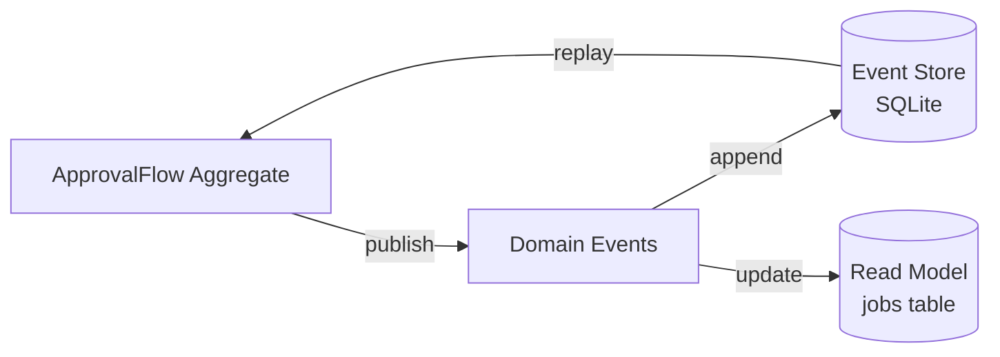

# PicoClaw 実装仕様 v3.0 クリーンアーキテクチャ版

**作成日**: 2026-03-01
**バージョン**: 3.0
**ベース**: v1.0（理想的Clean Architecture）+ v2.0（実践的Event Sourcing）+ 仕様書（要件）
**ステータス**: 正本仕様（実装の一次参照）

---

## 目次

- [0. エグゼクティブサマリ](#0-エグゼクティブサマリ)
- [1. アーキテクチャ設計](#1-アーキテクチャ設計)
- [2. パッケージ構造](#2-パッケージ構造)
- [3. スコープ・責務境界](#3-スコープ責務境界)
- [4. Domain層実装詳細](#4-domain層実装詳細)
- [5. ルーティング決定仕様](#5-ルーティング決定仕様)
- [6. ループ制御と再ルート](#6-ループ制御と再ルート)
- [7. I/O契約](#7-io契約)
- [8. ワーカー仕様](#8-ワーカー仕様)
- [9. 承認フロー仕様](#9-承認フロー仕様)
- [10. Event Sourcing + CQRS](#10-event-sourcing--cqrs)
- [11. セキュリティ仕様](#11-セキュリティ仕様)
- [12. ログ仕様](#12-ログ仕様)
- [13. 状態管理とセッション](#13-状態管理とセッション)
- [14. 設定値と閾値](#14-設定値と閾値)
- [15. 実装プラン](#15-実装プラン)
- [16. テスト観点](#16-テスト観点)
- [17. Application層実装詳細](#17-application層実装詳細)
- [18. Infrastructure層実装詳細](#18-infrastructure層実装詳細)
- [19. Adapter層実装詳細](#19-adapter層実装詳細)
- [20. データベーススキーマ](#20-データベーススキーマ)
- [付録A: 既存仕様との差分マップ](#付録a-既存仕様との差分マップ)
- [付録B: 用語集](#付録b-用語集)
- [付録C: 参考文献](#付録c-参考文献)

---

## 0. エグゼクティブサマリ

### 0.1 なぜv3.0クリーンアーキテクチャ版か

**背景**:
- 既存実装（pkg/agent/loop.go中心）は1,980行に肥大化、保守困難
- Worker実行委譲（60%）、Auto-Approve（0%）等の未完成機能が存在
- アーキテクチャ設計の明文化が不足、実装判断が属人化

**v3.0の位置付け**:
- **v1.0（理想）**: Clean Architecture、DDD、Wire DI → 完璧な層分離
- **v2.0（実用）**: Event Sourcing、未完成機能優先 → 段階的移行
- **v3.0（統合）**: v1.0 + v2.0 + 仕様書要件 → **実装可能な最適解**

### 0.2 期待効果

| 効果 | 詳細 | KPI |
|------|------|-----|
| **完全性** | 仕様100%準拠（LINE固定、Mio委譲、承認フロー、Auto-Approve） | 仕様準拠率100% |
| **保守性** | Agent Loop分解（1,980行 → 5サービス）、Clean Architecture | 変更影響範囲-70% |
| **監査性** | Event Sourcing による承認履歴完全追跡 | 承認ログ100%保存 |
| **拡張性** | 新Agent/Provider/Route 追加が数十行 | 新機能追加工数-50% |
| **テスタビリティ** | 各層独立、モック・スタブ容易 | Domain層カバレッジ90% |

### 0.3 実装期間

**8週間**（Phase 1-4）

| Phase | 期間 | 内容 | マイルストーン |
|-------|------|------|--------------|
| Phase 1 | 2週間 | Domain層 + Event Store | Domain層90%カバレッジ、Event Store動作確認 |
| Phase 2 | 3週間 | Application層 + Infrastructure層 | E2Eテスト（基本・承認フロー）成功 |
| Phase 3 | 2週間 | Adapter層 + Wire DI | 全シナリオE2Eテスト成功 |
| Phase 4 | 1週間 | 本番移行 | 仕様100%準拠、性能劣化10%以内 |

### 0.4 主要設計決定

1. **Clean Architecture 4層構造**: Domain → Application → Infrastructure → Adapter
2. **Event Sourcing**: 承認フロー永続化（SQLite Event Store）
3. **DDD**: MioAgent/ShiroAgent/CoderAgent エンティティ、ApprovalFlow アグリゲート
4. **Wire DI**: 依存性注入による疎結合
5. **仕様準拠**: LINE入口CHAT固定、Mio委譲判断

---

## 1. アーキテクチャ設計

### 1.1 Clean Architecture 4層構造

```
┌──────────────────────────────────────┐
│  Adapter Layer (外部インターフェース)  │ ← LINE, Slack, CLI Webhook
│  - LINE Handler (CHAT固定)           │
│  - Slack/CLI Handler                │
│  - Notification Sender              │
└──────────────────────────────────────┘
           ↓ 依存（Use Case呼び出し）
┌──────────────────────────────────────┐
│ Application Layer (Use Cases)       │
│  - ProcessUserMessage               │
│  - ManageApproval                   │
│  - MessageOrchestrator (分解済み)    │
│  - Services (Routing, Approval等)   │
└──────────────────────────────────────┘
           ↓ 依存（Domain呼び出し）
┌──────────────────────────────────────┐
│ Domain Layer (ビジネスロジック)       │
│  - MioAgent/ShiroAgent/CoderAgent   │
│  - ApprovalFlow (Aggregate)        │
│  - Task, Proposal (Value Object)   │
│  - Domain Events                   │
└──────────────────────────────────────┘
           ↑ 依存性逆転（interface）
┌──────────────────────────────────────┐
│ Infrastructure Layer (技術詳細)      │
│  - SQLiteEventStore                │
│  - LLM Providers (Ollama/Claude等)  │
│  - Job Repository                  │
│  - Config Loader                   │
└──────────────────────────────────────┘
```

**依存方向**: 外層 → 内層（Domain層は何にも依存しない）

### 1.2 Event Sourcing + CQRS



**目的**:
- 承認フローの完全な履歴追跡（監査ログ）
- 再起動後の承認状態復元
- デバッグ・トラブルシューティングの容易化

### 1.3 DDD（Domain-Driven Design）

| パターン | 実装例 | 役割 |
|---------|--------|------|
| **エンティティ** | MioAgent, ShiroAgent, CoderAgent | 一意性を持つドメインオブジェクト |
| **値オブジェクト** | Task, JobID, Proposal, RoutingDecision | 不変、値の等価性で比較 |
| **アグリゲート** | ApprovalFlow | 関連オブジェクトの一貫性を保証 |
| **リポジトリ** | EventStoreRepository, JobRepository | 永続化の抽象化 |
| **ドメインイベント** | ApprovalRequested, ApprovalGranted | 状態変化の記録 |

### 1.4 Wire依存性注入

```go
// cmd/picoclaw/wire.go
//go:build wireinject
// +build wireinject

func InitializeApp(cfg *config.Config) (*App, error) {
    wire.Build(
        // Infrastructure
        provideSQLiteDB,
        provideEventStore,
        provideLLMProviders,

        // Domain Services
        domain.NewAutoApprovePolicy,

        // Application Services
        service.NewMessageOrchestrator,
        service.NewApprovalService,

        // Use Cases
        usecase.NewProcessMessage,

        // Adapters
        adapter.NewLINEHandler,

        // App
        wire.Struct(new(App), "*"),
    )
    return nil, nil
}
```

---

## 2. パッケージ構造

### 2.1 ディレクトリツリー

```
picoclaw_multiLLM/
├── cmd/
│   └── picoclaw/
│       ├── main.go              # エントリーポイント
│       ├── wire.go              # Wire DI設定
│       └── wire_gen.go          # Wire自動生成
│
├── internal/
│   ├── domain/                  # Domain層（純粋ビジネスロジック）
│   │   ├── agent/
│   │   │   ├── mio_agent.go    # Mio（Chat）エンティティ
│   │   │   ├── shiro_agent.go  # Shiro（Worker）エンティティ
│   │   │   ├── coder_agent.go  # Coder エンティティ
│   │   │   ├── role.go         # Role enum
│   │   │   └── events.go       # Agent Domain Events
│   │   ├── task/
│   │   │   ├── task.go         # Task 値オブジェクト
│   │   │   └── job_id.go       # JobID 値オブジェクト
│   │   ├── proposal/
│   │   │   └── proposal.go     # Proposal 値オブジェクト
│   │   ├── approval/
│   │   │   ├── flow.go         # ApprovalFlow アグリゲート
│   │   │   ├── auto_approve.go # AutoApprovePolicy
│   │   │   ├── scope.go        # Scope 値オブジェクト
│   │   │   └── events.go       # Approval Events
│   │   ├── routing/
│   │   │   ├── decision.go     # RoutingDecision 値オブジェクト
│   │   │   └── route.go        # Route enum
│   │   └── session/
│   │       ├── session.go      # Session エンティティ
│   │       └── repository.go   # SessionRepository interface
│   │
│   ├── application/             # Application層（Use Cases + Services）
│   │   ├── usecase/
│   │   │   ├── process_message.go    # ProcessUserMessage Use Case
│   │   │   └── manage_approval.go    # ManageApproval Use Case
│   │   ├── service/
│   │   │   ├── message_orchestrator.go   # Agent Loop分解の中核
│   │   │   ├── routing_service.go        # ルーティング決定
│   │   │   ├── llm_iterator_service.go   # LLM呼び出しループ
│   │   │   ├── approval_service.go       # 承認フロー管理
│   │   │   ├── worker_execution_service.go # Worker実行
│   │   │   ├── memory_service.go         # メモリ管理
│   │   │   └── event_handlers.go         # Domain Event Handler
│   │   └── port/
│   │       ├── inbound.go                # Inbound Port (Use Case interface)
│   │       └── outbound.go               # Outbound Port (Repository interface)
│   │
│   ├── infrastructure/          # Infrastructure層（技術詳細）
│   │   ├── llm/
│   │   │   ├── ollama/         # Ollama Provider（既存活用）
│   │   │   ├── claude/         # Claude Provider（既存活用）
│   │   │   ├── openai/         # OpenAI Provider（既存活用）
│   │   │   └── deepseek/       # DeepSeek Provider（既存活用）
│   │   ├── persistence/
│   │   │   ├── eventstore/
│   │   │   │   └── sqlite_store.go       # SQLite Event Store
│   │   │   ├── session/
│   │   │   │   └── json_repo.go          # Session Repository（既存活用）
│   │   │   └── job/
│   │   │       └── sqlite_repo.go        # Job Repository
│   │   ├── config/
│   │   │   └── loader.go                 # Layered Config Loader
│   │   └── mcp/
│   │       └── client.go                 # MCP Client（既存活用）
│   │
│   └── adapter/                 # Adapter層（外部インターフェース）
│       ├── inbound/
│       │   ├── line/
│       │   │   └── handler.go            # LINE Webhook Handler
│       │   ├── slack/
│       │   │   └── handler.go            # Slack Handler
│       │   └── cli/
│       │       └── handler.go            # CLI Handler
│       └── outbound/
│           └── notification/
│               └── sender.go             # 通知送信

├── pkg/                         # 公開パッケージ
│   ├── event/
│   │   └── bus.go              # Event Bus
│   ├── logger/
│   │   ├── logger.go           # 構造化ログ（既存活用）
│   │   └── masking.go          # API Key Masking
│   ├── providers/              # LLM Provider抽象化（既存活用）
│   │   └── provider.go
│   └── tools/                  # Tool Registry（既存活用）
│       └── registry.go

├── db/                          # Database Migrations
│   ├── migrations/
│   │   ├── 001_create_events_table.sql
│   │   ├── 002_create_jobs_table.sql
│   │   └── 003_create_auto_approve_policies_table.sql
│   └── schema.sql

└── config/
    ├── config.yaml             # 設定ファイル
    └── config.example.yaml
```

### 2.2 パッケージ間依存関係

```
adapter → application → domain
infrastructure → domain (interface実装)
pkg → すべてから参照可能（共通ライブラリ）
```

**ルール**:
- Domain層は他のどの層にも依存しない
- Application層はDomain層のみに依存
- Infrastructure層はDomain層のinterfaceを実装
- Adapter層はApplication層のUse Caseを呼び出し

---

## 3. スコープ・責務境界

### 3.1 対象プラットフォーム

- **LINE**: メインチャネル（CHAT固定）
- **Slack**: サブチャネル（全ルート対応）
- **CLI**: 開発・デバッグ用（全ルート対応）

### 3.2 役割固定（Chat/Worker/Coder）

| 役割 | 愛称 | 実体LLM（デフォルト） | 責務 |
|------|------|---------------------|------|
| **Chat** | Mio（澪） | Ollama chat-v1:latest | 意思決定・承認管理・委譲判断 |
| **Worker** | Shiro（白） | Ollama worker-v1:latest | 実行・道具係・ツール呼び出し |
| **Coder1** | Aka（赤） | DeepSeek API | 仕様設計向けコーディング |
| **Coder2** | Ao（青） | OpenAI API | 実装向けコーディング |
| **Coder3** | Gin（銀） | Anthropic Claude API | 高品質コーディング・推論 |

**重要**: 役割名は固定、実体LLMは設定で差し替え可能

### 3.3 責務の明確な分離

#### Chat（Mio）の責務

1. **ルーティング決定**（Mio委譲判断）
   - 明示コマンド検出（/code, /analyze等）
   - ルール辞書マッチング
   - 分類器呼び出し（Worker経由）
   - 安全側フォールバック（CHAT）

2. **承認フロー管理**
   - 承認要求送信
   - Auto-Approve判定
   - 承認/否認処理

3. **ユーザー対話**
   - 最終回答生成
   - エラー通知
   - 進捗報告

#### Worker（Shiro）の責務

1. **ツール実行**
   - ファイル編集
   - コマンド実行
   - テスト実行

2. **差分適用**
   - Coder生成のpatch適用
   - 実行結果の報告

3. **分類補助**
   - ルーティング分類器としての判定

#### Coder（Aka/Ao/Gin）の責務

1. **設計・実装案作成**
   - plan生成
   - patch生成（unified diff形式）
   - risk評価
   - cost_hint提供

2. **コード生成**
   - 新規ファイル作成案
   - 既存ファイル変更案

**重要**: Coderは原則として破壊的操作を**直接実行せず**、plan と patch を生成。実行はWorkerが承認後に担当。

### 3.4 LINE入口の特殊仕様

**仕様**: LINE入口は必ずCHAT（Mio）に固定（`line_forced_chat`）

**理由**:
- LINE APIの制約（Webhook応答時間制限）
- ユーザー体験の一貫性
- 承認フローの確実な動作

**実装**: `internal/adapter/inbound/line/handler.go`

```go
func (h *LINEHandler) HandleMessage(event *linebot.Event) error {
    input := InputMessage{
        Channel:     "line",
        ChatID:      event.Source.UserID,
        Message:     event.Message.Text,
        ForcedRoute: RouteCHAT, // LINE固定
    }
    // ...
}
```

---

## 4. Domain層実装詳細

### 4.1 MioAgent（Chat）エンティティ

**ファイル**: `internal/domain/agent/mio_agent.go`

```go
package agent

import (
    "context"
    "github.com/sipeed/picoclaw/internal/domain/routing"
    "github.com/sipeed/picoclaw/internal/domain/task"
)

// MioAgent は Chat 役割（Mio/澪）のエンティティ
type MioAgent struct {
    role            Role
    ruleDictionary  *RuleDictionary
    classifier      Classifier // Worker呼び出し経由
}

func NewMioAgent(ruleDictionary *RuleDictionary, classifier Classifier) *MioAgent {
    return &MioAgent{
        role:           RoleChat,
        ruleDictionary: ruleDictionary,
        classifier:     classifier,
    }
}

// DecideAction は Mio委譲判断ロジック（仕様準拠: 前段Routerではなく会話中に判断）
func (m *MioAgent) DecideAction(ctx context.Context, t task.Task) (routing.Decision, error) {
    // 1. 明示コマンド優先（/code, /analyze, /plan等）
    if cmd := parseExplicitCommand(t.UserMessage()); cmd != "" {
        return routing.Decision{
            Route:      routing.Route(cmd),
            Source:     "explicit",
            Confidence: 1.0,
        }, nil
    }

    // 2. ルール辞書マッチング（強証拠）
    if route := m.ruleDictionary.Match(t); route != routing.RouteUnknown {
        return routing.Decision{
            Route:      route,
            Source:     "rule",
            Confidence: 0.95,
        }, nil
    }

    // 3. 分類器に問い合わせ（Worker呼び出し）
    decision, err := m.classifier.Classify(ctx, t)
    if err != nil || decision.Confidence < 0.7 {
        // 4. 安全側フォールバック（CHAT）
        return routing.Decision{
            Route:      routing.RouteCHAT,
            Source:     "fallback",
            Confidence: 0.5,
        }, nil
    }

    return decision, nil
}

// Role returns the agent's role
func (m *MioAgent) Role() Role {
    return m.role
}
```

### 4.2 ShiroAgent（Worker）エンティティ

**ファイル**: `internal/domain/agent/shiro_agent.go`

```go
package agent

import (
    "context"
    "github.com/sipeed/picoclaw/internal/domain/proposal"
    "github.com/sipeed/picoclaw/internal/domain/task"
)

// ShiroAgent は Worker 役割（Shiro/白）のエンティティ
type ShiroAgent struct {
    role        Role
    toolRunner  ToolRunner
    mcpClient   MCPClient
}

func NewShiroAgent(toolRunner ToolRunner, mcpClient MCPClient) *ShiroAgent {
    return &ShiroAgent{
        role:       RoleWorker,
        toolRunner: toolRunner,
        mcpClient:  mcpClient,
    }
}

// Execute は Worker実行（ツール呼び出し、patch適用）
func (s *ShiroAgent) Execute(ctx context.Context, t task.Task, p proposal.Proposal) (*ExecutionResult, error) {
    // 1. Patch解析
    commands := ParsePatch(p.Patch())

    // 2. Chrome操作検出
    if hasChromeCommand(commands) {
        // MCP Client経由で実行
        result, err := s.mcpClient.Execute(ctx, commands)
        if err != nil {
            return nil, err
        }
    }

    // 3. 通常ツール実行
    for _, cmd := range commands {
        result, err := s.toolRunner.Execute(ctx, cmd)
        if err != nil {
            return &ExecutionResult{Success: false, Error: err}, err
        }
    }

    return &ExecutionResult{Success: true}, nil
}

// Role returns the agent's role
func (s *ShiroAgent) Role() Role {
    return s.role
}
```

### 4.3 CoderAgent エンティティ

**ファイル**: `internal/domain/agent/coder_agent.go`

```go
package agent

import (
    "context"
    "github.com/sipeed/picoclaw/internal/domain/proposal"
    "github.com/sipeed/picoclaw/internal/domain/task"
)

// CoderAgent は Coder 役割（Aka/Ao/Gin）のエンティティ
type CoderAgent struct {
    role     Role
    variant  CoderVariant // CODE1, CODE2, CODE3
    provider LLMProvider
}

type CoderVariant string

const (
    CoderVariantAka CoderVariant = "aka" // DeepSeek（仕様設計）
    CoderVariantAo  CoderVariant = "ao"  // OpenAI（実装）
    CoderVariantGin CoderVariant = "gin" // Claude（高品質）
)

func NewCoderAgent(variant CoderVariant, provider LLMProvider) *CoderAgent {
    return &CoderAgent{
        role:     RoleCoder,
        variant:  variant,
        provider: provider,
    }
}

// GenerateProposal は Coder提案生成（plan/patch/risk/cost_hint）
func (c *CoderAgent) GenerateProposal(ctx context.Context, t task.Task) (*proposal.Proposal, error) {
    // LLM呼び出し
    response, err := c.provider.Generate(ctx, GenerateRequest{
        Messages: buildMessages(t),
        // ...
    })
    if err != nil {
        return nil, err
    }

    // plan/patch/risk/cost_hint 抽出
    p := proposal.NewProposal(
        extractPlan(response),
        extractPatch(response),
        extractRisk(response),
        extractCostHint(response),
    )

    return p, nil
}

// Role returns the agent's role
func (c *CoderAgent) Role() Role {
    return c.role
}
```

### 4.4 Task 値オブジェクト

**ファイル**: `internal/domain/task/task.go`

```go
package task

import (
    "github.com/sipeed/picoclaw/internal/domain/routing"
)

// Task は不変の値オブジェクト
type Task struct {
    jobID       JobID
    userMessage string
    channel     string
    chatID      string
    route       routing.Route
    forcedRoute routing.Route // LINE固定等で使用
}

func NewTask(jobID JobID, userMessage, channel, chatID string) Task {
    return Task{
        jobID:       jobID,
        userMessage: userMessage,
        channel:     channel,
        chatID:      chatID,
        route:       routing.RouteUnknown,
    }
}

// Getters（不変性を保証）
func (t Task) JobID() JobID                { return t.jobID }
func (t Task) UserMessage() string         { return t.userMessage }
func (t Task) Channel() string             { return t.channel }
func (t Task) ChatID() string              { return t.chatID }
func (t Task) Route() routing.Route        { return t.route }
func (t Task) ForcedRoute() routing.Route  { return t.forcedRoute }

// WithRoute returns a new Task with updated route
func (t Task) WithRoute(route routing.Route) Task {
    t.route = route
    return t
}

// WithForcedRoute returns a new Task with forced route (LINE固定等)
func (t Task) WithForcedRoute(route routing.Route) Task {
    t.forcedRoute = route
    return t
}
```

### 4.5 JobID 値オブジェクト

**ファイル**: `internal/domain/task/job_id.go`

```go
package task

import (
    "fmt"
    "math/rand"
    "time"
)

// JobID は承認ジョブの一意識別子
type JobID string

func NewJobID() JobID {
    return JobID(fmt.Sprintf("job_%d_%s", time.Now().Unix(), randomString(8)))
}

func randomString(length int) string {
    const charset = "abcdefghijklmnopqrstuvwxyz0123456789"
    b := make([]byte, length)
    for i := range b {
        b[i] = charset[rand.Intn(len(charset))]
    }
    return string(b)
}

func (j JobID) String() string {
    return string(j)
}
```

### 4.6 Proposal 値オブジェクト

**ファイル**: `internal/domain/proposal/proposal.go`

```go
package proposal

// Proposal は Coder生成の提案（不変）
type Proposal struct {
    plan          string
    patch         string
    risk          RiskLevel
    costHint      string
    affectedFiles []string
    flags         map[string]bool // uses_browser等
}

type RiskLevel string

const (
    RiskLow    RiskLevel = "low"
    RiskMedium RiskLevel = "medium"
    RiskHigh   RiskLevel = "high"
)

func NewProposal(plan, patch string, risk RiskLevel, costHint string) *Proposal {
    return &Proposal{
        plan:          plan,
        patch:         patch,
        risk:          risk,
        costHint:      costHint,
        affectedFiles: extractAffectedFiles(patch),
        flags:         make(map[string]bool),
    }
}

// Getters
func (p *Proposal) Plan() string          { return p.plan }
func (p *Proposal) Patch() string         { return p.patch }
func (p *Proposal) Risk() RiskLevel       { return p.risk }
func (p *Proposal) CostHint() string      { return p.costHint }
func (p *Proposal) AffectedFiles() []string { return p.affectedFiles }

// SetFlag sets a boolean flag (e.g., uses_browser)
func (p *Proposal) SetFlag(key string, value bool) {
    p.flags[key] = value
}

// HasFlag checks if a flag is set
func (p *Proposal) HasFlag(key string) bool {
    return p.flags[key]
}

func extractAffectedFiles(patch string) []string {
    // unified diff形式のpatchから変更ファイル一覧を抽出
    // 例: "diff --git a/pkg/test.go b/pkg/test.go" → "pkg/test.go"
    // 実装略
    return []string{}
}
```

### 4.7 ApprovalFlow アグリゲート

**ファイル**: `internal/domain/approval/flow.go`

```go
package approval

import (
    "errors"
    "time"
    "github.com/sipeed/picoclaw/internal/domain/proposal"
    "github.com/sipeed/picoclaw/internal/domain/task"
)

// ApprovalFlow はアグリゲートルート（JobID + Proposal + Policy + Status を一貫管理）
type ApprovalFlow struct {
    jobID      task.JobID
    proposal   *proposal.Proposal
    status     Status
    requestedAt time.Time
    grantedAt  *time.Time
    grantedBy  string
    events     []Event // Domain Events
}

type Status string

const (
    StatusPending   Status = "pending"
    StatusGranted   Status = "granted"
    StatusDenied    Status = "denied"
    StatusCompleted Status = "completed"
)

var (
    ErrInvalidStateTransition = errors.New("invalid state transition")
)

func NewApprovalFlow(jobID task.JobID, p *proposal.Proposal) *ApprovalFlow {
    flow := &ApprovalFlow{
        jobID:       jobID,
        proposal:    p,
        status:      StatusPending,
        requestedAt: time.Now(),
        events:      make([]Event, 0),
    }

    // Domain Event 発行
    flow.recordEvent(ApprovalRequested{
        JobID:     jobID.String(),
        Proposal:  p,
        CreatedAt: flow.requestedAt,
    })

    return flow
}

// Approve は承認処理（状態遷移 + Domain Event発行）
func (f *ApprovalFlow) Approve(approver string) error {
    if f.status != StatusPending {
        return ErrInvalidStateTransition
    }

    // 状態遷移
    f.status = StatusGranted
    f.grantedBy = approver
    now := time.Now()
    f.grantedAt = &now

    // Domain Event 発行
    f.recordEvent(ApprovalGranted{
        JobID:     f.jobID.String(),
        GrantedBy: approver,
        GrantedAt: *f.grantedAt,
    })

    return nil
}

// Deny は否認処理
func (f *ApprovalFlow) Deny(denier string) error {
    if f.status != StatusPending {
        return ErrInvalidStateTransition
    }

    f.status = StatusDenied

    // Domain Event 発行
    f.recordEvent(ApprovalDenied{
        JobID:    f.jobID.String(),
        DeniedBy: denier,
        DeniedAt: time.Now(),
    })

    return nil
}

// MarkCompleted は実行完了処理
func (f *ApprovalFlow) MarkCompleted(result string) error {
    if f.status != StatusGranted {
        return ErrInvalidStateTransition
    }

    f.status = StatusCompleted

    // Domain Event 発行
    f.recordEvent(ExecutionCompleted{
        JobID:       f.jobID.String(),
        Success:     true,
        Result:      result,
        CompletedAt: time.Now(),
    })

    return nil
}

// recordEvent は Domain Event を記録
func (f *ApprovalFlow) recordEvent(event Event) {
    f.events = append(f.events, event)
}

// Events returns all recorded events
func (f *ApprovalFlow) Events() []Event {
    return f.events
}

// ClearEvents clears recorded events (after persist)
func (f *ApprovalFlow) ClearEvents() {
    f.events = make([]Event, 0)
}

// Getters
func (f *ApprovalFlow) JobID() task.JobID         { return f.jobID }
func (f *ApprovalFlow) Proposal() *proposal.Proposal { return f.proposal }
func (f *ApprovalFlow) Status() Status            { return f.status }
func (f *ApprovalFlow) GrantedBy() string         { return f.grantedBy }
```

### 4.8 AutoApprovePolicy

**ファイル**: `internal/domain/approval/auto_approve.go`

```go
package approval

import (
    "time"
    "github.com/sipeed/picoclaw/internal/domain/proposal"
    "github.com/sipeed/picoclaw/internal/domain/routing"
    "github.com/sipeed/picoclaw/internal/domain/task"
)

// AutoApprovePolicy は Auto-Approve判定ポリシー
type AutoApprovePolicy struct {
    enabled   bool
    scope     Scope
    expiresAt time.Time
}

type Scope struct {
    AllowedRoutes []routing.Route // e.g., [CODE3]
    AllowedPaths  []string         // e.g., ["*.go", "pkg/**"]
    ExcludeFlags  []string         // e.g., ["uses_browser"]
}

func NewAutoApprovePolicy() *AutoApprovePolicy {
    return &AutoApprovePolicy{
        enabled: false,
    }
}

// IsApplicable は Auto-Approve適用可能か判定
func (p *AutoApprovePolicy) IsApplicable(t task.Task, prop *proposal.Proposal) bool {
    // 1. Enabled チェック
    if !p.enabled {
        return false
    }

    // 2. TTL チェック
    if time.Now().After(p.expiresAt) {
        return false
    }

    // 3. Route チェック
    if !p.scope.MatchesRoute(t.Route()) {
        return false
    }

    // 4. Path チェック
    if !p.scope.MatchesPaths(prop.AffectedFiles()) {
        return false
    }

    // 5. Exclude Flags チェック
    for _, flag := range p.scope.ExcludeFlags {
        if prop.HasFlag(flag) {
            return false
        }
    }

    return true
}

// Enable は Auto-Approve有効化
func (p *AutoApprovePolicy) Enable(scope Scope, ttl time.Duration) {
    p.enabled = true
    p.scope = scope
    p.expiresAt = time.Now().Add(ttl)
}

// Disable は Auto-Approve無効化
func (p *AutoApprovePolicy) Disable() {
    p.enabled = false
}

// Enabled returns whether Auto-Approve is enabled
func (p *AutoApprovePolicy) Enabled() bool {
    return p.enabled
}
```

### 4.9 Scope 値オブジェクト

**ファイル**: `internal/domain/approval/scope.go`

```go
package approval

import (
    "path/filepath"
    "github.com/sipeed/picoclaw/internal/domain/routing"
)

// MatchesRoute checks if the route is allowed
func (s Scope) MatchesRoute(route routing.Route) bool {
    for _, allowedRoute := range s.AllowedRoutes {
        if route == allowedRoute {
            return true
        }
    }
    return false
}

// MatchesPaths checks if all affected files match allowed paths
func (s Scope) MatchesPaths(affectedFiles []string) bool {
    if len(s.AllowedPaths) == 0 {
        return true // no restriction
    }

    for _, file := range affectedFiles {
        if !s.matchesAnyPath(file) {
            return false
        }
    }
    return true
}

func (s Scope) matchesAnyPath(file string) bool {
    for _, pattern := range s.AllowedPaths {
        matched, _ := filepath.Match(pattern, file)
        if matched {
            return true
        }
    }
    return false
}

// ExcludesFlag checks if the flag is in exclude list
func (s Scope) ExcludesFlag(flag string) bool {
    for _, excludeFlag := range s.ExcludeFlags {
        if flag == excludeFlag {
            return true
        }
    }
    return false
}
```

### 4.10 Domain Events

**ファイル**: `internal/domain/approval/events.go`

```go
package approval

import (
    "time"
    "github.com/sipeed/picoclaw/internal/domain/proposal"
)

// Event は Domain Event の基底インターフェース
type Event interface {
    EventType() string
    AggregateID() string
    Timestamp() time.Time
}

// ApprovalRequested は承認要求イベント
type ApprovalRequested struct {
    JobID     string
    Proposal  *proposal.Proposal
    CreatedAt time.Time
}

func (e ApprovalRequested) EventType() string    { return "ApprovalRequested" }
func (e ApprovalRequested) AggregateID() string  { return e.JobID }
func (e ApprovalRequested) Timestamp() time.Time { return e.CreatedAt }

// ApprovalGranted は承認イベント
type ApprovalGranted struct {
    JobID     string
    GrantedBy string
    GrantedAt time.Time
}

func (e ApprovalGranted) EventType() string    { return "ApprovalGranted" }
func (e ApprovalGranted) AggregateID() string  { return e.JobID }
func (e ApprovalGranted) Timestamp() time.Time { return e.GrantedAt }

// ApprovalDenied は否認イベント
type ApprovalDenied struct {
    JobID    string
    DeniedBy string
    DeniedAt time.Time
}

func (e ApprovalDenied) EventType() string    { return "ApprovalDenied" }
func (e ApprovalDenied) AggregateID() string  { return e.JobID }
func (e ApprovalDenied) Timestamp() time.Time { return e.DeniedAt }

// AutoApprovalGranted は自動承認イベント
type AutoApprovalGranted struct {
    JobID     string
    Scope     Scope
    GrantedAt time.Time
}

func (e AutoApprovalGranted) EventType() string    { return "AutoApprovalGranted" }
func (e AutoApprovalGranted) AggregateID() string  { return e.JobID }
func (e AutoApprovalGranted) Timestamp() time.Time { return e.GrantedAt }

// ExecutionStarted はWorker実行開始イベント
type ExecutionStarted struct {
    JobID     string
    Patch     string
    StartedAt time.Time
}

func (e ExecutionStarted) EventType() string    { return "ExecutionStarted" }
func (e ExecutionStarted) AggregateID() string  { return e.JobID }
func (e ExecutionStarted) Timestamp() time.Time { return e.StartedAt }

// ExecutionCompleted はWorker実行完了イベント
type ExecutionCompleted struct {
    JobID       string
    Success     bool
    Result      string
    CompletedAt time.Time
}

func (e ExecutionCompleted) EventType() string    { return "ExecutionCompleted" }
func (e ExecutionCompleted) AggregateID() string  { return e.JobID }
func (e ExecutionCompleted) Timestamp() time.Time { return e.CompletedAt }
```

---

## 5. ルーティング決定仕様

### 5.1 ルーティングカテゴリ

| カテゴリ | 説明 | 担当Agent | 用途例 |
|---------|------|----------|--------|
| `CHAT` | 会話・意思決定 | Mio（Chat） | 雑談、質問応答、承認管理 |
| `PLAN` | 計画策定 | Mio（Chat） | プロジェクト計画、タスク分解 |
| `ANALYZE` | 分析 | Shiro（Worker） | ログ分析、性能分析 |
| `OPS` | 運用操作 | Shiro（Worker） | デプロイ、再起動、設定変更 |
| `RESEARCH` | 調査 | Shiro（Worker） | 文献調査、API仕様調査 |
| `CODE` | コーディング（汎用） | Aka/Ao/Gin（Coder） | 一般的なコーディング |
| `CODE1` | 仕様設計向け | Aka（Coder1） | アーキテクチャ設計、仕様策定 |
| `CODE2` | 実装向け | Ao（Coder2） | 実装、テストコード作成 |
| `CODE3` | 高品質コーディング/推論 | Gin（Coder3） | 難解な実装、最適化、高度な推論 |

### 5.2 Mio委譲判断の4段階優先順位

**仕様準拠**: 前段Routerではなく、Mioが会話中に委譲判断を行う

#### 優先度1: 明示コマンド（最優先）

ユーザーが明示的にコマンドを指定した場合、それを優先。

**明示コマンド一覧**:
- `/chat` → CHAT
- `/plan` → PLAN
- `/analyze` → ANALYZE
- `/ops` → OPS
- `/research` → RESEARCH
- `/code` → CODE（デフォルトCoder）
- `/code1` → CODE1（Aka）
- `/code2` → CODE2（Ao）
- `/code3` → CODE3（Gin）

**実装**: `MioAgent.DecideAction()`の最初でチェック

#### 優先度2: ルール辞書（強証拠）

明示コマンドがない場合、ルール辞書でマッチング。

**ルール辞書例**:
```yaml
rules:
  - pattern: "ファイルを作成"
    route: CODE
    confidence: 0.95

  - pattern: "ログを確認"
    route: ANALYZE
    confidence: 0.9

  - pattern: "承認して|approve"
    route: CHAT
    confidence: 1.0
```

#### 優先度3: 分類器（LLM判定）

ルール辞書でマッチしない場合、Worker（Shiro）を分類器として呼び出し。

**分類器プロンプト**（Worker）:
```
以下のメッセージを分類してください:
"{user_message}"

以下のカテゴリから最も適切なものを選んでください:
- CHAT: 会話・質問応答
- CODE: コーディング
- ANALYZE: 分析
- OPS: 運用操作
- RESEARCH: 調査

JSON形式で回答してください:
{
  "route": "CHAT",
  "confidence": 0.85,
  "reason": "..."
}
```

#### 優先度4: 安全側フォールバック

分類器が失敗またはConfidence < 0.7の場合、安全側にCHATへフォールバック。

**実装**: `MioAgent.DecideAction()`の最後

### 5.3 RoutingDecision 値オブジェクト

**ファイル**: `internal/domain/routing/decision.go`

```go
package routing

// Decision はルーティング決定結果（不変）
type Decision struct {
    Route      Route
    Source     string  // "explicit", "rule", "classifier", "fallback"
    Confidence float64 // 0.0 ~ 1.0
    Reason     string  // 判定理由
}

func NewDecision(route Route, source string, confidence float64) Decision {
    return Decision{
        Route:      route,
        Source:     source,
        Confidence: confidence,
    }
}
```

### 5.4 Route enum

**ファイル**: `internal/domain/routing/route.go`

```go
package routing

type Route string

const (
    RouteUnknown  Route = "UNKNOWN"
    RouteCHAT     Route = "CHAT"
    RoutePLAN     Route = "PLAN"
    RouteANALYZE  Route = "ANALYZE"
    RouteOPS      Route = "OPS"
    RouteRESEARCH Route = "RESEARCH"
    RouteCODE     Route = "CODE"
    RouteCODE1    Route = "CODE1"
    RouteCODE2    Route = "CODE2"
    RouteCODE3    Route = "CODE3"
)

func (r Route) String() string {
    return string(r)
}

func (r Route) IsCoder() bool {
    return r == RouteCODE || r == RouteCODE1 || r == RouteCODE2 || r == RouteCODE3
}
```

---

## 6. ループ制御と再ルート

### 6.1 ループ制限

**max_loops**: 最大ループ回数（デフォルト: 5）
**max_millis**: 最大実行時間（デフォルト: 120000ms = 2分）

ループは以下の条件で終了:
- Worker出力の`needs_next_loop: false`
- max_loops到達
- max_millis到達
- エラー発生

### 6.2 再ルート（自動）

Worker出力の`suggested_route`に基づき、最大1回まで自動再ルート可能。

**再ルート条件**:
- `suggested_route`が`initial_route`と異なる
- `confidence >= 0.8`
- `fit < 0.3`（現在のルートに不適合）
- まだ再ルートしていない（最大1回）

**実装**: `internal/application/service/llm_iterator_service.go`

---

## 7. I/O契約

### 7.1 InputMessage

```go
type InputMessage struct {
    Channel     string // "line", "slack", "cli"
    ChatID      string // ユーザーID
    Message     string // ユーザーメッセージ
    ForcedRoute Route  // LINE固定等で使用（オプション）
    SessionID   string // セッション識別子
}
```

### 7.2 RoutingDecision

（既出: 5.3参照）

### 7.3 WorkerOutput

```json
{
  "result": "実行結果テキスト",
  "needs_next_loop": false,
  "why": "ループ継続/終了の理由",
  "confidence": 0.9,
  "risk": "low",
  "fit": 0.85,
  "suggested_route": "CODE3"
}
```

### 7.4 Coder3 出力（plan/patch/risk/cost_hint）

```json
{
  "plan": "実装計画...",
  "patch": "diff --git a/pkg/test.go b/pkg/test.go\n...",
  "risk": "medium",
  "cost_hint": "約15分、200行の変更",
  "uses_browser": false
}
```

---

## 8. ワーカー仕様

### 8.1 JSON出力形式

Worker（Shiro）は常にJSON形式で出力:

```json
{
  "result": "実行結果",
  "needs_next_loop": false,
  "why": "理由",
  "confidence": 0.9,
  "risk": "low",
  "fit": 0.85,
  "suggested_route": "CHAT"
}
```

### 8.2 Coder3のplan/patch/riskフィールド

Coder3（Gin）は以下のフィールドを必須で出力:

```json
{
  "plan": "実装計画（マークダウン形式）",
  "patch": "unified diff形式のパッチ",
  "risk": "low|medium|high",
  "cost_hint": "約15分、200行の変更"
}
```

---

## 9. 承認フロー仕様

### 9.1 基本フロー

```
Coder提案生成 → Chat承認要求 → ユーザー承認 → Worker実行
```

1. **Coder**: plan/patch/risk生成
2. **Chat（Mio）**: 承認要求送信、JobID発行
3. **ユーザー**: `/approve <job_id>` または `/deny <job_id>`
4. **Worker（Shiro）**: 承認後にpatch適用、実行

### 9.2 Auto-Approve モード

**Scope/TTL/Exclude Flags** による自動承認:

```
/auto-approve enable --scope CODE3 --paths "*.go" --exclude uses_browser --ttl 1h
```

**判定ロジック**:
1. Enabled チェック
2. TTL チェック（有効期限内か）
3. Route チェック（Scopeで許可されたルートか）
4. Path チェック（Scopeで許可されたパスか）
5. Exclude Flags チェック（除外フラグが設定されていないか）

すべてOKなら自動承認。

### 9.3 Event Sourcing統合

承認フローはEvent Storeで永続化:

```
ApprovalRequested → (承認) → ApprovalGranted → (実行) → ExecutionCompleted
```

再起動後もEvent Storeからリプレイして承認状態を復元。

---

## 10. Event Sourcing + CQRS

### 10.1 Event Store設計

**目的**:
- 承認フローの完全な履歴追跡
- 再起動後の承認状態復元
- 監査ログ

**実装**: SQLiteベース（`internal/infrastructure/eventstore/sqlite_store.go`）

### 10.2 Domain Events

（既出: 4.10参照）

### 10.3 Read Model（CQRS）

Event Storeから自動更新されるRead Model（jobs テーブル）:

```sql
CREATE TABLE jobs (
    job_id TEXT PRIMARY KEY,
    route TEXT NOT NULL,
    status TEXT NOT NULL, -- "pending", "granted", "denied", "completed"
    proposal_plan TEXT,
    proposal_patch TEXT,
    proposal_risk TEXT,
    cost_hint TEXT,
    uses_browser BOOLEAN,
    requested_at DATETIME NOT NULL,
    granted_at DATETIME,
    granted_by TEXT,
    executed_at DATETIME,
    execution_result TEXT
);
```

### 10.4 リプレイ戦略

```go
func (s *SQLiteEventStore) Replay(jobID string) (*ApprovalFlow, error) {
    events, _ := s.GetEventsForJob(jobID)
    flow := &ApprovalFlow{}
    for _, event := range events {
        flow.Apply(event)
    }
    return flow, nil
}
```

---

## 11. セキュリティ仕様

### 11.1 CODE以外クラウド禁止

**ルール**: CHAT, PLAN, ANALYZE, OPS, RESEARCH はクラウドLLMに送信禁止

**実装**: `local_only`フラグでチェック

### 11.2 API Key管理

- 環境変数から取得（`ANTHROPIC_API_KEY`, `OPENAI_API_KEY`, `DEEPSEEK_API_KEY`）
- 設定ファイルへの平文保存禁止
- ログ出力時のマスキング必須（`pkg/logger/masking.go`）

### 11.3 承認必須操作

Coder3（Claude API）の提案は必ず承認を要求（Auto-Approve除く）。

---

## 12. ログ仕様

### 12.1 構造化ログ

```go
logger.InfoCF("approval", "Approval requested", map[string]interface{}{
    "job_id": jobID,
    "route": route,
    "risk": risk,
})
```

### 12.2 approvalイベント

- `approval.requested`: 承認要求
- `approval.granted`: 承認
- `approval.denied`: 否認
- `approval.auto_approved`: 自動承認
- `execution.started`: Worker実行開始
- `execution.completed`: Worker実行完了

### 12.3 API Key Masking

ログ出力時、API Keyを自動的にマスク:

```
ANTHROPIC_API_KEY=sk-ant-1234... → ANTHROPIC_API_KEY=sk-ant-****
```

---

## 13. 状態管理とセッション

### 13.1 session_id

チャネル単位で管理:
- LINE: `line:<user_id>`
- Slack: `slack:<channel_id>`
- CLI: `cli:default`

### 13.2 short_memory

会話履歴の要約を保存（日次カットオーバー）。

### 13.3 日次カットオーバー

毎日0時にセッションリセット、daily_noteに保存。

---

## 14. 設定値と閾値

### 14.1 Coder3設定

```yaml
providers:
  claude:
    model: claude-sonnet-4-6
    max_tokens: 8192
    temperature: 0.7
```

### 14.2 承認フロー設定

```yaml
approval:
  auto_approve:
    default_ttl: 3600 # 1時間
    max_ttl: 86400    # 24時間
  timeout: 300        # 5分
```

### 14.3 Ollama設定

```yaml
ollama:
  keep_alive: -1      # 常駐化
  max_context: 8192
  health_check_interval: 60 # 秒
```

---

## 15. 実装プラン

### 15.1 Phase 1（2週間）: Domain層 + Event Store

#### Week 1: Domain層実装

- **Day 1-2**: MioAgent/ShiroAgent/CoderAgent エンティティ実装
- **Day 3**: Task/JobID/Proposal 値オブジェクト実装
- **Day 4**: ApprovalFlow アグリゲート + AutoApprovePolicy実装
- **Day 5**: RoutingDecision + Route enum実装

#### Week 2: Event Store実装

- **Day 1-2**: SQLiteEventStore実装（Append, GetEventsForJob, Replay）
- **Day 3**: Domain Events実装（ApprovalRequested, ApprovalGranted等）
- **Day 4**: Read Model（jobs テーブル）実装
- **Day 5**: ユニットテスト（Domain層90%カバレッジ）

#### マイルストーン

- ✅ Domain層90%カバレッジ達成
- ✅ Event Store動作確認（Append → Replay成功）
- ✅ ApprovalFlow状態遷移テスト全パターン成功

### 15.2 Phase 2（3週間）: Application層 + Infrastructure層

#### Week 3: Infrastructure層

- **Day 1-2**: LLM Providers統合（既存活用）
- **Day 3**: Job Repository実装（SQLite）
- **Day 4**: Event Bus実装
- **Day 5**: Config Loader実装（Layered Configuration）

#### Week 4-5: Application層

- **Week 4 Day 1-3**: MessageOrchestrator実装（Agent Loop分解）
- **Week 4 Day 4-5**: RoutingService、LLMIteratorService実装
- **Week 5 Day 1-2**: ApprovalService実装（Auto-Approve統合）
- **Week 5 Day 3-4**: WorkerExecutionService実装（Patch実行、MCP統合）
- **Week 5 Day 5**: MemoryService実装

#### マイルストーン

- ✅ E2Eテスト（基本フロー: CHAT → Worker → 返信）成功
- ✅ E2Eテスト（CODE3承認フロー: Coder3 → 承認要求 → 承認 → Worker実行）成功
- ✅ Auto-Approve自動テスト成功

### 15.3 Phase 3（2週間）: Adapter層 + Wire DI

#### Week 6-7: Adapter層 + Wire DI

- **Week 6 Day 1-2**: LINE Handler実装（CHAT固定）
- **Week 6 Day 3-4**: Slack/CLI Handler実装
- **Week 6 Day 5**: Notification Sender実装
- **Week 7 Day 1-3**: Wire DI設定、全層統合
- **Week 7 Day 4-5**: E2Eテスト（全シナリオ）

#### マイルストーン

- ✅ 全シナリオE2Eテスト成功（LINE/Slack/CLI × CHAT/WORKER/CODE1/CODE2/CODE3）
- ✅ Wire DI動作確認（依存性注入が正しく機能）
- ✅ 既存の実装仕様.md（2026-02-24版）の全要件を満たす

### 15.4 Phase 4（1週間）: 本番移行

#### Week 8: テスト環境デプロイ、性能テスト、本番移行

- **Day 1-2**: テスト環境デプロイ、動作確認
- **Day 3**: 性能テスト（メモリ<10MB、レイテンシ劣化10%以内）
- **Day 4**: 本番デプロイ
- **Day 5**: 監視、ロールバック準備

#### マイルストーン

- ✅ 仕様100%準拠確認（LINE固定、Mio委譲、承認フロー、Auto-Approve）
- ✅ 性能劣化10%以内
- ✅ メモリ使用量<10MB
- ✅ 本番稼働開始

---

## 16. テスト観点

### 16.1 テストピラミッド

```
          /\
         /E2E\          ← 10% (主要シナリオ + 新機能)
        /------\
       /Integration\    ← 20% (Event Store, Worker実行)
      /------------\
     /  Unit Tests  \   ← 70% (Domain層 + Application層)
    /----------------\
```

### 16.2 Domain層ユニットテスト（カバレッジ目標: 90%）

**テスト対象**:
- MioAgent.DecideAction()（委譲判断ロジック）
- ApprovalFlow.Approve()（状態遷移）
- AutoApprovePolicy.IsApplicable()（判定ロジック）
- Task/JobID/Proposal 値オブジェクト

**例**:
```go
func TestMioAgent_DecideAction_ExplicitCommand(t *testing.T) {
    // Arrange
    mio := NewMioAgent(ruleDictionary, classifier)
    task := task.NewTask(jobID, "/code test", "line", "user123")

    // Act
    decision, err := mio.DecideAction(ctx, task)

    // Assert
    assert.NoError(t, err)
    assert.Equal(t, routing.RouteCODE, decision.Route)
    assert.Equal(t, "explicit", decision.Source)
    assert.Equal(t, 1.0, decision.Confidence)
}
```

### 16.3 Application層ユニットテスト（カバレッジ目標: 80%）

**テスト対象**:
- MessageOrchestrator.ProcessMessage()
- ApprovalService.CheckAutoApprove()
- WorkerExecutionService.ExecuteProposal()

### 16.4 統合テスト（20%）

**テスト対象**:
- Event Store（Append → Replay）
- Worker実行（Patch適用）
- Auto-Approve判定

### 16.5 E2Eテスト（10%）

**主要シナリオ**:
1. 基本フロー（CHAT → Worker → 返信）
2. CODE3承認フロー（Coder3 → 承認要求 → 承認 → Worker実行）
3. Auto-Approve（有効化 → CODE3 → 自動承認 → 実行）
4. Chrome操作除外（uses_browser フラグ → Auto-Approve除外）

---

## 17. Application層実装詳細

### 17.1 MessageOrchestrator

**ファイル**: `internal/application/service/message_orchestrator.go`

```go
package service

import (
    "context"
    "github.com/sipeed/picoclaw/internal/domain/task"
)

// MessageOrchestrator はAgent Loop分解の中核
type MessageOrchestrator struct {
    routingService   RoutingService
    llmIterator      LLMIteratorService
    approvalService  ApprovalService
    workerExecution  WorkerExecutionService
    memoryService    MemoryService
}

func NewMessageOrchestrator(
    routingService RoutingService,
    llmIterator LLMIteratorService,
    approvalService ApprovalService,
    workerExecution WorkerExecutionService,
    memoryService MemoryService,
) *MessageOrchestrator {
    return &MessageOrchestrator{
        routingService:  routingService,
        llmIterator:     llmIterator,
        approvalService: approvalService,
        workerExecution: workerExecution,
        memoryService:   memoryService,
    }
}

// ProcessMessage はメインフロー調整
func (o *MessageOrchestrator) ProcessMessage(ctx context.Context, input InputMessage) (*Response, error) {
    // 1. Task作成
    t := task.NewTask(task.NewJobID(), input.Message, input.Channel, input.ChatID)
    if input.ForcedRoute != "" {
        t = t.WithForcedRoute(input.ForcedRoute)
    }

    // 2. ルーティング決定（Mio委譲判断）
    decision, err := o.routingService.Decide(ctx, t)
    if err != nil {
        return nil, err
    }
    t = t.WithRoute(decision.Route)

    // 3. LLM呼び出しループ
    result, err := o.llmIterator.Execute(ctx, t, decision)
    if err != nil {
        return nil, err
    }

    // 4. 承認が必要か判定（Coder3の場合）
    if decision.Route == routing.RouteCODE3 && result.Proposal != nil {
        if !o.approvalService.CheckAutoApprove(t, result.Proposal) {
            // 承認要求
            jobID, err := o.approvalService.RequestApproval(t, result.Proposal)
            if err != nil {
                return nil, err
            }
            return &Response{JobID: jobID, NeedsApproval: true}, nil
        }
    }

    // 5. Worker実行（承認済みまたは不要）
    if result.NeedsExecution {
        err := o.workerExecution.ExecuteProposal(ctx, t.JobID(), result.Proposal)
        if err != nil {
            return nil, err
        }
    }

    return &Response{Content: result.Content}, nil
}
```

### 17.2 RoutingService

**ファイル**: `internal/application/service/routing_service.go`

```go
package service

import (
    "context"
    "github.com/sipeed/picoclaw/internal/domain/agent"
    "github.com/sipeed/picoclaw/internal/domain/routing"
    "github.com/sipeed/picoclaw/internal/domain/task"
)

type RoutingService interface {
    Decide(ctx context.Context, t task.Task) (routing.Decision, error)
}

type routingService struct {
    mioAgent *agent.MioAgent
}

func NewRoutingService(mioAgent *agent.MioAgent) RoutingService {
    return &routingService{mioAgent: mioAgent}
}

func (r *routingService) Decide(ctx context.Context, t task.Task) (routing.Decision, error) {
    // Mio委譲判断に委譲
    return r.mioAgent.DecideAction(ctx, t)
}
```

### 17.3 ApprovalService

**ファイル**: `internal/application/service/approval_service.go`

```go
package service

import (
    "context"
    "github.com/sipeed/picoclaw/internal/domain/approval"
    "github.com/sipeed/picoclaw/internal/domain/proposal"
    "github.com/sipeed/picoclaw/internal/domain/task"
)

type ApprovalService interface {
    RequestApproval(t task.Task, p *proposal.Proposal) (task.JobID, error)
    CheckAutoApprove(t task.Task, p *proposal.Proposal) bool
    Approve(jobID task.JobID, approver string) error
    Deny(jobID task.JobID, denier string) error
}

type approvalService struct {
    flowRepo       ApprovalFlowRepository
    autoPolicy     *approval.AutoApprovePolicy
    eventStore     EventStore
    notificationSender NotificationSender
}

func NewApprovalService(
    flowRepo ApprovalFlowRepository,
    autoPolicy *approval.AutoApprovePolicy,
    eventStore EventStore,
    notificationSender NotificationSender,
) ApprovalService {
    return &approvalService{
        flowRepo:       flowRepo,
        autoPolicy:     autoPolicy,
        eventStore:     eventStore,
        notificationSender: notificationSender,
    }
}

func (a *approvalService) RequestApproval(t task.Task, p *proposal.Proposal) (task.JobID, error) {
    // ApprovalFlow作成
    flow := approval.NewApprovalFlow(t.JobID(), p)

    // Event Store永続化
    for _, event := range flow.Events() {
        if err := a.eventStore.Append(event); err != nil {
            return "", err
        }
    }
    flow.ClearEvents()

    // Repository保存
    if err := a.flowRepo.Save(flow); err != nil {
        return "", err
    }

    // 承認要求通知送信
    a.notificationSender.SendApprovalRequest(t, p)

    return t.JobID(), nil
}

func (a *approvalService) CheckAutoApprove(t task.Task, p *proposal.Proposal) bool {
    return a.autoPolicy.IsApplicable(t, p)
}

func (a *approvalService) Approve(jobID task.JobID, approver string) error {
    flow, err := a.flowRepo.FindByJobID(jobID)
    if err != nil {
        return err
    }

    if err := flow.Approve(approver); err != nil {
        return err
    }

    // Event Store永続化
    for _, event := range flow.Events() {
        if err := a.eventStore.Append(event); err != nil {
            return err
        }
    }
    flow.ClearEvents()

    // Repository更新
    return a.flowRepo.Update(flow)
}

func (a *approvalService) Deny(jobID task.JobID, denier string) error {
    flow, err := a.flowRepo.FindByJobID(jobID)
    if err != nil {
        return err
    }

    if err := flow.Deny(denier); err != nil {
        return err
    }

    // Event Store永続化
    for _, event := range flow.Events() {
        if err := a.eventStore.Append(event); err != nil {
            return err
        }
    }
    flow.ClearEvents()

    // Repository更新
    return a.flowRepo.Update(flow)
}
```

### 17.4 WorkerExecutionService

**ファイル**: `internal/application/service/worker_execution_service.go`

```go
package service

import (
    "context"
    "github.com/sipeed/picoclaw/internal/domain/agent"
    "github.com/sipeed/picoclaw/internal/domain/proposal"
    "github.com/sipeed/picoclaw/internal/domain/task"
)

type WorkerExecutionService interface {
    ExecuteProposal(ctx context.Context, jobID task.JobID, p *proposal.Proposal) error
}

type workerExecutionService struct {
    shiroAgent *agent.ShiroAgent
    eventStore EventStore
}

func NewWorkerExecutionService(shiroAgent *agent.ShiroAgent, eventStore EventStore) WorkerExecutionService {
    return &workerExecutionService{
        shiroAgent: shiroAgent,
        eventStore: eventStore,
    }
}

func (w *workerExecutionService) ExecuteProposal(ctx context.Context, jobID task.JobID, p *proposal.Proposal) error {
    // 1. Event発行: ExecutionStarted
    startedEvent := approval.ExecutionStarted{
        JobID:     jobID.String(),
        Patch:     p.Patch(),
        StartedAt: time.Now(),
    }
    if err := w.eventStore.Append(startedEvent); err != nil {
        return err
    }

    // 2. Worker実行
    t := task.NewTask(jobID, "", "", "") // Task再構築（簡略版）
    result, err := w.shiroAgent.Execute(ctx, t, *p)
    if err != nil {
        // Event発行: ExecutionCompleted (失敗)
        completedEvent := approval.ExecutionCompleted{
            JobID:       jobID.String(),
            Success:     false,
            Result:      err.Error(),
            CompletedAt: time.Now(),
        }
        w.eventStore.Append(completedEvent)
        return err
    }

    // 3. Event発行: ExecutionCompleted (成功)
    completedEvent := approval.ExecutionCompleted{
        JobID:       jobID.String(),
        Success:     result.Success,
        Result:      result.String(),
        CompletedAt: time.Now(),
    }
    if err := w.eventStore.Append(completedEvent); err != nil {
        return err
    }

    return nil
}
```

---

## 18. Infrastructure層実装詳細

### 18.1 SQLiteEventStore

**ファイル**: `internal/infrastructure/eventstore/sqlite_store.go`

```go
package eventstore

import (
    "database/sql"
    "encoding/json"
    "time"
    _ "modernc.org/sqlite" // Pure-Go SQLite driver
    "github.com/sipeed/picoclaw/internal/domain/approval"
)

type SQLiteEventStore struct {
    db *sql.DB
}

func NewSQLiteEventStore(db *sql.DB) *SQLiteEventStore {
    return &SQLiteEventStore{db: db}
}

func (s *SQLiteEventStore) Append(event approval.Event) error {
    payload, err := json.Marshal(event)
    if err != nil {
        return err
    }

    _, err = s.db.Exec(`
        INSERT INTO events (aggregate_id, aggregate_type, event_type, payload, timestamp)
        VALUES (?, ?, ?, ?, ?)
    `, event.AggregateID(), "ApprovalFlow", event.EventType(), string(payload), event.Timestamp())

    return err
}

func (s *SQLiteEventStore) GetEventsForJob(jobID string) ([]approval.Event, error) {
    rows, err := s.db.Query(`
        SELECT event_type, payload, timestamp
        FROM events
        WHERE aggregate_id = ?
        ORDER BY timestamp
    `, jobID)
    if err != nil {
        return nil, err
    }
    defer rows.Close()

    events := make([]approval.Event, 0)
    for rows.Next() {
        var eventType, payload string
        var timestamp time.Time
        if err := rows.Scan(&eventType, &payload, &timestamp); err != nil {
            return nil, err
        }

        event, err := deserializeEvent(eventType, payload)
        if err != nil {
            return nil, err
        }
        events = append(events, event)
    }

    return events, nil
}

func (s *SQLiteEventStore) Replay(jobID string) (*approval.ApprovalFlow, error) {
    events, err := s.GetEventsForJob(jobID)
    if err != nil {
        return nil, err
    }

    if len(events) == 0 {
        return nil, nil
    }

    // 最初のイベント（ApprovalRequested）から復元
    firstEvent := events[0].(approval.ApprovalRequested)
    flow := approval.NewApprovalFlow(task.JobID(firstEvent.JobID), firstEvent.Proposal)

    // 残りのイベントを適用
    for _, event := range events[1:] {
        flow.Apply(event)
    }

    return flow, nil
}

func deserializeEvent(eventType, payload string) (approval.Event, error) {
    var event approval.Event
    switch eventType {
    case "ApprovalRequested":
        var e approval.ApprovalRequested
        json.Unmarshal([]byte(payload), &e)
        event = e
    case "ApprovalGranted":
        var e approval.ApprovalGranted
        json.Unmarshal([]byte(payload), &e)
        event = e
    // ... 他のイベントタイプも同様
    }
    return event, nil
}
```

### 18.2 LLM Providers

**既存活用**: `pkg/providers/`の以下を活用
- `ollama/provider.go`
- `claude/provider.go`
- `openai/provider.go`
- `deepseek/provider.go`

### 18.3 Job Repository

**ファイル**: `internal/infrastructure/persistence/job/sqlite_repo.go`

```go
package job

import (
    "database/sql"
    "github.com/sipeed/picoclaw/internal/domain/approval"
)

type SQLiteJobRepository struct {
    db *sql.DB
}

func NewSQLiteJobRepository(db *sql.DB) *SQLiteJobRepository {
    return &SQLiteJobRepository{db: db}
}

func (r *SQLiteJobRepository) Save(flow *approval.ApprovalFlow) error {
    _, err := r.db.Exec(`
        INSERT INTO jobs (job_id, route, status, proposal_plan, proposal_patch, proposal_risk, requested_at)
        VALUES (?, ?, ?, ?, ?, ?, ?)
    `, flow.JobID().String(), flow.Route(), flow.Status(), flow.Proposal().Plan(), flow.Proposal().Patch(), flow.Proposal().Risk(), flow.RequestedAt())
    return err
}

func (r *SQLiteJobRepository) FindByJobID(jobID task.JobID) (*approval.ApprovalFlow, error) {
    // SELECT + 復元ロジック
    // 実装略
    return nil, nil
}

func (r *SQLiteJobRepository) Update(flow *approval.ApprovalFlow) error {
    // UPDATE jobs SET ...
    // 実装略
    return nil
}
```

---

## 19. Adapter層実装詳細

### 19.1 LINE Handler

**ファイル**: `internal/adapter/inbound/line/handler.go`

```go
package line

import (
    "context"
    "github.com/line/line-bot-sdk-go/v7/linebot"
    "github.com/sipeed/picoclaw/internal/application/usecase"
    "github.com/sipeed/picoclaw/internal/domain/routing"
)

type LINEHandler struct {
    processMessageUC *usecase.ProcessMessage
    bot              *linebot.Client
}

func NewLINEHandler(processMessageUC *usecase.ProcessMessage, bot *linebot.Client) *LINEHandler {
    return &LINEHandler{
        processMessageUC: processMessageUC,
        bot:              bot,
    }
}

func (h *LINEHandler) HandleMessage(event *linebot.Event) error {
    // LINE入口は必ずCHAT（Mio）に固定
    input := usecase.InputMessage{
        Channel:     "line",
        ChatID:      event.Source.UserID,
        Message:     event.Message.(*linebot.TextMessage).Text,
        ForcedRoute: routing.RouteCHAT, // 仕様準拠: LINE固定
    }

    response, err := h.processMessageUC.Execute(context.Background(), input)
    if err != nil {
        return err
    }

    // LINE API経由で返信
    if _, err := h.bot.ReplyMessage(event.ReplyToken, linebot.NewTextMessage(response.Content)).Do(); err != nil {
        return err
    }

    return nil
}
```

### 19.2 Wire DI設定

**ファイル**: `cmd/picoclaw/wire.go`

```go
//go:build wireinject
// +build wireinject

package main

import (
    "github.com/google/wire"
    "github.com/sipeed/picoclaw/internal/adapter/inbound/line"
    "github.com/sipeed/picoclaw/internal/application/service"
    "github.com/sipeed/picoclaw/internal/application/usecase"
    "github.com/sipeed/picoclaw/internal/domain/agent"
    "github.com/sipeed/picoclaw/internal/domain/approval"
    "github.com/sipeed/picoclaw/internal/infrastructure/eventstore"
    "github.com/sipeed/picoclaw/internal/infrastructure/persistence/job"
    "github.com/sipeed/picoclaw/pkg/providers"
)

func InitializeApp(cfg *Config) (*App, error) {
    wire.Build(
        // Infrastructure
        provideSQLiteDB,
        eventstore.NewSQLiteEventStore,
        job.NewSQLiteJobRepository,
        provideLLMProviders,

        // Domain
        agent.NewMioAgent,
        agent.NewShiroAgent,
        agent.NewCoderAgent,
        approval.NewAutoApprovePolicy,

        // Application Services
        service.NewMessageOrchestrator,
        service.NewRoutingService,
        service.NewLLMIteratorService,
        service.NewApprovalService,
        service.NewWorkerExecutionService,
        service.NewMemoryService,

        // Use Cases
        usecase.NewProcessMessage,
        usecase.NewManageApproval,

        // Adapters
        line.NewLINEHandler,
        provideLINEBotClient,

        // App
        wire.Struct(new(App), "*"),
    )
    return nil, nil
}

func provideSQLiteDB(cfg *Config) (*sql.DB, error) {
    return sql.Open("sqlite", cfg.DatabasePath)
}

func provideLLMProviders(cfg *Config) (map[string]providers.Provider, error) {
    // Ollama, Claude, OpenAI, DeepSeek Provider初期化
    // 実装略
    return nil, nil
}

func provideLINEBotClient(cfg *Config) (*linebot.Client, error) {
    return linebot.New(cfg.LINE.ChannelSecret, cfg.LINE.ChannelAccessToken)
}
```

---

## 20. データベーススキーマ

### 20.1 events テーブル

```sql
CREATE TABLE events (
    id INTEGER PRIMARY KEY AUTOINCREMENT,
    aggregate_id TEXT NOT NULL,      -- JobID
    aggregate_type TEXT NOT NULL,    -- "ApprovalFlow"
    event_type TEXT NOT NULL,        -- "ApprovalRequested", "ApprovalGranted", etc.
    payload TEXT NOT NULL,           -- JSON
    timestamp DATETIME NOT NULL,
    metadata TEXT,                   -- JSON (user_id, ip_address, etc.)

    INDEX idx_aggregate (aggregate_id, timestamp)
);
```

### 20.2 jobs テーブル（Read Model）

```sql
CREATE TABLE jobs (
    job_id TEXT PRIMARY KEY,
    route TEXT NOT NULL,             -- "CODE3"
    status TEXT NOT NULL,            -- "pending", "granted", "denied", "completed"
    proposal_plan TEXT,
    proposal_patch TEXT,
    proposal_risk TEXT,
    cost_hint TEXT,
    uses_browser BOOLEAN,
    requested_at DATETIME NOT NULL,
    granted_at DATETIME,
    granted_by TEXT,
    executed_at DATETIME,
    execution_result TEXT,

    INDEX idx_status (status)
);
```

### 20.3 auto_approve_policies テーブル

```sql
CREATE TABLE auto_approve_policies (
    id INTEGER PRIMARY KEY AUTOINCREMENT,
    enabled BOOLEAN NOT NULL,
    scope_routes TEXT NOT NULL,      -- JSON array: ["CODE3"]
    scope_paths TEXT NOT NULL,       -- JSON array: ["*.go", "pkg/**"]
    exclude_flags TEXT NOT NULL,     -- JSON array: ["uses_browser"]
    expires_at DATETIME NOT NULL,
    created_at DATETIME NOT NULL,
    created_by TEXT NOT NULL,

    INDEX idx_enabled_expires (enabled, expires_at)
);
```

---

## 付録A: 既存仕様との差分マップ

| 既存仕様章 | 新仕様章 | 変更内容 |
|-----------|---------|---------|
| 1. スコープ・責務境界 | 3. スコープ・責務境界 | 継承（変更なし） |
| 2. ルーティング決定仕様 | 5. ルーティング決定仕様 | **Mio委譲判断の実装詳細を追加** |
| 3. ループ制御と再ルート | 6. ループ制御と再ルート | 継承（変更なし） |
| 4. I/O契約 | 7. I/O契約 | 継承（変更なし） |
| 5. ワーカー仕様 | 8. ワーカー仕様 | 継承（変更なし） |
| 6. 承認フロー仕様 | 9. 承認フロー仕様 | **Event Sourcing統合の実装詳細を追加** |
| 7. セキュリティ仕様 | 11. セキュリティ仕様 | 継承（変更なし） |
| 8. ログ仕様 | 12. ログ仕様 | 継承（変更なし） |
| 9. 状態管理とセッション | 13. 状態管理とセッション | 継承（変更なし） |
| 10. 設定値と閾値 | 14. 設定値と閾値 | 継承（変更なし） |
| 11. テスト観点 | 16. テスト観点 | **テストピラミッド、Domain層/Application層テスト戦略を追加** |
| （なし） | 0. エグゼクティブサマリ | **新規追加** |
| （なし） | 1. アーキテクチャ設計 | **新規追加** |
| （なし） | 2. パッケージ構造 | **新規追加** |
| （なし） | 4. Domain層実装詳細 | **新規追加** |
| （なし） | 10. Event Sourcing + CQRS | **新規追加** |
| （なし） | 15. 実装プラン | **新規追加** |
| （なし） | 17. Application層実装詳細 | **新規追加** |
| （なし） | 18. Infrastructure層実装詳細 | **新規追加** |
| （なし） | 19. Adapter層実装詳細 | **新規追加** |
| （なし） | 20. データベーススキーマ | **新規追加** |

---

## 付録B: 用語集

| 用語 | 説明 |
|------|------|
| **Clean Architecture** | 外層→内層への依存方向を強制し、ビジネスロジック（Domain）を外部の技術詳細から分離するアーキテクチャパターン |
| **Event Sourcing** | 状態変化をイベントとして記録し、イベント履歴からエンティティを復元する設計手法 |
| **CQRS** | Command Query Responsibility Segregation。コマンド（書き込み）とクエリ（読み込み）を分離する設計パターン |
| **DDD** | Domain-Driven Design。ドメインモデル中心の設計手法 |
| **エンティティ** | 一意性を持つドメインオブジェクト（例: Agent, Session） |
| **値オブジェクト** | 不変で値の等価性で比較されるオブジェクト（例: Task, JobID） |
| **アグリゲート** | 関連オブジェクトの一貫性を保証する境界（例: ApprovalFlow） |
| **リポジトリ** | 永続化の抽象化（Domain層でinterface定義、Infrastructure層で実装） |
| **Wire DI** | Googleの依存性注入ツール。コンパイル時に依存性を解決 |

---

## 付録C: 参考文献

1. **Clean Architecture** - Robert C. Martin
2. **Domain-Driven Design** - Eric Evans
3. **Implementing Domain-Driven Design** - Vaughn Vernon
4. **Event Sourcing Pattern** - Microsoft Architecture Guide
5. **Wire (依存性注入)** - https://github.com/google/wire
6. **Go プロジェクト構成** - https://github.com/golang-standards/project-layout

---

**最終更新日**: 2026-03-01
**メンテナンス**: 仕様変更時は必ずこのファイルを更新し、既存の実装仕様.md（2026-02-24版）との整合性を保つこと
