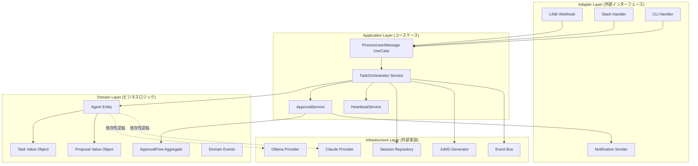
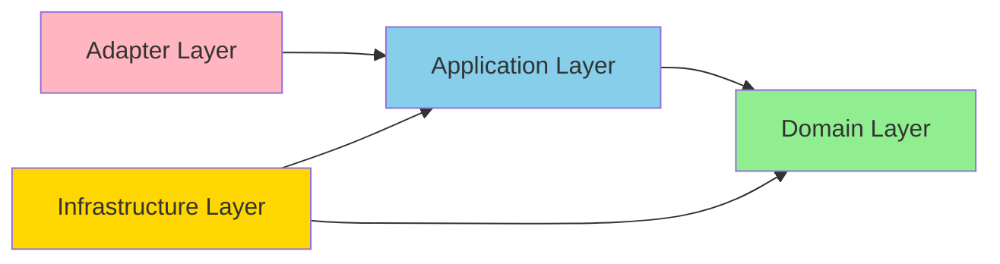
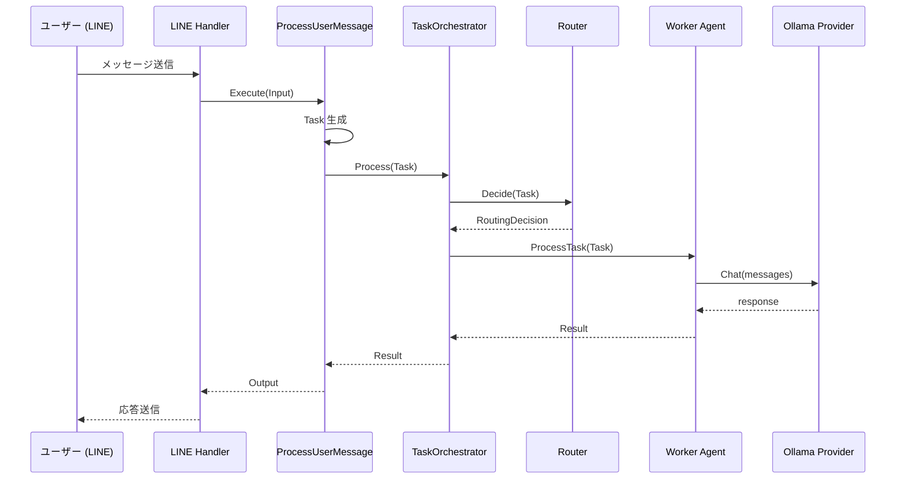
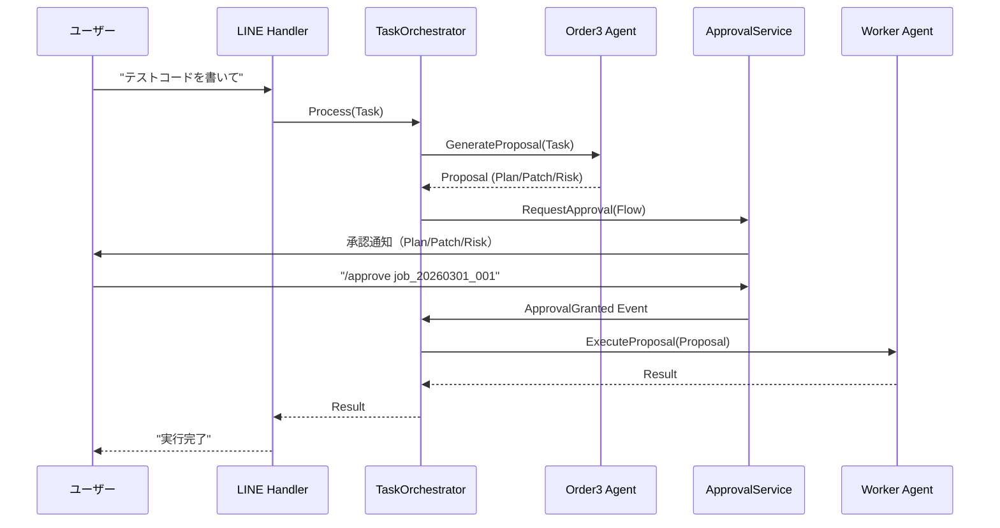
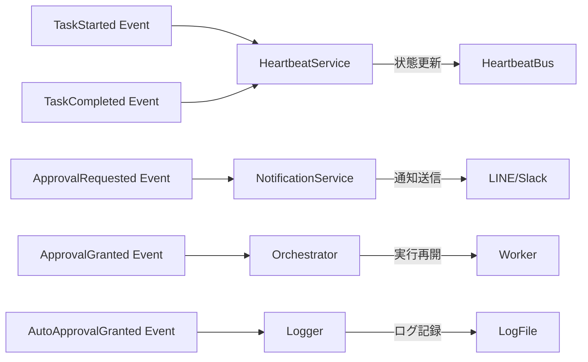

# PicoClaw クリーンアーキテクチャ再設計提案

**作成日**: 2026-03-01
**バージョン**: 1.0
**ステータス**: 提案
**対象**: PicoClaw マルチエージェントシステム全体再設計

---

## 目次

1. [エグゼクティブサマリ](#エグゼクティブサマリ)
2. [現状分析](#現状分析)
3. [設計原則](#設計原則)
4. [新アーキテクチャ詳細](#新アーキテクチャ詳細)
5. [パッケージ構造](#パッケージ構造)
6. [コンポーネント設計](#コンポーネント設計)
7. [データフロー](#データフロー)
8. [依存性管理](#依存性管理)
9. [イベント駆動設計](#イベント駆動設計)
10. [テスト戦略](#テスト戦略)
11. [移行計画](#移行計画)
12. [FAQ](#faq)
13. [参考資料](#参考資料)

---

## エグゼクティブサマリ

### 背景

PicoClaw は現在、2012行の `AgentLoop` が全責務を担う monolithic な設計となっており、保守性・拡張性・テスタビリティに課題を抱えています。

### 提案内容

**Clean Architecture / Hexagonal Architecture** を採用し、以下の4層構造に再設計：

```
Adapter Layer (外部インターフェース)
    ↓
Application Layer (ユースケース)
    ↓
Domain Layer (ビジネスロジック) ← 依存関係の中心
    ↑
Infrastructure Layer (外部実装)
```

### 期待効果

- **保守性**: 責務分離により変更影響を局所化（現状：1ファイル2012行 → 分散化）
- **テスタビリティ**: 各層が独立、モック・スタブが容易（カバレッジ目標: Domain 90%, Application 80%）
- **拡張性**: 新Agent/Provider/Channel の追加が容易（数十行で追加可能）
- **品質**: 型安全性・ドメイン知識の可視化

### 実装期間

**12週間**（Phase 1-4: ドメイン層 → アプリケーション層 → アダプター層 → 移行）

---

## 現状分析

### Explore エージェント分析結果サマリ

#### 痛点 Top 6

| # | 問題 | 深刻度 | 影響 |
|---|------|-------|------|
| 1 | **AgentLoop 肥大化** (2012行) | 高 | 単一責任原則違反、変更コスト増大 |
| 2 | **二重アーキテクチャ** (Legacy + New) | 高 | 保守コスト2倍、バグの温床 |
| 3 | **不完全なモジュール化** | 中 | Type assertion による Service Locator アンチパターン |
| 4 | **Config God Object** | 中 | 全パッケージが config に依存、変更影響大 |
| 5 | **未実装機能** (Auto-Approve, Worker 委譲) | 中 | 仕様と実装の乖離 |
| 6 | **重複定義** (Router, LLMProvider) | 低 | DRY 違反、保守コスト増 |

#### 成功している点

✅ **RouterAdapter パターン**: 循環依存を解決（良い設計、踏襲すべき）
✅ **JobID システム**: 実装完璧、トレーサビリティ確保
✅ **Heartbeat プロトコル**: 設計良好、wiring 未完だが基盤は完成
✅ **Provider 抽象化**: Ollama/Claude/OpenAI/DeepSeek を統一インターフェースで管理

### 定量分析

```
pkg/agent/loop.go:
  - 行数: 2012
  - 依存パッケージ: 18
  - 責務数: 7+ (ルーティング, LLM呼び出し, メッセージ管理, 承認フロー, Heartbeat, ...)
  - Cyclomatic Complexity: 推定 100+

pkg/config/config.go:
  - 設定型数: 100+
  - 依存元パッケージ: ほぼ全パッケージ
```

---

## 設計原則

### 1. Clean Architecture

**依存関係の方向**:

```
外層 (Adapter/Infrastructure) → 内層 (Application) → 核 (Domain)
```

**重要ルール**:
- Domain 層は外部に依存しない（依存性逆転の原則）
- Application 層は Domain のみに依存
- Adapter/Infrastructure 層は Application/Domain に依存可

### 2. SOLID 原則

#### S - 単一責任原則 (SRP)
- 各コンポーネントは1つの責務のみ
- 変更理由が1つ

#### O - 開放閉鎖原則 (OCP)
- 拡張に開き、修正に閉じる
- インターフェースで抽象化

#### L - リスコフの置換原則 (LSP)
- インターフェース実装は置き換え可能

#### I - インターフェース分離原則 (ISP)
- 不要なメソッドを強制しない
- 小さなインターフェース

#### D - 依存性逆転原則 (DIP)
- 抽象に依存、具象に依存しない
- Domain は抽象（インターフェース）のみ定義

### 3. DDD (Domain-Driven Design)

#### エンティティ (Entity)
- 一意識別子を持つ
- ライフサイクルがある
- 例: `Agent`, `Session`, `ApprovalFlow`

#### 値オブジェクト (Value Object)
- 不変
- 等価性は値で判定
- 例: `Task`, `JobID`, `Proposal`, `RoutingDecision`

#### アグリゲート (Aggregate)
- トランザクション境界
- 整合性を保つ単位
- 例: `ApprovalFlow` (JobID + Proposal + Policy + Status を一貫管理)

#### リポジトリ (Repository)
- 永続化の抽象
- ドメイン層で interface 定義、Infrastructure 層で実装

#### ドメインイベント (Domain Event)
- ドメイン内の重要な出来事
- 疎結合なコンポーネント間通信
- 例: `TaskStarted`, `ApprovalRequested`, `ApprovalGranted`

### 4. イベント駆動アーキテクチャ (EDA)

- エージェント間通信はイベント経由
- 同期処理を減らし、非同期・疎結合に
- Domain Events でステート変更を通知

---

## 新アーキテクチャ詳細

### レイヤー構成図



### 依存関係の方向



**重要**: Domain 層は他の層に依存しない（純粋なビジネスロジック）

---

## パッケージ構造

### ディレクトリツリー

```
picoclaw_multiLLM/
├── cmd/
│   └── picoclaw/
│       ├── main.go              # エントリーポイント
│       └── wire.go              # 依存性注入（Wire）
│
├── internal/                    # プライベートパッケージ
│   ├── domain/                  # ドメイン層
│   │   ├── agent/
│   │   │   ├── agent.go        # Agent エンティティ
│   │   │   ├── agent_test.go
│   │   │   ├── role.go         # AgentRole enum
│   │   │   ├── status.go       # AgentStatus enum
│   │   │   └── events.go       # TaskStarted, TaskCompleted events
│   │   ├── task/
│   │   │   ├── task.go         # Task 値オブジェクト
│   │   │   ├── task_test.go
│   │   │   ├── job_id.go       # JobID 値オブジェクト
│   │   │   ├── status.go       # TaskStatus enum
│   │   │   └── context.go      # TaskContext
│   │   ├── proposal/
│   │   │   ├── proposal.go     # Proposal 値オブジェクト
│   │   │   ├── proposal_test.go
│   │   │   └── comparison.go   # ProposalComparison (合議制)
│   │   ├── approval/
│   │   │   ├── flow.go         # ApprovalFlow アグリゲート
│   │   │   ├── flow_test.go
│   │   │   ├── policy.go       # ApprovalPolicy enum (Manual/Auto)
│   │   │   ├── scope.go        # Auto-Approve Scope
│   │   │   └── events.go       # ApprovalRequested, ApprovalGranted
│   │   ├── routing/
│   │   │   ├── decision.go     # RoutingDecision 値オブジェクト
│   │   │   ├── route.go        # Route enum (CHAT/PLAN/CODE1/2/3)
│   │   │   └── classifier.go   # RoutingClassifier interface
│   │   └── session/
│   │       ├── session.go      # Session エンティティ
│   │       └── repository.go   # SessionRepository interface
│   │
│   ├── application/             # アプリケーション層
│   │   ├── usecase/
│   │   │   ├── process_message.go      # ProcessUserMessage UseCase
│   │   │   ├── process_message_test.go
│   │   │   ├── route_task.go           # RouteTask UseCase
│   │   │   ├── execute_task.go         # ExecuteTask UseCase
│   │   │   ├── generate_proposal.go    # GenerateProposal UseCase
│   │   │   ├── manage_approval.go      # ManageApproval UseCase
│   │   │   └── aggregate_results.go    # AggregateResults UseCase
│   │   ├── service/
│   │   │   ├── orchestrator.go         # TaskOrchestrator Service
│   │   │   ├── orchestrator_test.go
│   │   │   ├── heartbeat.go            # HeartbeatService
│   │   │   ├── deliberation.go         # DeliberationService (合議制)
│   │   │   └── event_handlers.go       # Domain Event Handlers
│   │   └── port/
│   │       ├── inbound.go              # Inbound Port interfaces
│   │       └── outbound.go             # Outbound Port interfaces
│   │
│   ├── infrastructure/          # インフラ層
│   │   ├── llm/
│   │   │   ├── ollama/
│   │   │   │   ├── provider.go         # Ollama Provider 実装
│   │   │   │   └── provider_test.go
│   │   │   ├── claude/
│   │   │   │   ├── provider.go         # Claude API Provider 実装
│   │   │   │   └── provider_test.go
│   │   │   ├── openai/
│   │   │   │   ├── provider.go         # OpenAI Provider 実装
│   │   │   │   └── provider_test.go
│   │   │   └── deepseek/
│   │   │       ├── provider.go         # DeepSeek Provider 実装
│   │   │       └── provider_test.go
│   │   ├── persistence/
│   │   │   ├── memory/
│   │   │   │   ├── session_repo.go     # In-Memory SessionRepository
│   │   │   │   └── session_repo_test.go
│   │   │   └── file/
│   │   │       ├── session_repo.go     # File-based SessionRepository
│   │   │       └── session_repo_test.go
│   │   ├── messaging/
│   │   │   ├── inmemory/
│   │   │   │   ├── bus.go              # In-Memory MessageBus
│   │   │   │   └── bus_test.go
│   │   │   └── redis/
│   │   │       ├── bus.go              # Redis MessageBus
│   │   │       └── bus_test.go
│   │   ├── jobid/
│   │   │   ├── generator.go            # JobID Generator 実装
│   │   │   └── generator_test.go
│   │   └── config/
│   │       ├── loader.go               # Config Loader
│   │       └── loader_test.go
│   │
│   └── adapter/                 # アダプター層
│       ├── inbound/
│       │   ├── line/
│       │   │   ├── handler.go          # LINE Webhook Handler
│       │   │   └── handler_test.go
│       │   ├── slack/
│       │   │   ├── handler.go          # Slack Handler
│       │   │   └── handler_test.go
│       │   ├── telegram/
│       │   │   ├── handler.go          # Telegram Handler
│       │   │   └── handler_test.go
│       │   └── cli/
│       │       ├── handler.go          # CLI Handler
│       │       └── handler_test.go
│       └── outbound/
│           └── notification/
│               ├── sender.go           # 承認通知送信
│               └── sender_test.go
│
├── pkg/                         # 公開パッケージ
│   ├── event/
│   │   ├── bus.go              # Domain Event Bus
│   │   └── bus_test.go
│   └── logger/
│       ├── logger.go           # 構造化ロガー
│       └── logger_test.go
│
├── test/                        # E2E テスト
│   └── e2e/
│       ├── basic_flow_test.go
│       ├── code3_approval_test.go
│       └── auto_approve_test.go
│
└── config/
    ├── config.yaml             # 設定ファイル
    └── config.example.yaml
```

### パッケージ依存ルール

| パッケージ | 依存可能 | 依存禁止 |
|-----------|---------|---------|
| `internal/domain/*` | なし（純粋） | すべて |
| `internal/application/*` | `internal/domain`, `pkg/*` | `internal/infrastructure`, `internal/adapter` |
| `internal/infrastructure/*` | `internal/domain`, `internal/application`, `pkg/*` | `internal/adapter` |
| `internal/adapter/*` | すべて | なし |
| `pkg/*` | なし | `internal/*` |

**検証方法**:

```bash
# depguard で依存関係を検証
golangci-lint run --enable depguard
```

---

## コンポーネント設計

### 1. Domain Layer

#### Agent エンティティ

```go
// internal/domain/agent/agent.go
package agent

import (
    "context"
    "github.com/Nyukimin/picoclaw_multiLLM/internal/domain/task"
)

// Agent はエージェントのドメインエンティティ
type Agent struct {
    id       AgentID
    role     Role        // Chat, Worker, Order1, Order2, Order3
    alias    string      // Mio, Shiro, Aka, Ao, Gin
    status   Status      // Idle, Processing, Waiting
    provider LLMProvider // インターフェース（依存性逆転）
}

// LLMProvider は LLM プロバイダーの抽象インターフェース
// 実装は infrastructure 層に配置
type LLMProvider interface {
    Chat(ctx context.Context, messages []Message) (string, error)
    Model() string
}

// Message は LLM へのメッセージ
type Message struct {
    Role    string // "user", "assistant", "system"
    Content string
}

// NewAgent はエージェントを生成
func NewAgent(id AgentID, role Role, alias string, provider LLMProvider) *Agent {
    return &Agent{
        id:       id,
        role:     role,
        alias:    alias,
        status:   StatusIdle,
        provider: provider,
    }
}

// ProcessTask はタスクを処理
func (a *Agent) ProcessTask(ctx context.Context, t task.Task) (Result, error) {
    // ステータス更新
    a.status = StatusProcessing

    // Domain Event 発行
    publishEvent(TaskStarted{
        TaskID:    t.JobID(),
        AgentID:   a.id,
        Timestamp: time.Now(),
    })

    // LLM 呼び出し
    messages := a.buildMessages(t)
    response, err := a.provider.Chat(ctx, messages)
    if err != nil {
        a.status = StatusIdle
        return Result{}, err
    }

    // ステータス更新
    a.status = StatusIdle

    // Domain Event 発行
    publishEvent(TaskCompleted{
        TaskID:    t.JobID(),
        AgentID:   a.id,
        Result:    response,
        Timestamp: time.Now(),
    })

    return Result{Response: response}, nil
}

// GenerateProposal は提案を生成（Order 専用）
func (a *Agent) GenerateProposal(ctx context.Context, t task.Task) (proposal.Proposal, error) {
    if !a.role.IsOrder() {
        return proposal.Proposal{}, ErrInvalidRole
    }

    // プロンプト構築
    systemPrompt := a.buildSystemPrompt()
    userPrompt := t.UserMessage()

    messages := []Message{
        {Role: "system", Content: systemPrompt},
        {Role: "user", Content: userPrompt},
    }

    // LLM 呼び出し
    response, err := a.provider.Chat(ctx, messages)
    if err != nil {
        return proposal.Proposal{}, err
    }

    // レスポンスをパース
    return proposal.ParseFromResponse(response)
}

// buildSystemPrompt はロール別のシステムプロンプトを構築
func (a *Agent) buildSystemPrompt() string {
    switch a.role {
    case RoleOrder1:
        return "あなたは仕様設計に特化したコーダー（Aka）です..."
    case RoleOrder2:
        return "あなたは実装に特化したコーダー（Ao）です..."
    case RoleOrder3:
        return "あなたは高品質コーディングに特化したコーダー（Gin）です..."
    default:
        return "あなたは AI アシスタントです..."
    }
}
```

#### Role enum

```go
// internal/domain/agent/role.go
package agent

type Role int

const (
    RoleChat Role = iota
    RoleWorker
    RoleOrder1
    RoleOrder2
    RoleOrder3
)

func (r Role) String() string {
    return [...]string{"Chat", "Worker", "Order1", "Order2", "Order3"}[r]
}

func (r Role) IsOrder() bool {
    return r == RoleOrder1 || r == RoleOrder2 || r == RoleOrder3
}
```

#### Task 値オブジェクト

```go
// internal/domain/task/task.go
package task

import (
    "time"
    "github.com/Nyukimin/picoclaw_multiLLM/internal/domain/routing"
)

// Task は不変の値オブジェクト
type Task struct {
    jobID       JobID
    userMessage string
    route       routing.Route
    context     TaskContext
    createdAt   time.Time
}

// NewTask は新しい Task を生成
func NewTask(userMessage string) Task {
    return Task{
        jobID:       NewJobID(),
        userMessage: userMessage,
        route:       routing.RouteUnknown,
        createdAt:   time.Now(),
    }
}

// WithRoute はルートを設定した新しい Task を返す（不変性維持）
func (t Task) WithRoute(route routing.Route) Task {
    return Task{
        jobID:       t.jobID,
        userMessage: t.userMessage,
        route:       route,
        context:     t.context,
        createdAt:   t.createdAt,
    }
}

// WithContext はコンテキストを設定した新しい Task を返す
func (t Task) WithContext(ctx TaskContext) Task {
    return Task{
        jobID:       t.jobID,
        userMessage: t.userMessage,
        route:       t.route,
        context:     ctx,
        createdAt:   t.createdAt,
    }
}

// Getters（値オブジェクトは不変なので Setter は提供しない）
func (t Task) JobID() JobID                  { return t.jobID }
func (t Task) UserMessage() string           { return t.userMessage }
func (t Task) Route() routing.Route          { return t.route }
func (t Task) Context() TaskContext          { return t.context }
func (t Task) CreatedAt() time.Time          { return t.createdAt }
```

#### JobID 値オブジェクト

```go
// internal/domain/task/job_id.go
package task

import (
    "fmt"
    "time"
)

// JobID は job_YYYYMMDD_NNN 形式の識別子
type JobID struct {
    value string
}

var (
    counter int
    lastDate string
)

// NewJobID は新しい JobID を生成
func NewJobID() JobID {
    now := time.Now()
    date := now.Format("20060102")

    // 日付が変わったらカウンターリセット
    if date != lastDate {
        counter = 0
        lastDate = date
    }

    counter++
    value := fmt.Sprintf("job_%s_%03d", date, counter)

    return JobID{value: value}
}

// NewJobIDFromString は文字列から JobID を生成（バリデーション付き）
func NewJobIDFromString(s string) (JobID, error) {
    // フォーマット検証
    // job_YYYYMMDD_NNN の形式か？
    if !isValidJobIDFormat(s) {
        return JobID{}, ErrInvalidJobIDFormat
    }
    return JobID{value: s}, nil
}

func (j JobID) String() string {
    return j.value
}

func (j JobID) Equals(other JobID) bool {
    return j.value == other.value
}
```

#### ApprovalFlow アグリゲート

```go
// internal/domain/approval/flow.go
package approval

import (
    "time"
    "github.com/Nyukimin/picoclaw_multiLLM/internal/domain/task"
    "github.com/Nyukimin/picoclaw_multiLLM/internal/domain/proposal"
)

// ApprovalFlow は承認フローのアグリゲートルート
// JobID + Proposal + Policy + Status を一貫して管理
type ApprovalFlow struct {
    jobID     task.JobID
    proposal  proposal.Proposal
    policy    Policy        // Manual or Auto
    status    Status        // Pending, Granted, Denied
    scope     Scope         // Auto-Approve scope（Policy=Auto の場合のみ）
    expiresAt time.Time     // Auto-Approve 有効期限
    grantedBy string        // 承認者
    grantedAt time.Time     // 承認日時
}

// NewFlow は新しい承認フローを生成
func NewFlow(jobID task.JobID, prop proposal.Proposal, policy Policy) *ApprovalFlow {
    return &ApprovalFlow{
        jobID:    jobID,
        proposal: prop,
        policy:   policy,
        status:   StatusPending,
    }
}

// NewAutoApproveFlow は Auto-Approve フローを生成
func NewAutoApproveFlow(jobID task.JobID, prop proposal.Proposal, scope Scope, ttl time.Duration) *ApprovalFlow {
    return &ApprovalFlow{
        jobID:     jobID,
        proposal:  prop,
        policy:    PolicyAuto,
        status:    StatusPending,
        scope:     scope,
        expiresAt: time.Now().Add(ttl),
    }
}

// Approve は承認を実行
func (f *ApprovalFlow) Approve(grantedBy string) error {
    // ステータスチェック
    if f.status != StatusPending {
        return ErrAlreadyProcessed
    }

    // 承認
    f.status = StatusGranted
    f.grantedBy = grantedBy
    f.grantedAt = time.Now()

    // Domain Event 発行
    publishEvent(ApprovalGranted{
        JobID:     f.jobID,
        GrantedBy: grantedBy,
        Timestamp: f.grantedAt,
    })

    return nil
}

// Deny は承認を拒否
func (f *ApprovalFlow) Deny(deniedBy string) error {
    if f.status != StatusPending {
        return ErrAlreadyProcessed
    }

    f.status = StatusDenied

    // Domain Event 発行
    publishEvent(ApprovalDenied{
        JobID:     f.jobID,
        DeniedBy:  deniedBy,
        Timestamp: time.Now(),
    })

    return nil
}

// IsAutoApprovable は Auto-Approve 可能かチェック
func (f *ApprovalFlow) IsAutoApprovable(t task.Task) bool {
    // Policy が Manual なら不可
    if f.policy != PolicyAuto {
        return false
    }

    // 有効期限切れなら不可
    if time.Now().After(f.expiresAt) {
        return false
    }

    // Scope マッチチェック
    return f.scope.Matches(t)
}

// AutoApprove は自動承認を実行
func (f *ApprovalFlow) AutoApprove() error {
    if f.policy != PolicyAuto {
        return ErrNotAutoApproveFlow
    }

    if time.Now().After(f.expiresAt) {
        return ErrAutoApproveExpired
    }

    f.status = StatusGranted
    f.grantedBy = "auto-approve"
    f.grantedAt = time.Now()

    // Domain Event 発行
    publishEvent(AutoApprovalGranted{
        JobID:     f.jobID,
        Scope:     f.scope,
        Timestamp: f.grantedAt,
    })

    return nil
}

// Getters
func (f *ApprovalFlow) JobID() task.JobID          { return f.jobID }
func (f *ApprovalFlow) Proposal() proposal.Proposal { return f.proposal }
func (f *ApprovalFlow) Status() Status              { return f.status }
func (f *ApprovalFlow) IsGranted() bool             { return f.status == StatusGranted }
func (f *ApprovalFlow) IsDenied() bool              { return f.status == StatusDenied }
```

#### Scope 値オブジェクト（Auto-Approve 範囲）

```go
// internal/domain/approval/scope.go
package approval

import "github.com/Nyukimin/picoclaw_multiLLM/internal/domain/task"

// Scope は Auto-Approve の適用範囲
type Scope struct {
    allowedRoutes []routing.Route
    allowedPaths  []string // ファイルパスパターン（glob）
}

// NewScope は新しい Scope を生成
func NewScope(routes []routing.Route, paths []string) Scope {
    return Scope{
        allowedRoutes: routes,
        allowedPaths:  paths,
    }
}

// Matches は Task が Scope に含まれるかチェック
func (s Scope) Matches(t task.Task) bool {
    // Route チェック
    routeMatch := false
    for _, r := range s.allowedRoutes {
        if t.Route() == r {
            routeMatch = true
            break
        }
    }

    if !routeMatch {
        return false
    }

    // Path チェック（TODO: glob マッチング実装）
    // 実装例: t.Context().AffectedFiles() が s.allowedPaths のいずれかにマッチ

    return true
}
```

### 2. Application Layer

#### ProcessUserMessage UseCase

```go
// internal/application/usecase/process_message.go
package usecase

import (
    "context"
    "github.com/Nyukimin/picoclaw_multiLLM/internal/application/service"
    "github.com/Nyukimin/picoclaw_multiLLM/internal/domain/task"
    "github.com/Nyukimin/picoclaw_multiLLM/pkg/event"
)

// ProcessUserMessage はユーザーメッセージ処理のユースケース
type ProcessUserMessage struct {
    orchestrator *service.TaskOrchestrator
    eventBus     event.Bus
}

// Input は入力パラメータ
type Input struct {
    Message   string
    Channel   string
    ChatID    string
    SessionKey string
}

// Output は出力結果
type Output struct {
    Response string
    JobID    string
}

// NewProcessUserMessage はユースケースを生成
func NewProcessUserMessage(orchestrator *service.TaskOrchestrator, eventBus event.Bus) *ProcessUserMessage {
    return &ProcessUserMessage{
        orchestrator: orchestrator,
        eventBus:     eventBus,
    }
}

// Execute はユースケースを実行
func (uc *ProcessUserMessage) Execute(ctx context.Context, input Input) (Output, error) {
    // 1. Task 生成
    t := task.NewTask(input.Message)
    t = t.WithContext(task.TaskContext{
        Channel:    input.Channel,
        ChatID:     input.ChatID,
        SessionKey: input.SessionKey,
    })

    // 2. Orchestrator に委譲
    result, err := uc.orchestrator.Process(ctx, t)
    if err != nil {
        return Output{}, err
    }

    // 3. イベント発行
    uc.eventBus.Publish(TaskCompleted{
        TaskID:    t.JobID(),
        Timestamp: time.Now(),
    })

    return Output{
        Response: result.Response,
        JobID:    t.JobID().String(),
    }, nil
}
```

#### TaskOrchestrator Service

```go
// internal/application/service/orchestrator.go
package service

import (
    "context"
    "github.com/Nyukimin/picoclaw_multiLLM/internal/domain/agent"
    "github.com/Nyukimin/picoclaw_multiLLM/internal/domain/task"
    "github.com/Nyukimin/picoclaw_multiLLM/internal/domain/routing"
    "github.com/Nyukimin/picoclaw_multiLLM/internal/domain/approval"
)

// TaskOrchestrator はタスクの全体調整を担当
type TaskOrchestrator struct {
    chatAgent    *agent.Agent
    workerAgent  *agent.Agent
    orderAgents  []*agent.Agent
    router       routing.Router
    approvalSvc  *ApprovalService
    heartbeatSvc *HeartbeatService
}

// NewTaskOrchestrator は Orchestrator を生成
func NewTaskOrchestrator(
    chatAgent *agent.Agent,
    workerAgent *agent.Agent,
    orderAgents []*agent.Agent,
    router routing.Router,
    approvalSvc *ApprovalService,
    heartbeatSvc *HeartbeatService,
) *TaskOrchestrator {
    return &TaskOrchestrator{
        chatAgent:    chatAgent,
        workerAgent:  workerAgent,
        orderAgents:  orderAgents,
        router:       router,
        approvalSvc:  approvalSvc,
        heartbeatSvc: heartbeatSvc,
    }
}

// Process はタスクを処理
func (o *TaskOrchestrator) Process(ctx context.Context, t task.Task) (Result, error) {
    // 1. Chat エージェントが受領
    o.heartbeatSvc.Report(agent.Heartbeat{
        AgentID:   "chat",
        JobID:     t.JobID(),
        Status:    "processing",
        Timestamp: time.Now(),
    })

    // 2. Worker にルーティング委譲
    decision, err := o.router.Decide(ctx, t)
    if err != nil {
        return Result{}, err
    }

    t = t.WithRoute(decision.Route)

    // 3. Route に応じて処理
    switch decision.Route {
    case routing.RouteCODE3:
        return o.processCODE3(ctx, t)
    case routing.RouteCODE1, routing.RouteCODE2:
        return o.processOrder(ctx, t, decision.Route)
    default:
        return o.workerAgent.ProcessTask(ctx, t)
    }
}

// processCODE3 は CODE3 ルートを処理（承認フロー付き）
func (o *TaskOrchestrator) processCODE3(ctx context.Context, t task.Task) (Result, error) {
    // 1. Order3 が提案生成
    orderAgent := o.orderAgents[2] // Order3
    prop, err := orderAgent.GenerateProposal(ctx, t)
    if err != nil {
        return Result{}, err
    }

    // 2. 承認フロー生成
    flow := approval.NewFlow(t.JobID(), prop, approval.PolicyManual)

    // Auto-Approve チェック
    if o.approvalSvc.HasActiveAutoApprove() {
        autoFlow := o.approvalSvc.GetAutoApproveFlow()
        if autoFlow.IsAutoApprovable(t) {
            if err := autoFlow.AutoApprove(); err == nil {
                // Auto-Approve 成功 → 即座に実行
                return o.workerAgent.ExecuteProposal(ctx, prop)
            }
        }
    }

    // 3. 承認要求
    if err := o.approvalSvc.RequestApproval(ctx, flow); err != nil {
        return Result{}, err
    }

    // 4. 承認待ち（非同期）
    <-flow.WaitForApproval()

    if flow.IsDenied() {
        return Result{Response: "承認が拒否されました"}, nil
    }

    // 5. Worker が実行
    return o.workerAgent.ExecuteProposal(ctx, prop)
}

// processOrder は Order1/Order2 を処理（承認なし）
func (o *TaskOrchestrator) processOrder(ctx context.Context, t task.Task, route routing.Route) (Result, error) {
    var orderIndex int
    switch route {
    case routing.RouteCODE1:
        orderIndex = 0
    case routing.RouteCODE2:
        orderIndex = 1
    default:
        return Result{}, ErrInvalidRoute
    }

    orderAgent := o.orderAgents[orderIndex]
    prop, err := orderAgent.GenerateProposal(ctx, t)
    if err != nil {
        return Result{}, err
    }

    // 承認なしで即座に実行
    return o.workerAgent.ExecuteProposal(ctx, prop)
}
```

### 3. Infrastructure Layer

#### Ollama Provider 実装

```go
// internal/infrastructure/llm/ollama/provider.go
package ollama

import (
    "bytes"
    "context"
    "encoding/json"
    "fmt"
    "net/http"
    "github.com/Nyukimin/picoclaw_multiLLM/internal/domain/agent"
)

// Provider は Ollama の LLMProvider 実装
type Provider struct {
    client  *http.Client
    baseURL string
    model   string
}

// NewProvider は Provider を生成
func NewProvider(baseURL, model string) *Provider {
    return &Provider{
        client:  &http.Client{Timeout: 60 * time.Second},
        baseURL: baseURL,
        model:   model,
    }
}

// Chat は LLM とチャット
func (p *Provider) Chat(ctx context.Context, messages []agent.Message) (string, error) {
    // リクエスト構築
    reqBody := map[string]interface{}{
        "model":    p.model,
        "messages": messages,
        "stream":   false,
    }

    jsonData, err := json.Marshal(reqBody)
    if err != nil {
        return "", err
    }

    // API 呼び出し
    req, err := http.NewRequestWithContext(ctx, "POST", p.baseURL+"/api/chat", bytes.NewBuffer(jsonData))
    if err != nil {
        return "", err
    }

    req.Header.Set("Content-Type", "application/json")

    resp, err := p.client.Do(req)
    if err != nil {
        return "", err
    }
    defer resp.Body.Close()

    if resp.StatusCode != http.StatusOK {
        return "", fmt.Errorf("ollama API error: status=%d", resp.StatusCode)
    }

    // レスポンスパース
    var result struct {
        Message struct {
            Content string `json:"content"`
        } `json:"message"`
    }

    if err := json.NewDecoder(resp.Body).Decode(&result); err != nil {
        return "", err
    }

    return result.Message.Content, nil
}

// Model はモデル名を返す
func (p *Provider) Model() string {
    return p.model
}
```

#### SessionRepository 実装

```go
// internal/infrastructure/persistence/memory/session_repo.go
package memory

import (
    "context"
    "sync"
    "github.com/Nyukimin/picoclaw_multiLLM/internal/domain/session"
)

// SessionRepository は In-Memory SessionRepository 実装
type SessionRepository struct {
    mu       sync.RWMutex
    sessions map[string]*session.Session
}

// NewSessionRepository は Repository を生成
func NewSessionRepository() *SessionRepository {
    return &SessionRepository{
        sessions: make(map[string]*session.Session),
    }
}

// Save はセッションを保存
func (r *SessionRepository) Save(ctx context.Context, sess *session.Session) error {
    r.mu.Lock()
    defer r.mu.Unlock()

    r.sessions[sess.Key()] = sess
    return nil
}

// FindByKey はキーでセッションを検索
func (r *SessionRepository) FindByKey(ctx context.Context, key string) (*session.Session, error) {
    r.mu.RLock()
    defer r.mu.RUnlock()

    sess, ok := r.sessions[key]
    if !ok {
        return nil, session.ErrNotFound
    }

    return sess, nil
}

// Delete はセッションを削除
func (r *SessionRepository) Delete(ctx context.Context, key string) error {
    r.mu.Lock()
    defer r.mu.Unlock()

    delete(r.sessions, key)
    return nil
}
```

### 4. Adapter Layer

#### LINE Inbound Adapter

```go
// internal/adapter/inbound/line/handler.go
package line

import (
    "encoding/json"
    "net/http"
    "github.com/line/line-bot-sdk-go/v7/linebot"
    "github.com/Nyukimin/picoclaw_multiLLM/internal/application/usecase"
)

// Handler は LINE Webhook Handler
type Handler struct {
    client  *linebot.Client
    useCase *usecase.ProcessUserMessage
}

// NewHandler は Handler を生成
func NewHandler(channelSecret, channelToken string, uc *usecase.ProcessUserMessage) (*Handler, error) {
    client, err := linebot.New(channelSecret, channelToken)
    if err != nil {
        return nil, err
    }

    return &Handler{
        client:  client,
        useCase: uc,
    }, nil
}

// HandleWebhook は Webhook を処理
func (h *Handler) HandleWebhook(w http.ResponseWriter, r *http.Request) {
    events, err := h.client.ParseRequest(r)
    if err != nil {
        http.Error(w, err.Error(), http.StatusBadRequest)
        return
    }

    for _, event := range events {
        if event.Type == linebot.EventTypeMessage {
            switch message := event.Message.(type) {
            case *linebot.TextMessage:
                h.handleTextMessage(event, message)
            }
        }
    }

    w.WriteHeader(http.StatusOK)
}

// handleTextMessage はテキストメッセージを処理
func (h *Handler) handleTextMessage(event *linebot.Event, message *linebot.TextMessage) {
    // UseCase 実行
    output, err := h.useCase.Execute(context.Background(), usecase.Input{
        Message:    message.Text,
        Channel:    "line",
        ChatID:     event.Source.UserID,
        SessionKey: event.Source.UserID,
    })

    if err != nil {
        // エラー応答
        h.client.ReplyMessage(event.ReplyToken, linebot.NewTextMessage("エラーが発生しました"))
        return
    }

    // 応答送信
    h.client.ReplyMessage(event.ReplyToken, linebot.NewTextMessage(output.Response))
}
```

---

## データフロー

### シーケンス図: 基本フロー



### シーケンス図: CODE3 承認フロー



### イベントフロー図



---

## 依存性管理

### Wire を使った依存性注入

```go
// cmd/picoclaw/wire.go
//go:build wireinject
// +build wireinject

package main

import (
    "github.com/google/wire"
    "github.com/Nyukimin/picoclaw_multiLLM/internal/application/service"
    "github.com/Nyukimin/picoclaw_multiLLM/internal/application/usecase"
    "github.com/Nyukimin/picoclaw_multiLLM/internal/domain/agent"
    "github.com/Nyukimin/picoclaw_multiLLM/internal/infrastructure/llm/ollama"
    "github.com/Nyukimin/picoclaw_multiLLM/internal/infrastructure/persistence/memory"
    "github.com/Nyukimin/picoclaw_multiLLM/internal/adapter/inbound/line"
    "github.com/Nyukimin/picoclaw_multiLLM/pkg/event"
)

// InitializeApp は依存性を解決して App を生成
func InitializeApp(cfg *Config) (*App, error) {
    wire.Build(
        // Infrastructure
        provideOllamaProvider,
        provideClaudeProvider,
        memory.NewSessionRepository,
        event.NewBus,

        // Domain
        provideChatAgent,
        provideWorkerAgent,
        provideOrderAgents,
        provideRouter,

        // Application
        service.NewTaskOrchestrator,
        service.NewApprovalService,
        service.NewHeartbeatService,
        usecase.NewProcessUserMessage,

        // Adapter
        line.NewHandler,

        // App
        NewApp,
    )
    return &App{}, nil
}

// Provider Functions

func provideOllamaProvider(cfg *Config) agent.LLMProvider {
    return ollama.NewProvider(cfg.Ollama.BaseURL, cfg.Ollama.Model)
}

func provideClaudeProvider(cfg *Config) agent.LLMProvider {
    return claude.NewProvider(cfg.Claude.APIKey, cfg.Claude.Model)
}

func provideChatAgent(ollamaProvider agent.LLMProvider) *agent.Agent {
    return agent.NewAgent(
        agent.AgentID("chat"),
        agent.RoleChat,
        "Mio",
        ollamaProvider,
    )
}

func provideWorkerAgent(ollamaProvider agent.LLMProvider) *agent.Agent {
    return agent.NewAgent(
        agent.AgentID("worker"),
        agent.RoleWorker,
        "Shiro",
        ollamaProvider,
    )
}

func provideOrderAgents(deepseekProvider, openaiProvider, claudeProvider agent.LLMProvider) []*agent.Agent {
    return []*agent.Agent{
        agent.NewAgent(agent.AgentID("order1"), agent.RoleOrder1, "Aka", deepseekProvider),
        agent.NewAgent(agent.AgentID("order2"), agent.RoleOrder2, "Ao", openaiProvider),
        agent.NewAgent(agent.AgentID("order3"), agent.RoleOrder3, "Gin", claudeProvider),
    }
}
```

### 生成コマンド

```bash
# Wire によるコード生成
cd cmd/picoclaw
go run github.com/google/wire/cmd/wire

# wire_gen.go が生成される
```

---

## イベント駆動設計

### Domain Event Bus

```go
// pkg/event/bus.go
package event

import (
    "reflect"
    "sync"
)

// Bus は Domain Event Bus
type Bus interface {
    Publish(event interface{})
    Subscribe(eventType reflect.Type, handler Handler)
    Unsubscribe(eventType reflect.Type, handler Handler)
}

// Handler はイベントハンドラー
type Handler func(event interface{})

// bus は Bus の実装
type bus struct {
    mu        sync.RWMutex
    handlers  map[reflect.Type][]Handler
}

// NewBus は Bus を生成
func NewBus() Bus {
    return &bus{
        handlers: make(map[reflect.Type][]Handler),
    }
}

// Publish はイベントを発行
func (b *bus) Publish(event interface{}) {
    eventType := reflect.TypeOf(event)

    b.mu.RLock()
    handlers := b.handlers[eventType]
    b.mu.RUnlock()

    // 並行実行
    for _, handler := range handlers {
        go handler(event)
    }
}

// Subscribe はイベントを購読
func (b *bus) Subscribe(eventType reflect.Type, handler Handler) {
    b.mu.Lock()
    defer b.mu.Unlock()

    b.handlers[eventType] = append(b.handlers[eventType], handler)
}

// Unsubscribe は購読解除
func (b *bus) Unsubscribe(eventType reflect.Type, handler Handler) {
    b.mu.Lock()
    defer b.mu.Unlock()

    handlers := b.handlers[eventType]
    for i, h := range handlers {
        if reflect.ValueOf(h).Pointer() == reflect.ValueOf(handler).Pointer() {
            b.handlers[eventType] = append(handlers[:i], handlers[i+1:]...)
            break
        }
    }
}
```

### イベントハンドラー登録

```go
// internal/application/service/event_handlers.go
package service

import (
    "reflect"
    "github.com/Nyukimin/picoclaw_multiLLM/internal/domain/agent"
    "github.com/Nyukimin/picoclaw_multiLLM/internal/domain/approval"
    "github.com/Nyukimin/picoclaw_multiLLM/pkg/event"
)

// RegisterEventHandlers はイベントハンドラーを登録
func RegisterEventHandlers(
    bus event.Bus,
    heartbeatSvc *HeartbeatService,
    notificationSvc *NotificationService,
) {
    // TaskStarted → HeartbeatService
    bus.Subscribe(reflect.TypeOf(agent.TaskStarted{}), func(e interface{}) {
        event := e.(agent.TaskStarted)
        heartbeatSvc.OnTaskStarted(event)
    })

    // TaskCompleted → HeartbeatService
    bus.Subscribe(reflect.TypeOf(agent.TaskCompleted{}), func(e interface{}) {
        event := e.(agent.TaskCompleted)
        heartbeatSvc.OnTaskCompleted(event)
    })

    // ApprovalRequested → NotificationService
    bus.Subscribe(reflect.TypeOf(approval.ApprovalRequested{}), func(e interface{}) {
        event := e.(approval.ApprovalRequested)
        notificationSvc.OnApprovalRequested(event)
    })

    // ApprovalGranted → Logger
    bus.Subscribe(reflect.TypeOf(approval.ApprovalGranted{}), func(e interface{}) {
        event := e.(approval.ApprovalGranted)
        logger.InfoCF("approval", "approval.granted", map[string]interface{}{
            "job_id":     event.JobID.String(),
            "granted_by": event.GrantedBy,
            "timestamp":  event.Timestamp,
        })
    })
}
```

---

## テスト戦略

### テストピラミッド

```
          /\
         /E2E\          ← 10% (数件の重要シナリオ)
        /------\
       /Integration\    ← 20% (コンポーネント間の統合)
      /------------\
     /  Unit Tests  \   ← 70% (ドメイン・アプリケーション層)
    /----------------\
```

### 1. ドメイン層のユニットテスト

```go
// internal/domain/approval/flow_test.go
package approval_test

import (
    "testing"
    "github.com/stretchr/testify/assert"
    "github.com/Nyukimin/picoclaw_multiLLM/internal/domain/approval"
    "github.com/Nyukimin/picoclaw_multiLLM/internal/domain/task"
    "github.com/Nyukimin/picoclaw_multiLLM/internal/domain/proposal"
)

func TestApprovalFlow_Approve(t *testing.T) {
    // Arrange
    jobID := task.NewJobID()
    prop := proposal.NewProposal("plan", "patch", "risk")
    flow := approval.NewFlow(jobID, prop, approval.PolicyManual)

    // Act
    err := flow.Approve("user123")

    // Assert
    assert.NoError(t, err)
    assert.Equal(t, approval.StatusGranted, flow.Status())
    assert.True(t, flow.IsGranted())
}

func TestApprovalFlow_Approve_AlreadyProcessed(t *testing.T) {
    // Arrange
    jobID := task.NewJobID()
    prop := proposal.NewProposal("plan", "patch", "risk")
    flow := approval.NewFlow(jobID, prop, approval.PolicyManual)
    flow.Approve("user123") // 1回目の承認

    // Act
    err := flow.Approve("user456") // 2回目の承認（エラー）

    // Assert
    assert.Error(t, err)
    assert.Equal(t, approval.ErrAlreadyProcessed, err)
}

func TestApprovalFlow_AutoApprove(t *testing.T) {
    // Arrange
    jobID := task.NewJobID()
    prop := proposal.NewProposal("plan", "patch", "risk")
    scope := approval.NewScope([]routing.Route{routing.RouteCODE3}, []string{"*.go"})
    flow := approval.NewAutoApproveFlow(jobID, prop, scope, 1*time.Hour)

    t := task.NewTask("テストコードを書いて").WithRoute(routing.RouteCODE3)

    // Act
    canAuto := flow.IsAutoApprovable(t)
    err := flow.AutoApprove()

    // Assert
    assert.True(t, canAuto)
    assert.NoError(t, err)
    assert.Equal(t, approval.StatusGranted, flow.Status())
}
```

### 2. アプリケーション層の統合テスト

```go
// internal/application/usecase/process_message_test.go
package usecase_test

import (
    "context"
    "testing"
    "github.com/stretchr/testify/assert"
    "github.com/stretchr/testify/mock"
    "github.com/Nyukimin/picoclaw_multiLLM/internal/application/usecase"
    "github.com/Nyukimin/picoclaw_multiLLM/internal/application/service"
)

// MockOrchestrator は TaskOrchestrator のモック
type MockOrchestrator struct {
    mock.Mock
}

func (m *MockOrchestrator) Process(ctx context.Context, t task.Task) (service.Result, error) {
    args := m.Called(ctx, t)
    return args.Get(0).(service.Result), args.Error(1)
}

// MockEventBus は Event Bus のモック
type MockEventBus struct {
    mock.Mock
}

func (m *MockEventBus) Publish(event interface{}) {
    m.Called(event)
}

func TestProcessUserMessage_Execute(t *testing.T) {
    // Arrange
    mockOrchestrator := new(MockOrchestrator)
    mockEventBus := new(MockEventBus)

    mockOrchestrator.On("Process", mock.Anything, mock.Anything).Return(
        service.Result{Response: "テストコードを生成しました"},
        nil,
    )
    mockEventBus.On("Publish", mock.Anything).Return()

    uc := usecase.NewProcessUserMessage(mockOrchestrator, mockEventBus)

    // Act
    output, err := uc.Execute(context.Background(), usecase.Input{
        Message:    "テストコードを書いて",
        Channel:    "line",
        ChatID:     "user123",
        SessionKey: "session_001",
    })

    // Assert
    assert.NoError(t, err)
    assert.NotEmpty(t, output.Response)
    assert.NotEmpty(t, output.JobID)
    mockOrchestrator.AssertExpectations(t)
    mockEventBus.AssertExpectations(t)
}
```

### 3. E2E テスト

```go
// test/e2e/code3_approval_flow_test.go
package e2e_test

import (
    "context"
    "testing"
    "time"
    "github.com/stretchr/testify/assert"
)

func TestCODE3_ApprovalFlow_E2E(t *testing.T) {
    // 1. テスト用 App 起動
    app := setupTestApp(t)
    defer app.Shutdown()

    // 2. ユーザーメッセージ送信
    jobID, err := app.SendMessage(context.Background(), "テストコードを書いて")
    assert.NoError(t, err)

    // 3. 承認要求を待つ
    approval, err := app.WaitForApproval(jobID, 5*time.Second)
    assert.NoError(t, err)
    assert.NotNil(t, approval)
    assert.Contains(t, approval.Proposal.Plan, "テスト")

    // 4. 承認
    err = app.Approve(jobID)
    assert.NoError(t, err)

    // 5. 実行完了を待つ
    result, err := app.WaitForCompletion(jobID, 10*time.Second)
    assert.NoError(t, err)
    assert.Equal(t, "completed", result.Status)
}

func TestAutoApprove_E2E(t *testing.T) {
    // 1. App 起動
    app := setupTestApp(t)
    defer app.Shutdown()

    // 2. Auto-Approve 設定
    err := app.EnableAutoApprove(AutoApproveScope{
        Routes: []string{"CODE3"},
        Paths:  []string{"*.go"},
        TTL:    1 * time.Hour,
    })
    assert.NoError(t, err)

    // 3. CODE3 タスク送信
    jobID, err := app.SendMessage(context.Background(), "テストコードを書いて")
    assert.NoError(t, err)

    // 4. 承認なしで実行完了を待つ
    result, err := app.WaitForCompletion(jobID, 10*time.Second)
    assert.NoError(t, err)
    assert.Equal(t, "completed", result.Status)
    assert.Equal(t, "auto-approve", result.ApprovedBy)
}
```

### テストカバレッジ目標

```bash
# ドメイン層: 90% 以上
go test -cover -coverprofile=coverage.out ./internal/domain/...
go tool cover -func=coverage.out | grep total

# アプリケーション層: 80% 以上
go test -cover -coverprofile=coverage.out ./internal/application/...

# インフラ層: 70% 以上
go test -cover -coverprofile=coverage.out ./internal/infrastructure/...

# 全体レポート
go tool cover -html=coverage.out -o coverage.html
```

---

## 移行計画

### Phase 1: 基盤構築（4週間）

#### Week 1-2: ドメイン層実装

**実装対象**:
- `internal/domain/agent/` - Agent, Role, Status
- `internal/domain/task/` - Task, JobID, TaskContext
- `internal/domain/proposal/` - Proposal
- `internal/domain/approval/` - ApprovalFlow, Policy, Scope
- `internal/domain/routing/` - Route, RoutingDecision
- `internal/domain/session/` - Session, Repository interface

**成果物**:
- ドメイン層の完全実装
- ユニットテスト（カバレッジ 90%+）

**検証**:
```bash
go test -cover ./internal/domain/...
```

#### Week 3-4: インフラ層実装

**実装対象**:
- `internal/infrastructure/llm/ollama/` - Ollama Provider
- `internal/infrastructure/llm/claude/` - Claude Provider
- `internal/infrastructure/llm/openai/` - OpenAI Provider
- `internal/infrastructure/llm/deepseek/` - DeepSeek Provider
- `internal/infrastructure/persistence/memory/` - In-Memory SessionRepository
- `internal/infrastructure/jobid/` - JobID Generator
- `pkg/event/` - Domain Event Bus

**成果物**:
- インフラ層の完全実装
- 統合テスト（ドメイン + インフラ）

**検証**:
```bash
go test -cover ./internal/infrastructure/...
go test ./internal/domain/agent -tags=integration
```

### Phase 2: アプリケーション層（4週間）

#### Week 5-6: ユースケース実装

**実装対象**:
- `internal/application/usecase/process_message.go`
- `internal/application/usecase/route_task.go`
- `internal/application/usecase/execute_task.go`
- `internal/application/usecase/generate_proposal.go`
- `internal/application/usecase/manage_approval.go`

**成果物**:
- ユースケース層の実装
- ユニットテスト（モック使用、カバレッジ 80%+）

**検証**:
```bash
go test -cover ./internal/application/usecase/...
```

#### Week 7-8: サービス実装

**実装対象**:
- `internal/application/service/orchestrator.go` - TaskOrchestrator
- `internal/application/service/heartbeat.go` - HeartbeatService
- `internal/application/service/deliberation.go` - DeliberationService
- `internal/application/service/event_handlers.go` - イベントハンドラー登録

**成果物**:
- アプリケーションサービスの実装
- E2E テスト（基本フロー、CODE3 承認フロー）

**検証**:
```bash
go test ./test/e2e/...
```

### Phase 3: アダプター層（2週間）

#### Week 9-10: Inbound/Outbound Adapters

**実装対象**:
- `internal/adapter/inbound/line/` - LINE Handler
- `internal/adapter/inbound/slack/` - Slack Handler
- `internal/adapter/inbound/cli/` - CLI Handler
- `internal/adapter/outbound/notification/` - 通知送信
- `cmd/picoclaw/wire.go` - 依存性注入

**成果物**:
- アダプター層の完全実装
- Wire による DI
- E2E テスト（全シナリオ）

**検証**:
```bash
# Wire コード生成
cd cmd/picoclaw && go run github.com/google/wire/cmd/wire

# E2E テスト
go test ./test/e2e/...
```

### Phase 4: 段階的移行（2週間）

#### Week 11: テスト環境デプロイ

**実施内容**:
1. 新アーキテクチャをテスト環境にデプロイ
2. 基本フローの動作確認
3. CODE3 承認フローの動作確認
4. Auto-Approve フローの動作確認
5. 性能テスト（ベンチマーク、負荷テスト）

**検証項目**:
- [ ] すべての E2E テストが通る
- [ ] 性能劣化が 10% 以内
- [ ] メモリ使用量が増加していない
- [ ] ログが正しく記録される

#### Week 12: 本番移行

**実施内容**:
1. 本番環境へデプロイ
2. 段階的ロールアウト（10% → 50% → 100%）
3. モニタリング（エラー率、レスポンスタイム、メモリ使用量）
4. 旧アーキテクチャの削除（安定稼働確認後）

**ロールバック手順**:
```bash
# 新バージョンに問題があった場合
kubectl rollout undo deployment/picoclaw

# または手動で旧バージョンに切り替え
kubectl set image deployment/picoclaw picoclaw=picoclaw:old-version
```

---

## FAQ

### Q1: 既存の AgentLoop (2012行) はどうなる？

**A**: 段階的に削除します。
1. Week 1-10: 新アーキテクチャを並行実装
2. Week 11: テスト環境で新アーキテクチャのみ動作確認
3. Week 12: 本番環境で新アーキテクチャに切り替え
4. 安定稼働 2週間後: 旧コード削除

### Q2: 後方互換性は？

**A**: 外部インターフェース（LINE Webhook, CLI コマンド等）は完全互換を維持します。内部実装のみ変更するため、ユーザーに影響なし。

### Q3: 性能は劣化しない？

**A**: ベンチマークで検証します。許容範囲は **10% 以内の劣化**。層の増加によるオーバーヘッドは最小限（インターフェース呼び出しのみ）。

### Q4: テストの追加コストは？

**A**: 初期投資は必要ですが、長期的にはコスト削減：
- ユニットテストがモック・スタブで容易に書ける
- バグの早期発見（コンパイル時 + テスト時）
- リグレッションテストで既存機能の安全性確保

### Q5: チームの学習コストは？

**A**: Clean Architecture の概念理解が必要ですが、以下で軽減：
- ドキュメント整備（この提案書）
- サンプルコード提供
- ペアプログラミング
- 既存の良い設計（RouterAdapter 等）を踏襲

### Q6: 小規模プロジェクトには過剰設計では？

**A**: 現時点（2012行）では確かに過剰に見えますが、以下を考慮：
- **長期的な成長**: 新 Agent/Provider の追加が容易
- **複数人開発**: 並行開発が可能になる
- **保守性**: 責務分離により、将来の変更が容易

**推奨**: まず Phase 1 を実装し、効果を検証してから Phase 2-4 を判断。

### Q7: Wire の代わりに手動 DI は？

**A**: 可能ですが、Wire を推奨する理由：
- コンパイル時に依存関係を検証
- ボイラープレートコードの自動生成
- リファクタリング時の追従が容易

手動 DI でも同じ効果は得られますが、保守コストが高い。

### Q8: イベント駆動は必須？

**A**: オプションです。最小限の実装なら同期呼び出しでも可。ただし、イベント駆動のメリット：
- 疎結合（コンポーネント間の依存を減らす）
- 非同期処理（Heartbeat 等）
- 拡張性（新しいハンドラー追加が容易）

Heartbeat や通知機能を実装する場合は、イベント駆動を推奨。

---

## 参考資料

### 書籍

1. **Clean Architecture** - Robert C. Martin
   - Clean Architecture の原典

2. **Domain-Driven Design** - Eric Evans
   - DDD の概念・パターン

3. **Implementing Domain-Driven Design** - Vaughn Vernon
   - DDD の実践ガイド

### Web 記事

1. **The Clean Architecture** - Robert C. Martin
   - https://blog.cleancoder.com/uncle-bob/2012/08/13/the-clean-architecture.html

2. **Hexagonal Architecture** - Alistair Cockburn
   - https://alistair.cockburn.us/hexagonal-architecture/

3. **golang-standards/project-layout**
   - https://github.com/golang-standards/project-layout

### Go ライブラリ

1. **Wire** - 依存性注入
   - https://github.com/google/wire

2. **testify** - テストアサーション・モック
   - https://github.com/stretchr/testify

3. **golangci-lint** - Linter
   - https://github.com/golangci/golangci-lint

### PicoClaw 関連ドキュメント

1. **実装仕様**: `docs/01_正本仕様/実装仕様.md`
2. **実装ギャップ分析**: `docs/08_AIからの提案/implementation_gap_analysis.md`
3. **マルチエージェント仕様**: `docs/08_AIからの提案/multi_agent_specification_日本語版.md`

---

## まとめ

この提案は、PicoClaw を **Clean Architecture / Hexagonal Architecture** に基づいて再設計し、以下を実現します：

### ✅ 主要な改善点

1. **AgentLoop の肥大化を解消** (2012行 → 各層に分散)
2. **責務分離** (Domain, Application, Infrastructure, Adapter)
3. **依存性逆転** (Domain は外部に依存しない)
4. **イベント駆動** (疎結合なコンポーネント間通信)
5. **テスタビリティ** (モック・スタブが容易)
6. **拡張性** (新 Agent/Provider/Channel の追加が容易)

### ⏱️ 実装期間

**12週間**（Phase 1-4: ドメイン層 → アプリケーション層 → アダプター層 → 移行）

### 🎯 期待効果

- **保守性**: 責務分離により変更影響を局所化
- **品質**: 型安全性・ドメイン知識の可視化
- **チーム開発**: 並行開発が可能

### ⚠️ リスクと対策

- **移行コスト**: 段階的移行、フラグでロールバック可能
- **学習コスト**: ドキュメント整備、ペアプログラミング
- **過剰設計**: YAGNI 原則、Phase 1 で効果検証

### 🚀 推奨判断

**Yes, with conditions:**
- ✅ プロジェクトの長期的な成長を見据えるなら推奨
- ✅ 複数人でのチーム開発を想定するなら推奨
- ✅ 高品質・高信頼性を求めるなら推奨

**推奨**: テスト環境で Phase 1 を実装し、効果を検証してから本格移行を判断

---

**作成日**: 2026-03-01
**バージョン**: 1.0
**次回レビュー**: Phase 1 完了時（Week 4）
