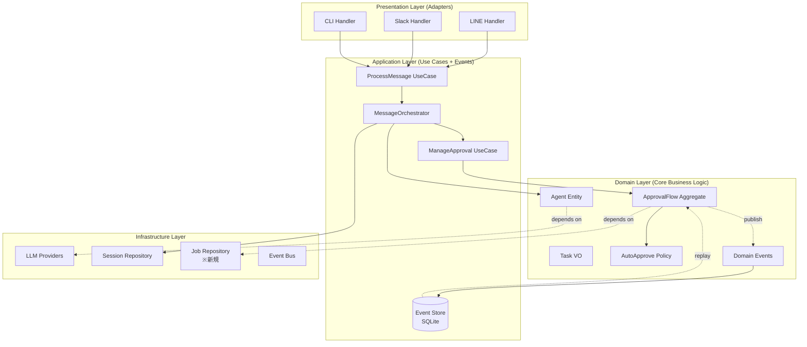

# PicoClaw 実践的クリーンアーキテクチャ再設計提案 v2.0

## Context

### 前回提案からの進化

**前回（v1.0）**: Clean Architecture / Hexagonal Architecture の理想的な4層構造を提案
**今回（v2.0）**: codebase-map 分析を踏まえ、以下を追加：

1. **具体的な問題解決**: Agent Loop 1,980行の分解、承認フロー完成、Auto-Approve実装
2. **イベントソーシング**: 承認ジョブの永続化と監査ログ
3. **段階的移行**: 既存コードとの共存戦略
4. **未完成機能の優先**: Worker実行委譲、MCP統合、Auto-Approve

### 現状分析（codebase-map より）

#### 痛点 Top 10

| # | 問題 | 深刻度 | 状態 | 影響 |
|---|------|-------|------|------|
| 1 | **Agent Loop 肥大化** (1,980行) | 高 | 継続 | 保守性最悪、テスト困難 |
| 2 | **Worker実行委譲** 未実装 | 高 | 60%完成 | 承認後何も起こらない |
| 3 | **Auto-Approve** 完全未実装 | 高 | 0% | Phase 4-6 停滞 |
| 4 | **In-Memory Job Storage** | 高 | 設計問題 | 再起動で承認状態喪失 |
| 5 | **MCP Phase 5-C** 未完成 | 高 | 50% | Chrome操作が動かない |
| 6 | **環境変数テンプレート** 不動作 | 中 | バグ | 設定が効かない |
| 7 | **ハードコード散在** | 中 | 継続 | Timezone, Timeout等 |
| 8 | **ログローテーション** なし | 中 | 欠如 | ディスク溢れリスク |
| 9 | **API Key Masking** なし | 低 | 欠如 | セキュリティリスク |
| 10 | **設定ホットリロード** なし | 低 | 欠如 | 再起動必須 |

#### 成功している点（継承すべき）

✅ **Provider 抽象化**: 4種類のLLM（Ollama/Claude/OpenAI/DeepSeek）を統一インターフェースで管理
✅ **Session Management**: 日次カットオーバー、JSON永続化
✅ **Router + Classifier**: 4段階ルーティング（明示コマンド → ルール辞書 → 分類器 → フォールバック）
✅ **Approval Manager**: 基本構造は完成（実行が未実装）

---

## 新アーキテクチャ設計

### 設計原則（v1.0から継承 + 追加）

1. **Hexagonal Architecture** （ポート＆アダプター）
   - ドメイン層は外部に依存しない
   - インフラ層はドメインに依存

2. **Event Sourcing + CQRS** （新規追加）
   - 承認フローを Event Store で永続化
   - 監査ログとリカバリを実現

3. **Micro-Kernel Pattern** （新規追加）
   - コアを最小限に保つ
   - 機能は Plugin として追加

4. **SOLID原則** （継承）
   - 単一責任、開放閉鎖、依存性逆転

5. **実用主義** （新規追加）
   - 完璧より動くものを優先
   - 段階的リファクタリング
   - 既存の良いコードは活かす

### アーキテクチャ図



---

## 重要な設計決定

### 1. Event Sourcing for Approval Flow

**問題**: In-Memory Job Storage → 再起動で承認状態喪失

**解決**: Event Store（SQLite）で承認フローを永続化

```go
// internal/domain/approval/events.go
type ApprovalEvent interface {
    EventType() string
    AggregateID() string
    Timestamp() time.Time
}

type ApprovalRequested struct {
    JobID     string
    Proposal  Proposal
    CreatedAt time.Time
}

type ApprovalGranted struct {
    JobID      string
    GrantedBy  string
    GrantedAt  time.Time
}

type AutoApprovalGranted struct {
    JobID     string
    Scope     AutoApproveScope
    GrantedAt time.Time
}

type PatchExecutionStarted struct {
    JobID     string
    Patch     string
    StartedAt time.Time
}

type PatchExecutionCompleted struct {
    JobID       string
    Success     bool
    Result      string
    CompletedAt time.Time
}
```

**Event Store 実装**:

```go
// internal/infrastructure/eventstore/sqlite_store.go
type SQLiteEventStore struct {
    db *sql.DB
}

func (s *SQLiteEventStore) Append(event ApprovalEvent) error {
    // INSERT INTO events (aggregate_id, event_type, payload, timestamp)
}

func (s *SQLiteEventStore) GetEventsForJob(jobID string) ([]ApprovalEvent, error) {
    // SELECT * FROM events WHERE aggregate_id = ? ORDER BY timestamp
}

func (s *SQLiteEventStore) Replay(jobID string) (*ApprovalFlow, error) {
    events, _ := s.GetEventsForJob(jobID)
    flow := &ApprovalFlow{}
    for _, event := range events {
        flow.Apply(event)
    }
    return flow, nil
}
```

### 2. Worker Execution Service（未実装機能の完成）

**問題**: 承認後のパッチ適用が未実装

**解決**: WorkerExecutionService を新設

```go
// internal/application/service/worker_execution.go
type WorkerExecutionService struct {
    eventStore EventStore
    toolRunner *tools.ToolRegistry
    mcpClient  *mcp.Client
}

func (w *WorkerExecutionService) ExecuteProposal(ctx context.Context, jobID string, proposal Proposal) error {
    // 1. Event 発行: PatchExecutionStarted
    w.eventStore.Append(PatchExecutionStarted{JobID: jobID, Patch: proposal.Patch})

    // 2. Patch を解析してツール呼び出し
    commands := ParsePatch(proposal.Patch)

    for _, cmd := range commands {
        if cmd.Type == "chrome" {
            // MCP経由でChrome操作
            result, err := w.mcpClient.ExecuteChromeCommand(cmd)
        } else {
            // 通常のツール実行
            result, err := w.toolRunner.Execute(cmd)
        }
    }

    // 3. Event 発行: PatchExecutionCompleted
    w.eventStore.Append(PatchExecutionCompleted{JobID: jobID, Success: true})
}
```

### 3. Auto-Approve System（完全新規実装）

**問題**: Auto-Approve が完全未実装

**解決**: Policy-based Auto-Approve with Scope & TTL

```go
// internal/domain/approval/auto_approve.go
type AutoApprovePolicy struct {
    enabled   bool
    scope     Scope
    expiresAt time.Time
}

type Scope struct {
    AllowedRoutes []routing.Route  // e.g., [CODE3]
    AllowedPaths  []string          // e.g., ["*.go", "pkg/**"]
    ExcludeFlags  []string          // e.g., ["uses_browser"]
}

func (p *AutoApprovePolicy) IsApplicable(task Task, proposal Proposal) bool {
    // 1. Enabled チェック
    if !p.enabled {
        return false
    }

    // 2. TTL チェック
    if time.Now().After(p.expiresAt) {
        return false
    }

    // 3. Route チェック
    if !p.scope.MatchesRoute(task.Route()) {
        return false
    }

    // 4. Path チェック
    if !p.scope.MatchesPaths(proposal.AffectedFiles()) {
        return false
    }

    // 5. Exclude Flags チェック
    if proposal.HasFlag("uses_browser") && p.scope.ExcludesFlag("uses_browser") {
        return false
    }

    return true
}

func (p *AutoApprovePolicy) Enable(scope Scope, ttl time.Duration) {
    p.enabled = true
    p.scope = scope
    p.expiresAt = time.Now().Add(ttl)
}

func (p *AutoApprovePolicy) Disable() {
    p.enabled = false
}
```

### 4. Agent Loop 分解戦略

**問題**: 1,980行の肥大化

**解決**: 責務別に5つのサービスに分割

```
agent/loop.go (1,980行)
    ↓ 分解
┌─────────────────────────────────────────┐
│ MessageOrchestrator (300行)             │ ← メインフロー調整
│  - processMessage()                      │
│  - handleCommand()                       │
│  - delegateToService()                   │
└─────────────────────────────────────────┘
            │
            ├─→ RoutingService (200行)
            │    - decide()
            │    - applyRules()
            │    - classifyWithLLM()
            │
            ├─→ LLMIteratorService (300行)
            │    - reflectionLoop()
            │    - callLLM()
            │    - parseResponse()
            │
            ├─→ ApprovalService (250行)
            │    - requestApproval()
            │    - checkAutoApprove()
            │    - waitForDecision()
            │
            ├─→ WorkerExecutionService (200行)
            │    - executePatch()
            │    - runTools()
            │    - integrateMCP()
            │
            └─→ MemoryService (150行)
                 - dailyCutover()
                 - saveDailyNote()
                 - resetSessions()
```

**段階的移行**:

1. **Week 1**: WorkerExecutionService 抽出（最優先、未実装機能完成）
2. **Week 2**: ApprovalService 抽出（Auto-Approve追加）
3. **Week 3**: RoutingService 抽出
4. **Week 4**: LLMIteratorService 抽出
5. **Week 5**: MemoryService 抽出
6. **Week 6**: MessageOrchestrator 最終統合

### 5. Configuration Management 改善

**問題**: ハードコード散在、環境変数テンプレート不動作

**解決**: Layered Configuration with Validation

```go
// internal/infrastructure/config/loader.go
type ConfigLoader struct {
    layers []ConfigLayer
}

type ConfigLayer interface {
    Load() (*Config, error)
    Priority() int
}

// Layer 1: Defaults (lowest priority)
type DefaultConfigLayer struct{}
func (d *DefaultConfigLayer) Load() (*Config, error) {
    return &Config{
        Timezone:        "UTC",          // ハードコード排除
        MCPTimeout:      30 * time.Second,
        OllamaMaxContext: 8192,
        LogRotation:     LogRotationConfig{MaxSize: "100MB", MaxAge: "7d"},
    }, nil
}

// Layer 2: File Config
type FileConfigLayer struct{ path string }
func (f *FileConfigLayer) Load() (*Config, error) {
    // config.yaml を読み込み
}

// Layer 3: Environment Variables (highest priority)
type EnvConfigLayer struct{}
func (e *EnvConfigLayer) Load() (*Config, error) {
    cfg := &Config{}
    // 具体的な env タグ（テンプレート排除）
    cfg.Providers.Claude.APIKey = os.Getenv("ANTHROPIC_API_KEY")
    cfg.Providers.OpenAI.APIKey = os.Getenv("OPENAI_API_KEY")
    cfg.Providers.DeepSeek.APIKey = os.Getenv("DEEPSEEK_API_KEY")
    // ...
    return cfg, nil
}

// Merge and Validate
func (l *ConfigLoader) LoadAndValidate() (*Config, error) {
    merged := &Config{}
    for _, layer := range l.layers {
        layerCfg, _ := layer.Load()
        merged = MergeConfig(merged, layerCfg)
    }

    // Validation
    if err := ValidateConfig(merged); err != nil {
        return nil, err
    }

    return merged, nil
}
```

### 6. MCP Integration 完成（Phase 5-C）

**問題**: MCP Client 実装済みだが Agent Loop 統合なし

**解決**: Chrome Command Detection + MCP Execution

```go
// internal/application/service/worker_execution.go (追加)
func (w *WorkerExecutionService) detectChromeCommands(patch string) []ChromeCommand {
    // Patch を解析して Chrome 操作を検出
    // 例: "ブラウザで https://example.com を開いて..."

    patterns := []string{
        "ブラウザで.*を開いて",
        "Chrome.*で.*を.*",
        "Webページ.*にアクセス",
    }

    commands := []ChromeCommand{}
    for _, pattern := range patterns {
        if matched := regexp.MustCompile(pattern).FindString(patch); matched != "" {
            cmd := ParseChromeCommand(matched)
            commands = append(commands, cmd)
        }
    }

    return commands
}

func (w *WorkerExecutionService) ExecuteProposal(ctx context.Context, jobID string, proposal Proposal) error {
    // Chrome コマンド検出
    chromeCommands := w.detectChromeCommands(proposal.Patch)

    if len(chromeCommands) > 0 {
        // uses_browser フラグ設定
        proposal.SetFlag("uses_browser", true)

        // Auto-Approve 判定（Chrome操作は除外）
        if autoApprovePolicy.IsApplicable(task, proposal) {
            // Scopeで uses_browser が除外されているか確認
        }

        // MCP Client 経由で実行
        for _, cmd := range chromeCommands {
            result, err := w.mcpClient.Execute(cmd)
            if err != nil {
                return err
            }
        }
    }

    // 通常のツール実行
    // ...
}
```

---

## パッケージ構造（実践的版）

### ディレクトリツリー

```
picoclaw_multiLLM/
├── cmd/
│   └── picoclaw/
│       ├── main.go              # エントリーポイント
│       └── wire.go              # 依存性注入（Wire）
│
├── internal/
│   ├── domain/                  # ドメイン層（純粋ビジネスロジック）
│   │   ├── agent/
│   │   │   ├── agent.go        # Agent エンティティ
│   │   │   ├── role.go         # Role enum
│   │   │   └── events.go       # Domain Events
│   │   ├── task/
│   │   │   ├── task.go         # Task 値オブジェクト
│   │   │   └── job_id.go       # JobID 値オブジェクト
│   │   ├── proposal/
│   │   │   └── proposal.go     # Proposal 値オブジェクト
│   │   ├── approval/
│   │   │   ├── flow.go         # ApprovalFlow アグリゲート
│   │   │   ├── auto_approve.go # AutoApprove Policy ※新規
│   │   │   ├── scope.go        # Scope VO ※新規
│   │   │   └── events.go       # Approval Events ※新規
│   │   ├── routing/
│   │   │   ├── decision.go     # RoutingDecision
│   │   │   └── route.go        # Route enum
│   │   └── session/
│   │       ├── session.go      # Session エンティティ
│   │       └── repository.go   # Repository interface
│   │
│   ├── application/             # アプリケーション層
│   │   ├── usecase/
│   │   │   ├── process_message.go    # ProcessUserMessage
│   │   │   └── manage_approval.go    # ManageApproval ※改善
│   │   ├── service/
│   │   │   ├── message_orchestrator.go   # ※Agent Loop 分解
│   │   │   ├── routing_service.go        # ※Agent Loop 分解
│   │   │   ├── llm_iterator_service.go   # ※Agent Loop 分解
│   │   │   ├── approval_service.go       # ※Auto-Approve 追加
│   │   │   ├── worker_execution_service.go # ※新規（Worker実行）
│   │   │   ├── memory_service.go         # ※Agent Loop 分解
│   │   │   └── event_handlers.go
│   │   └── port/
│   │       ├── inbound.go
│   │       └── outbound.go
│   │
│   ├── infrastructure/          # インフラ層
│   │   ├── llm/
│   │   │   ├── ollama/         # 既存活用
│   │   │   ├── claude/         # 既存活用
│   │   │   ├── openai/         # 既存活用
│   │   │   └── deepseek/       # 既存活用
│   │   ├── persistence/
│   │   │   ├── eventstore/
│   │   │   │   └── sqlite_store.go       # ※新規（Event Store）
│   │   │   ├── session/
│   │   │   │   └── json_repo.go          # 既存活用
│   │   │   └── job/
│   │   │       └── sqlite_repo.go        # ※新規（Job永続化）
│   │   ├── config/
│   │   │   └── loader.go                 # ※改善（Layered Config）
│   │   └── mcp/
│   │       └── client.go                 # 既存活用 + Phase 5-C完成
│   │
│   └── adapter/                 # アダプター層
│       ├── inbound/
│       │   ├── line/           # 既存活用
│       │   ├── slack/          # 既存活用
│       │   └── cli/            # 既存活用
│       └── outbound/
│           └── notification/
│               └── sender.go
│
├── pkg/                         # 公開パッケージ
│   ├── event/
│   │   └── bus.go              # Event Bus
│   └── logger/
│       ├── logger.go           # 既存活用
│       └── masking.go          # ※新規（API Key Masking）
│
├── db/                          # ※新規（Database Migrations）
│   ├── migrations/
│   │   ├── 001_create_events_table.sql
│   │   └── 002_create_jobs_table.sql
│   └── schema.sql
│
└── config/
    ├── config.yaml             # 既存改善
    └── config.example.yaml
```

---

## データベーススキーマ（Event Store + Job Repository）

### events テーブル

```sql
CREATE TABLE events (
    id INTEGER PRIMARY KEY AUTOINCREMENT,
    aggregate_id TEXT NOT NULL,      -- JobID
    aggregate_type TEXT NOT NULL,    -- "ApprovalFlow"
    event_type TEXT NOT NULL,        -- "ApprovalRequested", "ApprovalGranted", etc.
    payload TEXT NOT NULL,           -- JSON
    timestamp DATETIME NOT NULL,
    metadata TEXT,                   -- JSON (user_id, ip_address, etc.)

    INDEX idx_aggregate (aggregate_id, timestamp)
);
```

### jobs テーブル（Read Model for CQRS）

```sql
CREATE TABLE jobs (
    job_id TEXT PRIMARY KEY,
    route TEXT NOT NULL,             -- "CODE3"
    status TEXT NOT NULL,            -- "pending", "granted", "denied", "completed"
    proposal_plan TEXT,
    proposal_patch TEXT,
    proposal_risk TEXT,
    cost_hint TEXT,                  -- ※新規フィールド
    uses_browser BOOLEAN,            -- ※新規フィールド
    requested_at DATETIME NOT NULL,
    granted_at DATETIME,
    granted_by TEXT,
    executed_at DATETIME,
    execution_result TEXT,

    INDEX idx_status (status)
);
```

### auto_approve_policies テーブル

```sql
CREATE TABLE auto_approve_policies (
    id INTEGER PRIMARY KEY AUTOINCREMENT,
    enabled BOOLEAN NOT NULL,
    scope_routes TEXT NOT NULL,      -- JSON array: ["CODE3"]
    scope_paths TEXT NOT NULL,       -- JSON array: ["*.go", "pkg/**"]
    exclude_flags TEXT NOT NULL,     -- JSON array: ["uses_browser"]
    expires_at DATETIME NOT NULL,
    created_at DATETIME NOT NULL,
    created_by TEXT NOT NULL,

    INDEX idx_enabled_expires (enabled, expires_at)
);
```

---

## 移行戦略（段階的リファクタリング）

### Phase 1: Critical Fixes（Week 1-2）

**目標**: 未実装機能の完成

1. **WorkerExecutionService 実装**
   - `internal/application/service/worker_execution_service.go` 新規作成
   - Patch 解析 → ツール実行 → Event 記録
   - 既存の Approval Manager と統合

2. **Event Store 実装**
   - SQLite ベースの Event Store
   - Migration スクリプト作成
   - ApprovalFlow → Event Sourcing 移行

3. **MCP Phase 5-C 完成**
   - Chrome Command Detection
   - MCP Client 統合
   - `uses_browser` フラグ設定

**検証**:
```bash
# E2E テスト: 承認 → 実行の完全フロー
go test ./test/e2e/approval_execution_test.go
```

### Phase 2: Auto-Approve Implementation（Week 3-4）

**目標**: Auto-Approve 完全実装

1. **AutoApprovePolicy 実装**
   - `internal/domain/approval/auto_approve.go` 新規作成
   - Scope, TTL, Exclude Flags
   - DB 永続化

2. **ApprovalService 改善**
   - Auto-Approve 判定ロジック追加
   - `/auto-approve enable` コマンド追加
   - `/auto-approve disable` コマンド追加
   - `/auto-approve status` コマンド追加

3. **E2E テスト**
   - Auto-Approve 有効 → CODE3 → 自動承認 → 実行
   - Chrome操作除外テスト

**検証**:
```bash
go test ./test/e2e/auto_approve_test.go
```

### Phase 3: Agent Loop Decomposition（Week 5-8）

**目標**: 1,980行を5サービスに分解

**週次計画**:
- Week 5: WorkerExecutionService 抽出（完了済み）
- Week 6: ApprovalService 抽出
- Week 7: RoutingService 抽出
- Week 8: LLMIteratorService, MemoryService 抽出

**実装パターン**（例: RoutingService）:

```go
// Step 1: Extract interface
type RoutingService interface {
    Decide(ctx context.Context, task Task) (RoutingDecision, error)
}

// Step 2: Implement service
type routingService struct {
    router     *Router
    classifier *Classifier
    ruleDictionary *RuleDictionary
}

func (r *routingService) Decide(ctx context.Context, task Task) (RoutingDecision, error) {
    // 1. 明示コマンド
    if cmd := parseCommand(task.UserMessage()); cmd != "" {
        return RoutingDecision{Route: cmd, Source: "explicit"}, nil
    }

    // 2. ルール辞書
    if route := r.ruleDictionary.Match(task); route != RouteUnknown {
        return RoutingDecision{Route: route, Source: "rule"}, nil
    }

    // 3. 分類器
    decision, err := r.classifier.Classify(ctx, task)
    if err != nil || decision.Confidence < threshold {
        return RoutingDecision{Route: RouteCHAT, Source: "fallback"}, nil
    }

    return decision, nil
}

// Step 3: Replace in AgentLoop
// Before:
//   decision := al.router.Decide(...)
// After:
//   decision := al.routingService.Decide(...)
```

### Phase 4: Configuration & Infrastructure（Week 9-10）

**目標**: 設定管理とインフラ改善

1. **Layered Configuration**
   - DefaultConfigLayer, FileConfigLayer, EnvConfigLayer 実装
   - 環境変数テンプレート削除（具体的タグに置換）
   - バリデーション追加

2. **Logging 改善**
   - API Key Masking 実装
   - Log Rotation 実装（size-based: 100MB, time-based: 7days）

3. **Hot-Reload 対応**
   - SIGHUP シグナル受信で設定再読み込み
   - Graceful な設定変更

**検証**:
```bash
# 設定検証
go test ./internal/infrastructure/config/...

# ログローテーション検証
# （手動: 100MB書き込み → ローテーション確認）
```

---

## 実装優先順位

### 最優先（Phase 1）- Week 1-2

| タスク | 理由 | 影響 |
|--------|------|------|
| **WorkerExecutionService** | 承認フロー60%完成 → 100%へ | 高 |
| **Event Store** | 承認状態の永続化 | 高 |
| **MCP Phase 5-C** | Chrome操作統合 | 高 |

### 高優先（Phase 2）- Week 3-4

| タスク | 理由 | 影響 |
|--------|------|------|
| **Auto-Approve** | 完全未実装 → 仕様書の要件満たす | 高 |
| **cost_hint フィールド** | Coder3仕様で必須 | 中 |

### 中優先（Phase 3）- Week 5-8

| タスク | 理由 | 影響 |
|--------|------|------|
| **Agent Loop 分解** | 保守性向上 | 中 |
| **Routing/LLM/Memory Service** | テスタビリティ向上 | 中 |

### 低優先（Phase 4）- Week 9-10

| タスク | 理由 | 影響 |
|--------|------|------|
| **Config 改善** | 運用改善 | 低 |
| **Logging 改善** | セキュリティ・運用改善 | 低 |

---

## テスト戦略

### テストピラミッド（改善版）

```
          /\
         /E2E\          ← 15% (主要シナリオ + 新機能)
        /------\
       /Integration\    ← 25% (Event Store, Worker実行)
      /------------\
     /  Unit Tests  \   ← 60% (Domain層 + Service層)
    /----------------\
```

### 新規テストケース

#### 1. WorkerExecutionService テスト

```go
func TestWorkerExecutionService_ExecuteProposal(t *testing.T) {
    // Arrange
    mockEventStore := &MockEventStore{}
    mockToolRunner := &MockToolRunner{}
    mockMCPClient := &MockMCPClient{}

    service := NewWorkerExecutionService(mockEventStore, mockToolRunner, mockMCPClient)

    proposal := Proposal{
        Plan:  "Test plan",
        Patch: "diff --git a/test.go\n+func Test() {}",
        Risk:  "low",
    }

    // Act
    err := service.ExecuteProposal(context.Background(), "job_001", proposal)

    // Assert
    assert.NoError(t, err)
    assert.Equal(t, 2, mockEventStore.AppendCallCount()) // Started + Completed
}
```

#### 2. Auto-Approve テスト

```go
func TestAutoApprovePolicy_IsApplicable(t *testing.T) {
    // Arrange
    policy := &AutoApprovePolicy{
        enabled: true,
        scope: Scope{
            AllowedRoutes: []Route{RouteCODE3},
            AllowedPaths:  []string{"*.go"},
            ExcludeFlags:  []string{"uses_browser"},
        },
        expiresAt: time.Now().Add(1 * time.Hour),
    }

    task := Task{route: RouteCODE3}
    proposal := Proposal{
        AffectedFiles: []string{"pkg/test.go"},
        Flags:         map[string]bool{},
    }

    // Act
    applicable := policy.IsApplicable(task, proposal)

    // Assert
    assert.True(t, applicable)
}

func TestAutoApprovePolicy_ExcludesBrowserFlag(t *testing.T) {
    // Arrange
    policy := &AutoApprovePolicy{
        enabled: true,
        scope: Scope{
            AllowedRoutes: []Route{RouteCODE3},
            ExcludeFlags:  []string{"uses_browser"},
        },
        expiresAt: time.Now().Add(1 * time.Hour),
    }

    task := Task{route: RouteCODE3}
    proposal := Proposal{
        Flags: map[string]bool{"uses_browser": true},
    }

    // Act
    applicable := policy.IsApplicable(task, proposal)

    // Assert
    assert.False(t, applicable) // uses_browser フラグで除外
}
```

#### 3. Event Store テスト

```go
func TestSQLiteEventStore_AppendAndReplay(t *testing.T) {
    // Arrange
    db := setupTestDB(t)
    store := NewSQLiteEventStore(db)

    // Act: Append events
    store.Append(ApprovalRequested{JobID: "job_001", CreatedAt: time.Now()})
    store.Append(ApprovalGranted{JobID: "job_001", GrantedBy: "user123", GrantedAt: time.Now()})

    // Act: Replay
    flow, err := store.Replay("job_001")

    // Assert
    assert.NoError(t, err)
    assert.Equal(t, StatusGranted, flow.Status())
    assert.Equal(t, "user123", flow.GrantedBy())
}
```

---

## FAQ

### Q1: Event Sourcing は過剰では？

**A**: 承認フローには必須です。理由：
- 監査ログ（誰が、いつ、何を承認したか）
- リカバリ（再起動後も承認状態を復元）
- デバッグ（承認フローの履歴を追跡）

最小限の実装（SQLite + 3テーブル）なので、オーバーヘッドは小さい。

### Q2: 既存コードとの互換性は？

**A**: 完全互換を維持します：
- 外部インターフェース（LINE, Slack, CLI）は変更なし
- 既存の良いコード（Provider, SessionManager, Router）は活用
- 段階的移行なので、途中でロールバック可能

### Q3: Phase 1-2 で最低限動くか？

**A**: Yes。Phase 1-2 完了で以下が動作：
- ✅ 基本的な Chat/Worker/Coder フロー
- ✅ 承認 → 実行の完全フロー
- ✅ Auto-Approve（Scope + TTL + Exclude）
- ✅ MCP Chrome 操作

Phase 3-4 は品質改善なので、後回しでも可。

### Q4: 実装期間は？

**A**:
- Phase 1（Critical Fixes）: 2週間
- Phase 2（Auto-Approve）: 2週間
- Phase 3（Agent Loop分解）: 4週間
- Phase 4（Config/Infra）: 2週間

**合計: 10週間**（前回12週間から短縮）

### Q5: v1.0（前回提案）との違いは？

**A**:

| 項目 | v1.0 | v2.0 |
|------|------|------|
| **設計思想** | 理想的Clean Architecture | 実践的Hexagonal + Event Sourcing |
| **優先順位** | フル実装（12週間） | 未完成機能優先（10週間）|
| **Event Store** | なし | あり（承認フロー永続化）|
| **Auto-Approve** | 概念のみ | 完全実装計画 |
| **Agent Loop** | 全面書き換え | 段階的分解 |
| **既存コード** | 置き換え | 活用 + 改善 |

v2.0 は **実用主義**: 完璧より動くものを優先。

---

## まとめ

### ✅ 主要な改善点

1. **未実装機能の完成**: Worker実行、Auto-Approve、MCP統合
2. **Event Sourcing**: 承認フローの永続化と監査ログ
3. **Agent Loop 分解**: 1,980行 → 5サービス
4. **実用主義**: 既存の良いコードを活かす
5. **段階的移行**: Phase 1-2 で最低限動く

### ⏱️ 実装期間

**10週間**（v1.0 から 2週間短縮）
- Phase 1: 2週間（Critical Fixes）
- Phase 2: 2週間（Auto-Approve）
- Phase 3: 4週間（Agent Loop分解）
- Phase 4: 2週間（Config/Infra）

### 🎯 期待効果

- **完全性**: 承認フロー100%、Auto-Approve100%、MCP統合100%
- **保守性**: Agent Loop分解により変更容易
- **監査性**: Event Store で承認履歴追跡
- **信頼性**: 再起動後も承認状態復元

### 🚀 推奨判断

**Yes, recommended:**
- ✅ 未実装機能を完成させたい → Phase 1-2 必須
- ✅ 保守性を向上させたい → Phase 3-4 推奨
- ✅ 段階的に進めたい → Phase 別に実装可能

**推奨**: Phase 1 から開始し、動作確認しながら Phase 2-4 へ進む

---

**作成日**: 2026-03-01
**バージョン**: 2.0
**前回との差分**: Event Sourcing追加、未実装機能優先、実用主義
**次回レビュー**: Phase 1 完了時（Week 2）
