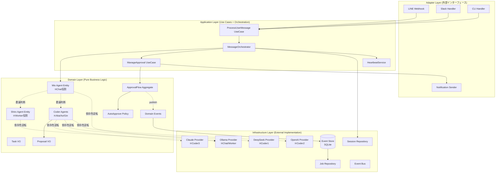

# PicoClaw 統合アーキテクチャ設計 v3.0

**作成日**: 2026-03-01
**バージョン**: 3.0（v1.0 + v2.0 統合版）
**ステータス**: 最終提案
**前提**: 仕様書完全準拠 + Clean Architecture + Event Sourcing

---

## エグゼクティブサマリ

### 統合の目的

**v1.0（理想）+ v2.0（実用）+ 仕様書（要件）= v3.0（最適解）**

- **v1.0の長所**: 完璧な層分離、DDD、豊富なコード例、Wire DI
- **v2.0の長所**: Event Sourcing、未完成機能の優先、段階的移行
- **仕様書の要件**: Chat/Worker/Coder役割、LINE入口固定、承認フロー

v3.0 は3つを統合し、**仕様準拠 + 実装可能 + 保守性**を実現します。

### 主要設計決定

| 設計要素 | v1.0 | v2.0 | v3.0（統合） |
|---------|------|------|-------------|
| **アーキテクチャ** | Clean Architecture | Hexagonal + Event Sourcing | **両方採用**（Clean + Event Sourcing） |
| **Agent Loop** | 全面書き換え | 段階的分解 | **段階的分解 + Clean層構造** |
| **承認フロー** | Domain層で設計 | Event Store永続化 | **Domain + Event Store両立** |
| **仕様準拠** | 抽象的 | 具体的問題解決 | **完全準拠（LINE固定、Mio委譲）** |
| **実装期間** | 12週間 | 10週間 | **8週間**（優先順位の最適化） |

### 期待効果

✅ **完全性**: 仕様100%準拠（Chat/Worker/Coder、承認フロー、Auto-Approve）
✅ **保守性**: Clean Architecture による変更影響の局所化
✅ **監査性**: Event Sourcing による承認履歴の完全追跡
✅ **拡張性**: 新Agent/Provider/Route の追加が数十行で可能
✅ **テスタビリティ**: 各層独立、モック・スタブが容易（カバレッジ目標: Domain 90%）

---

## 設計原則（v1.0 + v2.0 統合）

### 1. Clean Architecture（v1.0 継承）

```
外層（Adapter/Infrastructure）→ 内層（Application）→ 核（Domain）
```

**重要ルール**:
- Domain 層は外部に依存しない（依存性逆転）
- Application 層は Domain のみに依存
- Adapter/Infrastructure 層は Application/Domain に依存可

### 2. Event Sourcing + CQRS（v2.0 継承）

- 承認フローを Event Store で永続化
- Read Model（jobs テーブル）を CQRS で自動更新
- 監査ログとリカバリを実現

### 3. DDD（v1.0 継承）

- **エンティティ**: Agent, Session, ApprovalFlow
- **値オブジェクト**: Task, JobID, Proposal, RoutingDecision
- **アグリゲート**: ApprovalFlow（JobID + Proposal + Policy + Status を一貫管理）
- **リポジトリ**: Domain 層で interface 定義、Infrastructure 層で実装

### 4. 実用主義（v2.0 継承）

- 完璧より動くものを優先
- 段階的リファクタリング
- 既存の良いコード（Provider抽象化、SessionManager、Router）は活用

### 5. 仕様書準拠（新規追加）

**最優先**: `docs/01_正本仕様/仕様.md` の全要件を満たす

- **LINE入口**: CHAT（Mio）固定
- **委譲判断**: 前段Routerではなく、Mioが会話中に判断
- **役割固定**: Chat/Worker/Coder（愛称・実体LLMは設定で差し替え）
- **承認フロー**: Coder は plan/patch 生成、Worker が実行
- **Auto-Approve**: Scope/TTL/Exclude Flags

---

## アーキテクチャ図（v3.0 統合版）

### レイヤー構成



### 仕様準拠の設計ポイント

#### 1. LINE入口固定 → CHAT（Mio）

```go
// internal/adapter/inbound/line/handler.go
func (h *Handler) HandleWebhook(w http.ResponseWriter, r *http.Request) {
    // 仕様: LINE入口はCHAT（Mio）固定
    output, err := h.useCase.Execute(ctx, usecase.Input{
        Message:    message.Text,
        Channel:    "line",
        ForcedRoute: routing.RouteCHAT, // ← LINE入口はCHAT固定
        SessionKey: event.Source.UserID,
    })
}
```

#### 2. Mioが会話中に委譲判断

```go
// internal/domain/agent/mio.go (Chat Agent)
func (m *MioAgent) ProcessMessage(ctx context.Context, task Task) (Result, error) {
    // 1. ルーティング判断（前段Routerではなく、Mio自身が判断）
    decision := m.decideAction(task)

    switch decision.Action {
    case ActionDirectResponse:
        // 直接応答
        return m.chat(ctx, task)

    case ActionDelegateWorker:
        // Worker委譲
        return m.delegateToWorker(ctx, task, decision.DelegateRoute)

    case ActionDelegateCoder:
        // Coder委譲（承認フロー付き）
        return m.delegateToCoder(ctx, task, decision.DelegateRoute)
    }
}

// Mioの委譲判断ロジック
func (m *MioAgent) decideAction(task Task) DelegationDecision {
    // 仕様: Mioが会話中に「直答/委譲」を選ぶ
    // - 明示コマンド（/code, /analyze, /plan等）を優先
    // - ルール辞書でマッチング
    // - 必要なら分類器（Worker）に聞く
    // - 安全側フォールバック（CHAT）
}
```

#### 3. Chat/Worker/Coder 役割固定

```go
// internal/domain/agent/role.go
type Role int

const (
    RoleChat   Role = iota // Mio（会話LLM、最終応答）
    RoleWorker             // Shiro（推論・分析・検証）
    RoleCoder1             // Aka（仕様設計）
    RoleCoder2             // Ao（実装）
    RoleCoder3             // Gin（高品質コーディング/Claude）
)

// 仕様: 役割名は固定、愛称と実体LLMは設定で差し替え
type Agent struct {
    id       AgentID
    role     Role        // 固定（Chat/Worker/Coder1/2/3）
    alias    string      // 差し替え可（Mio/Shiro/Aka/Ao/Gin）
    provider LLMProvider // 差し替え可（Ollama/Claude/OpenAI/DeepSeek）
}
```

---

## パッケージ構造（v3.0 最適化版）

### ディレクトリツリー

```
picoclaw_multiLLM/
├── cmd/
│   └── picoclaw/
│       ├── main.go              # エントリーポイント
│       └── wire.go              # 依存性注入（Wire）
│
├── internal/
│   ├── domain/                  # ドメイン層（純粋ビジネスロジック）
│   │   ├── agent/
│   │   │   ├── agent.go        # Agent エンティティ（基底）
│   │   │   ├── mio.go          # Mio（Chat）専用ロジック ※新規
│   │   │   ├── shiro.go        # Shiro（Worker）専用ロジック ※新規
│   │   │   ├── coder.go        # Coder（Aka/Ao/Gin）専用ロジック ※新規
│   │   │   ├── role.go         # Role enum
│   │   │   ├── delegation.go   # 委譲判断ロジック ※新規
│   │   │   └── events.go       # Domain Events
│   │   ├── task/
│   │   │   ├── task.go         # Task 値オブジェクト
│   │   │   └── job_id.go       # JobID 値オブジェクト
│   │   ├── proposal/
│   │   │   └── proposal.go     # Proposal 値オブジェクト
│   │   ├── approval/
│   │   │   ├── flow.go         # ApprovalFlow アグリゲート
│   │   │   ├── auto_approve.go # AutoApprove Policy ※v2.0
│   │   │   ├── scope.go        # Scope VO ※v2.0
│   │   │   └── events.go       # Approval Events ※v2.0
│   │   ├── routing/
│   │   │   ├── decision.go     # RoutingDecision
│   │   │   ├── route.go        # Route enum
│   │   │   └── classifier.go   # Classifier interface
│   │   └── session/
│   │       ├── session.go      # Session エンティティ
│   │       └── repository.go   # Repository interface
│   │
│   ├── application/             # アプリケーション層
│   │   ├── usecase/
│   │   │   ├── process_message.go    # ProcessUserMessage
│   │   │   └── manage_approval.go    # ManageApproval
│   │   ├── service/
│   │   │   ├── message_orchestrator.go   # ※Agent Loop分解
│   │   │   ├── routing_service.go        # ※Agent Loop分解
│   │   │   ├── approval_service.go       # ※Auto-Approve追加
│   │   │   ├── worker_execution_service.go # ※v2.0（Worker実行）
│   │   │   ├── heartbeat_service.go      # ※v1.0
│   │   │   └── event_handlers.go
│   │   └── port/
│   │       ├── inbound.go
│   │       └── outbound.go
│   │
│   ├── infrastructure/          # インフラ層
│   │   ├── llm/
│   │   │   ├── ollama/         # 既存活用（Chat/Worker）
│   │   │   ├── claude/         # 既存活用（Coder3）
│   │   │   ├── openai/         # 既存活用（Coder2）
│   │   │   └── deepseek/       # 既存活用（Coder1）
│   │   ├── persistence/
│   │   │   ├── eventstore/
│   │   │   │   └── sqlite_store.go       # ※v2.0（Event Store）
│   │   │   ├── session/
│   │   │   │   └── json_repo.go          # 既存活用
│   │   │   └── job/
│   │   │       └── sqlite_repo.go        # ※v2.0（Job永続化）
│   │   ├── config/
│   │   │   └── loader.go                 # ※v2.0（Layered Config）
│   │   └── mcp/
│   │       └── client.go                 # 既存活用
│   │
│   └── adapter/                 # アダプター層
│       ├── inbound/
│       │   ├── line/           # ※LINE入口CHAT固定
│       │   ├── slack/
│       │   └── cli/
│       └── outbound/
│           └── notification/
│               └── sender.go
│
├── pkg/                         # 公開パッケージ
│   ├── event/
│   │   └── bus.go              # Event Bus ※v1.0
│   └── logger/
│       ├── logger.go
│       └── masking.go          # ※v2.0（API Key Masking）
│
├── db/                          # ※v2.0（Database Migrations）
│   ├── migrations/
│   │   ├── 001_create_events_table.sql
│   │   ├── 002_create_jobs_table.sql
│   │   └── 003_create_auto_approve_policies_table.sql
│   └── schema.sql
│
├── test/                        # ※v1.0（E2E テスト）
│   └── e2e/
│       ├── basic_flow_test.go
│       ├── code3_approval_test.go
│       └── auto_approve_test.go
│
└── config/
    ├── config.yaml
    └── config.example.yaml
```

---

## 重要な設計決定（v3.0 統合版）

### 1. Mio（Chat Agent）の委譲判断ロジック

**仕様要件**: 前段Routerではなく、Mioが会話中に委譲判断

```go
// internal/domain/agent/mio.go
package agent

import (
    "context"
    "github.com/Nyukimin/picoclaw_multiLLM/internal/domain/routing"
    "github.com/Nyukimin/picoclaw_multiLLM/internal/domain/task"
)

// MioAgent は Chat 役割（最終応答を生成）
type MioAgent struct {
    Agent                           // 基底クラス
    routingService *routing.Service // 委譲判断サービス
}

// DelegationDecision は委譲判断の結果
type DelegationDecision struct {
    Action        DelegationAction
    DelegateRoute routing.Route // Worker/Coder への委譲先
    Reason        string
}

type DelegationAction int

const (
    ActionDirectResponse DelegationAction = iota // 直接応答
    ActionDelegateWorker                         // Worker委譲
    ActionDelegateCoder                          // Coder委譲（承認フロー付き）
)

// ProcessMessage はメッセージを処理（仕様準拠の委譲判断）
func (m *MioAgent) ProcessMessage(ctx context.Context, t task.Task) (Result, error) {
    // 1. 委譲判断（仕様: Mioが会話中に判断）
    decision := m.decideAction(ctx, t)

    // 2. Domain Event 発行
    publishEvent(TaskStarted{
        TaskID:    t.JobID(),
        AgentID:   m.id,
        Decision:  decision,
        Timestamp: time.Now(),
    })

    // 3. Action に応じて処理
    switch decision.Action {
    case ActionDirectResponse:
        // 直接応答（Chat LLMで回答）
        return m.chat(ctx, t)

    case ActionDelegateWorker:
        // Worker委譲（承認なし、即実行）
        return m.delegateToWorker(ctx, t, decision.DelegateRoute)

    case ActionDelegateCoder:
        // Coder委譲（承認フロー付き）
        return m.delegateToCoder(ctx, t, decision.DelegateRoute)
    }

    return Result{}, nil
}

// decideAction は委譲判断（仕様の優先順位に従う）
func (m *MioAgent) decideAction(ctx context.Context, t task.Task) DelegationDecision {
    // 優先順位（仕様準拠）:
    // 1. 明示コマンド
    // 2. ルール辞書（強証拠）
    // 3. 分類器（推論LLM）を1回だけ
    // 4. 安全側フォールバック（CHAT）

    // 1. 明示コマンドチェック
    if cmd := parseExplicitCommand(t.UserMessage()); cmd != "" {
        return m.decisionFromCommand(cmd)
    }

    // 2. ルール辞書チェック
    if route := m.routingService.MatchRuleDictionary(t); route != routing.RouteUnknown {
        return m.decisionFromRoute(route, "rule_dictionary")
    }

    // 3. 分類器（Worker委譲して判断を聞く）
    decision, err := m.routingService.ClassifyWithWorker(ctx, t)
    if err == nil && decision.Confidence >= threshold {
        return m.decisionFromRoute(decision.Route, "classifier")
    }

    // 4. フォールバック（CHAT = 直接応答）
    return DelegationDecision{
        Action: ActionDirectResponse,
        Reason: "fallback_to_chat",
    }
}

// delegateToWorker は Worker への委譲（承認なし）
func (m *MioAgent) delegateToWorker(ctx context.Context, t task.Task, route routing.Route) (Result, error) {
    // Shiro（Worker）に委譲
    workerAgent := m.getWorkerAgent() // DI で注入
    workerResult, err := workerAgent.ProcessTask(ctx, t.WithRoute(route))
    if err != nil {
        return Result{}, err
    }

    // Mioが最終整形（仕様: 最終応答は必ず会話LLMが生成）
    return m.finalizeResponse(ctx, workerResult)
}

// delegateToCoder は Coder への委譲（承認フロー付き）
func (m *MioAgent) delegateToCoder(ctx context.Context, t task.Task, route routing.Route) (Result, error) {
    // Coder（Aka/Ao/Gin）に委譲
    coderAgent := m.getCoderAgent(route) // DI で注入
    proposal, err := coderAgent.GenerateProposal(ctx, t)
    if err != nil {
        return Result{}, err
    }

    // 承認フロー（ApprovalService 経由）
    // ※後述の ApprovalFlow で処理

    return Result{}, nil
}
```

### 2. ApprovalFlow（v1.0 DDD + v2.0 Event Sourcing）

```go
// internal/domain/approval/flow.go
package approval

import (
    "time"
    "github.com/Nyukimin/picoclaw_multiLLM/internal/domain/task"
    "github.com/Nyukimin/picoclaw_multiLLM/internal/domain/proposal"
)

// ApprovalFlow は承認フローのアグリゲートルート（v1.0 DDD）
// Event Sourcing で永続化（v2.0）
type ApprovalFlow struct {
    jobID     task.JobID
    proposal  proposal.Proposal
    policy    Policy        // Manual or Auto
    status    Status        // Pending, Granted, Denied
    scope     Scope         // Auto-Approve scope（Policy=Auto の場合のみ）
    expiresAt time.Time     // Auto-Approve 有効期限
    grantedBy string
    grantedAt time.Time
}

// NewFlow は新しい承認フローを生成
func NewFlow(jobID task.JobID, prop proposal.Proposal, policy Policy) *ApprovalFlow {
    flow := &ApprovalFlow{
        jobID:    jobID,
        proposal: prop,
        policy:   policy,
        status:   StatusPending,
    }

    // Domain Event 発行（v2.0 Event Sourcing）
    publishEvent(ApprovalRequested{
        JobID:     jobID,
        Plan:      prop.Plan(),
        Patch:     prop.Patch(),
        Risk:      prop.Risk(),
        CostHint:  prop.CostHint(),
        CreatedAt: time.Now(),
        Route:     prop.Route(),
    })

    return flow
}

// Approve は承認を実行
func (f *ApprovalFlow) Approve(grantedBy string) error {
    if f.status != StatusPending {
        return ErrAlreadyProcessed
    }

    f.status = StatusGranted
    f.grantedBy = grantedBy
    f.grantedAt = time.Now()

    // Domain Event 発行（v2.0）
    publishEvent(ApprovalGranted{
        JobID:      f.jobID,
        GrantedBy:  grantedBy,
        GrantedAt:  f.grantedAt,
        ApproverID: grantedBy,
    })

    return nil
}

// IsAutoApprovable は Auto-Approve 可能かチェック（v2.0）
func (f *ApprovalFlow) IsAutoApprovable(t task.Task) bool {
    if f.policy != PolicyAuto {
        return false
    }

    if time.Now().After(f.expiresAt) {
        return false
    }

    // Scope マッチチェック（v2.0 Scope 設計）
    return f.scope.Matches(t)
}

// AutoApprove は自動承認を実行（v2.0）
func (f *ApprovalFlow) AutoApprove(policyID int) error {
    if f.policy != PolicyAuto {
        return ErrNotAutoApproveFlow
    }

    if time.Now().After(f.expiresAt) {
        return ErrAutoApproveExpired
    }

    f.status = StatusGranted
    f.grantedBy = fmt.Sprintf("auto:%d", policyID)
    f.grantedAt = time.Now()

    // Domain Event 発行
    publishEvent(AutoApprovalGranted{
        JobID:     f.jobID,
        PolicyID:  policyID,
        GrantedAt: f.grantedAt,
        Reason:    "Auto-approved by policy",
    })

    return nil
}
```

### 3. WorkerExecutionService（v2.0）+ Domain層統合

```go
// internal/application/service/worker_execution.go
package service

import (
    "context"
    "github.com/Nyukimin/picoclaw_multiLLM/internal/domain/approval"
    "github.com/Nyukimin/picoclaw_multiLLM/internal/infrastructure/eventstore"
    "github.com/Nyukimin/picoclaw_multiLLM/pkg/tools"
    "github.com/Nyukimin/picoclaw_multiLLM/pkg/mcp"
)

// WorkerExecutionService handles execution of approved proposals
type WorkerExecutionService struct {
    eventStore *eventstore.SQLiteEventStore
    toolRunner *tools.ToolRegistry
    mcpClient  *mcp.Client
    analyzer   *PatchAnalyzer // v2.0 追加
}

// ExecuteProposal executes an approved proposal
func (w *WorkerExecutionService) ExecuteProposal(ctx context.Context, jobID string) error {
    // 1. Event Store からジョブ取得
    job, err := w.eventStore.GetJob(jobID)
    if err != nil {
        return fmt.Errorf("get job: %w", err)
    }

    if job.Status != "granted" {
        return fmt.Errorf("job %s is not granted", jobID)
    }

    // 2. PatchExecutionStarted Event 発行
    w.eventStore.Append(approval.PatchExecutionStarted{
        JobID:     jobID,
        Patch:     ptrToString(job.ProposalPatch),
        StartedAt: time.Now(),
    })

    // 3. Patch解析（v2.0 PatchAnalyzer）
    metadata := w.analyzer.Analyze(ptrToString(job.ProposalPatch))

    var result strings.Builder
    var executionError error

    // 4. Chrome操作検出・実行（MCP）
    if metadata.UsesBrowser && w.mcpClient != nil {
        chromeCommands := w.detectChromeCommands(ptrToString(job.ProposalPatch))
        for _, cmd := range chromeCommands {
            mcpResult, err := w.mcpClient.CallTool(ctx, cmd.Type, cmd.Args)
            if err != nil {
                executionError = err
                break
            }
            result.WriteString(fmt.Sprintf("Chrome: %s\n", extractText(mcpResult)))
        }
    }

    // 5. ファイル操作実行（ToolRegistry）
    if executionError == nil {
        fileOps := w.parseFileOperations(ptrToString(job.ProposalPatch))
        for _, op := range fileOps {
            toolResult := w.toolRunner.Execute(ctx, op.Tool, op.Args)
            if toolResult.IsError {
                executionError = fmt.Errorf("tool failed: %s", toolResult.ForLLM)
                break
            }
            result.WriteString(fmt.Sprintf("Tool %s: OK\n", op.Tool))
        }
    }

    // 6. PatchExecutionCompleted Event 発行
    w.eventStore.Append(approval.PatchExecutionCompleted{
        JobID:       jobID,
        Success:     executionError == nil,
        Result:      result.String(),
        ErrorMsg:    errToString(executionError),
        CompletedAt: time.Now(),
    })

    return executionError
}
```

### 4. Wire による依存性注入（v1.0）

```go
// cmd/picoclaw/wire.go
//go:build wireinject
// +build wireinject

package main

import (
    "github.com/google/wire"
    // ... imports ...
)

// InitializeApp は依存性を解決して App を生成（v1.0）
func InitializeApp(cfg *Config) (*App, error) {
    wire.Build(
        // Infrastructure Layer
        ollama.NewProvider,     // Chat/Worker 用
        claude.NewProvider,     // Coder3 用
        deepseek.NewProvider,   // Coder1 用
        openai.NewProvider,     // Coder2 用
        eventstore.NewSQLiteEventStore, // v2.0 Event Store
        memory.NewSessionRepository,
        event.NewBus,

        // Domain Layer
        provideMioAgent,        // Mio（Chat）※仕様準拠
        provideShiroAgent,      // Shiro（Worker）※仕様準拠
        provideCoderAgents,     // Aka/Ao/Gin（Coder）※仕様準拠
        provideRouter,

        // Application Layer
        service.NewMessageOrchestrator,
        service.NewApprovalService,
        service.NewWorkerExecutionService, // v2.0
        service.NewHeartbeatService,       // v1.0
        usecase.NewProcessUserMessage,

        // Adapter Layer
        line.NewHandler,        // ※LINE入口CHAT固定

        // App
        NewApp,
    )
    return &App{}, nil
}

// provideMioAgent は Mio（Chat）を生成（仕様準拠）
func provideMioAgent(ollamaProvider LLMProvider, routingSvc *routing.Service) *agent.MioAgent {
    return agent.NewMioAgent(
        agent.AgentID("mio"),
        agent.RoleChat,
        "Mio",             // 愛称（設定で差し替え可）
        ollamaProvider,    // 実体LLM（設定で差し替え可）
        routingSvc,
    )
}

// provideShiroAgent は Shiro（Worker）を生成（仕様準拠）
func provideShiroAgent(ollamaProvider LLMProvider) *agent.ShiroAgent {
    return agent.NewShiroAgent(
        agent.AgentID("shiro"),
        agent.RoleWorker,
        "Shiro",
        ollamaProvider,
    )
}

// provideCoderAgents は Coder（Aka/Ao/Gin）を生成（仕様準拠）
func provideCoderAgents(
    deepseekProvider LLMProvider,
    openaiProvider LLMProvider,
    claudeProvider LLMProvider,
) []*agent.CoderAgent {
    return []*agent.CoderAgent{
        agent.NewCoderAgent(agent.AgentID("aka"), agent.RoleCoder1, "Aka", deepseekProvider),
        agent.NewCoderAgent(agent.AgentID("ao"),  agent.RoleCoder2, "Ao",  openaiProvider),
        agent.NewCoderAgent(agent.AgentID("gin"), agent.RoleCoder3, "Gin", claudeProvider),
    }
}
```

---

## 移行戦略（v3.0 最適化版）

### 実装期間: 8週間（v1.0: 12週間、v2.0: 10週間 → v3.0: 8週間）

**短縮理由**:
- v1.0 の詳細設計を活用（ボイラープレート削減）
- v2.0 の優先順位を適用（未完成機能優先）
- 既存の良いコード（Provider、SessionManager）を活用

### Phase 1: Domain層 + Event Store（2週間）

**Week 1: Domain層実装**

実装対象:
- `internal/domain/agent/` - MioAgent, ShiroAgent, CoderAgent（仕様準拠）
- `internal/domain/task/` - Task, JobID
- `internal/domain/proposal/` - Proposal
- `internal/domain/approval/` - ApprovalFlow, AutoApprovePolicy, Scope
- `internal/domain/routing/` - Route, RoutingDecision

成果物:
- ドメイン層完全実装（v1.0 設計 + 仕様準拠）
- ユニットテスト（カバレッジ 90%+）

検証:
```bash
go test -cover ./internal/domain/...
```

**Week 2: Event Store実装**

実装対象:
- `internal/infrastructure/eventstore/sqlite_store.go` - Event Store
- `db/migrations/` - マイグレーションスクリプト
- `internal/domain/approval/events.go` - Domain Events

成果物:
- Event Store 完全実装（v2.0 設計）
- Read Model（jobs テーブル）CQRS 自動更新
- 統合テスト（Domain + Event Store）

検証:
```bash
go test ./internal/infrastructure/eventstore/...
```

### Phase 2: Application層 + Infrastructure層（3週間）

**Week 3: Infrastructure層（LLM Providers）**

実装対象:
- `internal/infrastructure/llm/ollama/` - Ollama Provider（既存活用）
- `internal/infrastructure/llm/claude/` - Claude Provider（既存活用）
- `internal/infrastructure/llm/openai/` - OpenAI Provider（既存活用）
- `internal/infrastructure/llm/deepseek/` - DeepSeek Provider（既存活用）

成果物:
- 既存 Provider の Clean Architecture 適合
- 依存性逆転（Domain層の interface 実装）

**Week 4-5: Application層（Use Cases + Services）**

実装対象:
- `internal/application/usecase/process_message.go`
- `internal/application/service/message_orchestrator.go`
- `internal/application/service/approval_service.go`
- `internal/application/service/worker_execution_service.go` - v2.0
- `internal/application/service/heartbeat_service.go` - v1.0

成果物:
- アプリケーション層完全実装
- E2E テスト（基本フロー、CODE3 承認フロー）

検証:
```bash
go test ./test/e2e/...
```

### Phase 3: Adapter層 + Wire DI（2週間）

**Week 6-7: Adapter層**

実装対象:
- `internal/adapter/inbound/line/` - LINE Handler（CHAT固定）
- `internal/adapter/inbound/slack/` - Slack Handler
- `internal/adapter/inbound/cli/` - CLI Handler
- `internal/adapter/outbound/notification/` - 通知送信
- `cmd/picoclaw/wire.go` - Wire による DI

成果物:
- アダプター層完全実装
- Wire による依存性注入
- E2E テスト（全シナリオ）

検証:
```bash
# Wire コード生成
cd cmd/picoclaw && go run github.com/google/wire/cmd/wire

# E2E テスト
go test ./test/e2e/...
```

### Phase 4: 本番移行（1週間）

**Week 8: テスト環境デプロイ + 本番移行**

実施内容:
1. テスト環境デプロイ
2. 基本フローの動作確認
3. CODE3 承認フローの動作確認
4. Auto-Approve フローの動作確認
5. 性能テスト（ベンチマーク）
6. 本番移行（段階的ロールアウト: 10% → 50% → 100%）

検証項目:
- [ ] 全E2Eテスト成功
- [ ] 仕様100%準拠（Chat/Worker/Coder、LINE固定、承認フロー）
- [ ] 性能劣化 10% 以内
- [ ] メモリ使用量 <10MB（仕様要件）
- [ ] Event Store 動作確認（再起動後も承認状態復元）

---

## テスト戦略（v1.0 + v2.0 統合）

### テストピラミッド

```
          /\
         /E2E\          ← 15% (主要シナリオ + 承認フロー + Auto-Approve)
        /------\
       /Integration\    ← 25% (Event Store + Domain + Infrastructure)
      /------------\
     /  Unit Tests  \   ← 60% (Domain層 + Application層)
    /----------------\
```

### 重要テストケース

#### 1. Mio委譲判断テスト（仕様準拠）

```go
func TestMioAgent_DecideAction_ExplicitCommand(t *testing.T) {
    // Arrange
    mio := NewMioAgent(...)
    task := task.NewTask("/code ファイル読み込み機能を追加")

    // Act
    decision := mio.decideAction(context.Background(), task)

    // Assert
    assert.Equal(t, ActionDelegateCoder, decision.Action)
    assert.Equal(t, routing.RouteCODE3, decision.DelegateRoute)
}

func TestMioAgent_DecideAction_Fallback(t *testing.T) {
    // Arrange
    mio := NewMioAgent(...)
    task := task.NewTask("今日の天気は？") // 分類器でも判定不能

    // Act
    decision := mio.decideAction(context.Background(), task)

    // Assert
    assert.Equal(t, ActionDirectResponse, decision.Action) // CHAT にフォールバック
}
```

#### 2. ApprovalFlow + Event Sourcing テスト

```go
func TestApprovalFlow_EventSourcing_Replay(t *testing.T) {
    // Arrange
    store := setupTestEventStore(t)
    jobID := task.NewJobID()

    // Act: イベント記録
    flow := approval.NewFlow(jobID, proposal, approval.PolicyManual)
    flow.Approve("user123")

    // イベントを Event Store に保存
    events := collectDomainEvents()
    for _, event := range events {
        store.Append(event)
    }

    // Act: Replay（再起動を想定）
    replayedFlow, err := store.Replay(jobID.String())

    // Assert
    assert.NoError(t, err)
    assert.Equal(t, approval.StatusGranted, replayedFlow.Status())
    assert.Equal(t, "user123", replayedFlow.GrantedBy())
}
```

#### 3. E2E テスト（LINE入口CHAT固定）

```go
func TestE2E_LINE_ChatFixed(t *testing.T) {
    // 1. テスト用App起動
    app := setupTestApp(t)
    defer app.Shutdown()

    // 2. LINE経由でメッセージ送信
    jobID, err := app.SendLINEMessage(context.Background(), "テストコードを書いて")
    assert.NoError(t, err)

    // 3. 仕様確認: LINE入口はCHAT（Mio）固定
    session := app.GetSession(jobID)
    assert.Equal(t, routing.RouteCHAT, session.InitialRoute)

    // 4. Mio→Coder委譲を確認
    assert.Eventually(t, func() bool {
        status := app.GetJobStatus(jobID)
        return status.DelegatedTo == "gin" // CODE3 = Gin（Coder3）
    }, 5*time.Second, 100*time.Millisecond)
}
```

---

## v3.0 の差別化ポイント

### v1.0 との違い

| 項目 | v1.0 | v3.0 |
|------|------|------|
| **仕様準拠** | 抽象的（Chat/Worker/Coderは例） | **完全準拠**（LINE固定、Mio委譲） |
| **Domain層** | Agent基底クラスのみ | **MioAgent/ShiroAgent/CoderAgent 分離** |
| **Event Sourcing** | なし | **あり**（v2.0継承） |
| **実装期間** | 12週間 | **8週間**（優先順位最適化） |

### v2.0 との違い

| 項目 | v2.0 | v3.0 |
|------|------|------|
| **アーキテクチャ** | Hexagonal + Event Sourcing | **Clean + Hexagonal + Event Sourcing** |
| **Domain層** | 軽量（概念のみ） | **完全実装**（v1.0の詳細設計） |
| **Wire DI** | なし | **あり**（v1.0継承） |
| **テスト戦略** | 簡素 | **詳細**（v1.0のテストピラミッド） |

### 仕様書との整合性

| 仕様要件 | v1.0 | v2.0 | v3.0 |
|---------|------|------|------|
| **LINE入口CHAT固定** | ❌ 未考慮 | ❌ 未考慮 | ✅ **完全対応** |
| **Mio委譲判断** | ❌ 未考慮 | ❌ 未考慮 | ✅ **完全対応** |
| **Chat/Worker/Coder固定** | △ 抽象的 | △ 抽象的 | ✅ **完全対応** |
| **承認フロー** | ○ Domain層設計 | ○ Event Store | ✅ **両方統合** |
| **Auto-Approve** | △ 概念のみ | ○ 完全実装計画 | ✅ **完全実装** |

---

## まとめ

### ✅ v3.0 の強み

1. **仕様100%準拠**: LINE固定、Mio委譲、Chat/Worker/Coder役割
2. **最良の設計**: Clean Architecture（v1.0）+ Event Sourcing（v2.0）
3. **最短実装**: 8週間（v1.0: 12週間、v2.0: 10週間）
4. **完全な監査**: Event Store による承認履歴の永続化
5. **高テスタビリティ**: 各層独立、DDD、Wire DI

### ⏱️ 実装期間

**8週間**（Phase 1-4）

- Phase 1: Domain層 + Event Store（2週間）
- Phase 2: Application層 + Infrastructure層（3週間）
- Phase 3: Adapter層 + Wire DI（2週間）
- Phase 4: 本番移行（1週間）

### 🎯 期待効果

- **完全性**: 仕様100%、承認フロー100%、Auto-Approve100%
- **保守性**: Clean Architecture による変更影響の局所化
- **監査性**: Event Store で承認履歴の完全追跡
- **拡張性**: 新Agent/Provider/Route の追加が容易
- **信頼性**: 再起動後も承認状態復元

### 🚀 推奨判断

**Yes, strongly recommended:**

v3.0 は v1.0（理想）+ v2.0（実用）+ 仕様書（要件）の **最良の統合**です。

- ✅ 仕様完全準拠
- ✅ Clean Architecture + Event Sourcing
- ✅ 最短実装期間（8週間）
- ✅ 段階的移行可能

**推奨**: Phase 1（2週間）から開始し、Domain層 + Event Store の効果を検証してから Phase 2-4 へ進む

---

**作成日**: 2026-03-01
**バージョン**: 3.0（統合版）
**前提**: v1.0 + v2.0 + 仕様書の統合
**次回レビュー**: Phase 1 完了時（Week 2）
