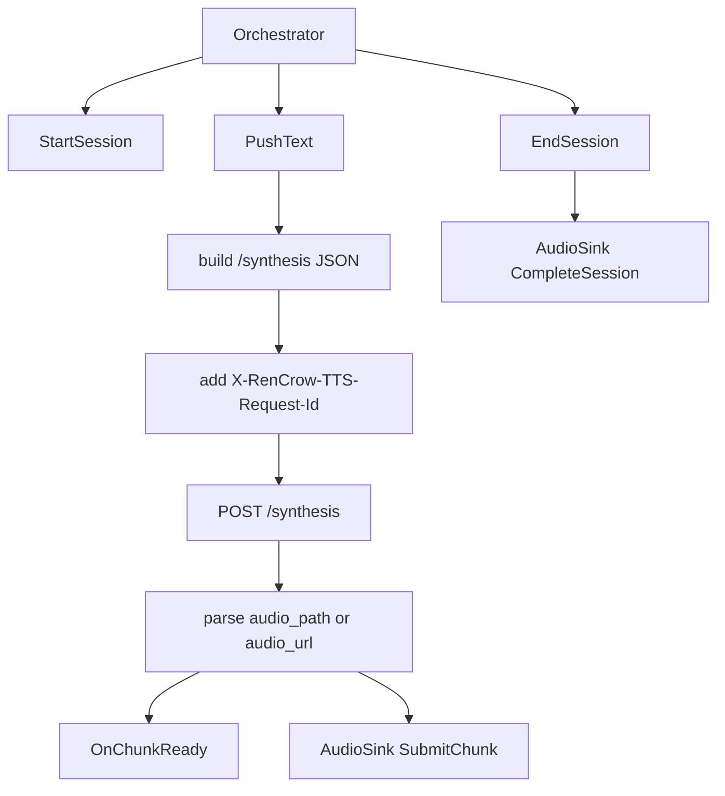

# RenCrow TTS 新ブリッジ実装仕様

本書は `REN_CROW_TTS_BRIDGE_SPEC.md` を実装へ落とすための、開発者向け実装仕様です。  
対象は TTS クライアントブリッジの完全移行（`/synthesis` 一本化）です。

---

## 1. 実装方針

- 旧経路（WS `/sessions`、`POST /synthesize`）を廃止
- 新経路（`POST /synthesis`）に統一
- `X-RenCrow-TTS-Request-Id` を全合成リクエストで付与
- `provider_params` は設定ファイルから透過
- エラー処理は `error.code` の抽出を優先

---

## 2. 変更対象

## 2.1 新規追加

- `internal/infrastructure/tts/rencrow_tts_bridge.go`
  - 新ブリッジ本体（`StartSession` / `PushText` / `EndSession`）

- `internal/infrastructure/tts/rencrow_tts_bridge_test.go`
  - `/synthesis` 呼び出し・ヘッダ付与・`provider_params` 送信・エラーコード解釈のテスト

## 2.2 更新

- `cmd/picoclaw/tts_client_bridge.go`
  - ブリッジ生成を `NewRenCrowTTSBridge` に固定

- `internal/adapter/config/config.go`
  - TTS設定を新ブリッジ向けに整理
    - 使用: `http_base_url`, `timeout_ms`, `voice_id`, `provider_params`

- `internal/adapter/config/config_test.go`
  - 新設定キーの読み込み検証に更新

- `config.yaml`
  - 運用設定を `/synthesis` 前提に整理

## 2.3 削除

- `internal/infrastructure/tts/client_bridge.go`
- `internal/infrastructure/tts/client_bridge_test.go`
- `internal/infrastructure/tts/routing_bridge.go`
- `internal/infrastructure/tts/sbv2_direct_bridge.go`
- `internal/infrastructure/tts/sbv2_direct_bridge_test.go`

---

## 3. データモデル仕様

## 3.1 TTS設定

```yaml
tts:
  enabled: true
  http_base_url: "http://127.0.0.1:8765"
  timeout_ms: 15000
  voice_id: "female_01"
  provider_params:
    style: "Neutral"
    style_weight: 2.8
```

### フィールド定義

- `http_base_url`: TTS サーバベース URL（`/synthesis` は実装側で補完）
- `timeout_ms`: `/synthesis` リクエストタイムアウト
- `voice_id`: デフォルト voice_id
- `provider_params`: 透過送信するSBV2制御パラメータ

---

## 4. 処理フロー



### 4.1 StartSession
- `session_id` 必須チェック
- `character_id` / `voice_id` / `nextChunk` をセッション保持

### 4.2 PushText
- テキスト正規化（句点補完）
- リクエスト構築:
  - `text`
  - `voice_id`
  - `speed` / `pitch`（emotion 由来）
  - `provider_params`（config 由来）
- ヘッダ設定:
  - `Content-Type`
  - `X-RenCrow-TTS-Request-Id`
- レスポンス処理:
  - 成功: `audio_path` / `audio_url` を chunk 化して通知
  - 失敗: `error.code` / `error.message` を抽出して返却

### 4.3 EndSession
- セッション削除
- `AudioSink.CompleteSession` と完了通知

---

## 5. 旧経路削除仕様

- 旧経路に関するコード・テストは削除し、参照を残さない
- TTS起動配線は新ブリッジのみを生成する
- ドキュメントは新仕様へ集約し、旧Bridge中心の記述を残さない

---

## 6. テスト仕様

## 6.1 ユニットテスト
- `/synthesis` パスへ送信される
- `X-RenCrow-TTS-Request-Id` が送信される
- `provider_params` が JSON に含まれる
- `error.code` がエラー文字列に反映される

## 6.2 設定テスト
- `timeout_ms` / `provider_params` を読み込める
- デフォルト値が正しく補完される

## 6.3 回帰確認
- 既存 TTS イベント（`tts.audio_chunk`）の payload 互換が維持される
- AudioSink 連携（Submit/Complete）が維持される

---

## 7. 完了条件

- 新ブリッジ以外のTTS経路がコード上に存在しない
- 新仕様書と実装仕様書の契約に実装が一致する
- 対象パッケージの `go test` が成功する
- 変更ファイルで Lint エラーがない

