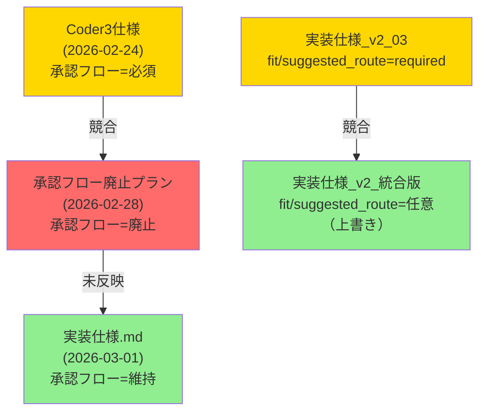

# トレーサビリティマトリクス（仕様 ↔ 実装 対応表）

## 概要

`--refs docs/` モードで生成。正本仕様・v2統合仕様・LLM運用仕様・監査差分メモを実装コードと突合し、
各要件の実装状況・乖離・リスクを記録する。

## 関連ドキュメント

- 正本仕様: `docs/01_正本仕様/実装仕様.md`
- v2統合仕様: `docs/02_v2統合分割仕様/実装仕様_v2_統合版.md`
- Coder3仕様: `docs/05_LLM運用プロンプト設計/Coder3_Claude_API仕様.md`
- 既存差分メモ: `docs/04_監査差分分析/仕様_実装仕様_差分メモ.md`
- 廃止プラン: `docs/06_実装ガイド進行管理/20260228_承認フロー廃止プラン.md`
- ギャップ分析: `docs/08_AIからの提案/implementation_gap_analysis.md`

---

## 凡例

| 記号 | 意味 |
|------|------|
| [OK] | 仕様通りに実装済み |
| [OK-P] | 部分実装（コア動作は満たす） |
| [PLANNED] | 計画中（廃止・置換プランあり） |
| [TODO] | 未実装（フェーズ未到達） |
| [GAP] | 仕様との乖離（実装が仕様と異なる） |
| [CONFLICT] | 仕様文書間で矛盾あり |
| [OBSOLETE] | 廃止決定済み（廃止プランが承認待ち） |

---

## 1. エージェントアーキテクチャ（仕様 1.0章）

| 要件ID | 仕様内容 | 実装場所 | 状態 | 備考 |
|--------|---------|---------|------|------|
| ARCH-001 | 5エージェント共通コア（AgentCore） | `pkg/modules/types.go` | [OK] | AgentCore 構造体実装済み |
| ARCH-002 | Chat=Mio / Worker=Shiro / Order1=Aka / Order2=Ao / Order3=Gin | `pkg/agent/factory.go` | [OK] | 愛称マッピング実装済み |
| ARCH-003 | provider: ollama(Chat/Worker), deepseek(Order1), openai(Order2), anthropic(Order3) | `pkg/agent/factory.go:resolveProvider()` | [GAP] | resolveProvider() が常に nil を返す（#19） |
| ARCH-004 | 旧名称 coder1/coder2/coder3 の後方互換 | `pkg/config/config.go` | [OK] | 設定で指定可能 |
| ARCH-005 | JobID 全体必須化（全作業・応答） | `pkg/jobid/generator.go` | [OK-P] | 新アーキでのみ付与。旧アーキでは未付与 |

---

## 2. ルーティング仕様（仕様 2章）

| 要件ID | 仕様内容 | 実装場所 | 状態 | 備考 |
|--------|---------|---------|------|------|
| ROUTE-001 | 優先順位: 明示コマンド→ルール辞書→分類器→フォールバック | `pkg/agent/router.go:Decide()` | [OK] | 順序通りに実装済み |
| ROUTE-002 | /local 中の /code は Router で拒否・会話LLM案内 | `pkg/agent/router.go` | [OK-P] | 拒否は実装済み、会話LLM案内は未確認 |
| ROUTE-003 | 分類器出力は JSON のみ（route/confidence/reason/evidence） | `pkg/agent/classifier.go` | [OK] | JSON解析実装済み |
| ROUTE-004 | 分類器故障時（JSON不正等）→ CHAT フォールバック | `pkg/agent/router.go` | [OK] | フォールバック実装済み |
| ROUTE-005 | CODE判定: confidence >= 0.8 かつ強証拠必須 | `pkg/agent/router.go:hasStrongCodeEvidence()` | [OK] | 閾値チェック実装済み |
| ROUTE-006 | 分類器 system prompt は1枚固定（REQ-080） | `pkg/agent/` | [GAP] | prompt管理ファイル未確認（`pkg/llm/prompts/classifier_system.md` 未作成※推測） |
| ROUTE-007 | LINE チャネルは常に CHAT ルート | `pkg/agent/loop.go` | [OK] | LINE 強制 CHAT 実装済み |

---

## 3. ループ制御と再ルート（仕様 3章）

| 要件ID | 仕様内容 | 実装場所 | 状態 | 備考 |
|--------|---------|---------|------|------|
| LOOP-001 | 停止条件: loops >= max_loops / 経過時間 >= max_millis | `pkg/agent/loop.go` | [OK] | 実装済み |
| LOOP-002 | 停止条件: ワーカー失敗 | `pkg/agent/loop.go` | [OK] | 実装済み |
| LOOP-003 | 停止条件: ユーザー確認が必要（need_user_confirmation） | `pkg/agent/loop.go` | [TODO] | risk=high 時の自動停止未実装（差分メモ #3） |
| LOOP-004 | 再ルート（最大1回）: fit=false かつ suggested_route 有効 | `pkg/agent/loop.go` | [TODO] | 未実装（潜在バグ #12） |
| LOOP-005 | 会話LLM提案IF（propose_next_loop=true/false） | `pkg/agent/loop.go` | [TODO] | 未実装（潜在バグ #13） |
| LOOP-006 | fit/suggested_route は任意（v2 で上書き確定） | `pkg/agent/loop.go` | [CONFLICT] | 実装仕様_03 が required と記載、v2 が任意に上書き |

---

## 4. I/O 契約（仕様 4章）

| 要件ID | 仕様内容 | 実装場所 | 状態 | 備考 |
|--------|---------|---------|------|------|
| IO-001 | InputMessage: channel/session_id/user_text/raw/received_at | `pkg/bus/types.go:InboundMessage` | [OK-P] | channel/SenderID/Content/SessionKey あり（raw/received_at なし） |
| IO-002 | RoutingDecision: primary_route/source/confidence/reason/evidence/flags | `pkg/agent/router.go:RoutingDecision` | [OK-P] | route/confidence/reason あり（evidence フィールドは未確認） |
| IO-003 | WorkerOutput 統一定義（result/needs_next_loop/why/next_actions/confidence/risk） | `pkg/agent/loop.go` | [GAP] | WorkerOutput JSON 契約未適用（潜在バグ #14） |
| IO-004 | WorkerOutput: fit/suggested_route は任意 | — | [CONFLICT] | 実装仕様_03 と v2 で競合（差分メモ #1） |

---

## 5. ワーカー仕様（仕様 5章）

| 要件ID | 仕様内容 | 実装場所 | 状態 | 備考 |
|--------|---------|---------|------|------|
| WORK-001 | Worker: ルーティング決定を担当 | `pkg/modules/worker/routing.go` | [OK] | RoutingModule 実装済み |
| WORK-002 | Worker: 実行・パッチ適用を担当（承認後） | `pkg/modules/worker/execution.go` | [TODO] | 承認フロー廃止プラン未適用の状態 |
| WORK-003 | Worker: Heartbeat 集約 | `pkg/modules/worker/heartbeat.go` | [OK-P] | 構造は実装済みだが報告者なし（#24） |
| WORK-004 | PLAN/ANALYZE/OPS/RESEARCH の内部プロンプト | `pkg/agent/loop.go` | [OK] | ルート別処理実装済み |
| WORK-005 | CODE: local_only=true 時は呼び出し禁止 | `pkg/agent/router.go` | [OK] | Router 段階で拒否実装済み |
| WORK-006 | Worker 即時実行ロジック（承認フロー廃止後） | — | [PLANNED] | 廃止プランに基づく新機能（未実装） |
| WORK-007 | Git 自動コミット（実行前後） | — | [PLANNED] | 廃止プランで追加予定（未実装） |

---

## 6. セキュリティ仕様（仕様 6章）

| 要件ID | 仕様内容 | 実装場所 | 状態 | 備考 |
|--------|---------|---------|------|------|
| SEC-001 | サニタイズ責務: pkg/security/sanitizer.go に一本化 | `pkg/security/` | [GAP] | ディレクトリ存在未確認（※推測）。materials.MakeSimpleRedactor との分離が揺れている（差分メモ #5） |
| SEC-002 | CODE以外でクラウド呼び出し禁止 | `pkg/agent/loop.go` | [OK] | ルーティング制御で実装済み |
| SEC-003 | /local 中はクラウド呼び出し禁止 | `pkg/agent/loop.go:SessionFlags.LocalOnly` | [OK] | LocalOnly フラグで制御済み |
| SEC-004 | 機密情報（token/secret/PII）はクラウド送信前に除外 | `pkg/agent/loop.go` | [OK-P] | 実装あり（詳細は未検証） |
| SEC-005 | ログ保存時もマスク後データのみ | `pkg/logger/logger.go` | [GAP] | マスキング機構未実装（潜在バグ #10） |

---

## 7. ログ仕様（仕様 7章）

| 要件ID | 仕様内容 | 実装場所 | 状態 | 備考 |
|--------|---------|---------|------|------|
| LOG-001 | router.decision イベント | `pkg/logger/logger.go` | [OK] | 45種のログイベント中に含む |
| LOG-002 | classifier.error イベント | `pkg/logger/logger.go` | [OK] | 実装済み |
| LOG-003 | worker.success / worker.fail イベント | `pkg/logger/logger.go` | [OK] | 実装済み |
| LOG-004 | route.override イベント | `pkg/logger/logger.go` | [OK] | 実装済み |
| LOG-005 | loop.stop イベント | `pkg/logger/logger.go` | [OK] | 実装済み |
| LOG-006 | final.route イベント | `pkg/logger/logger.go` | [OK-P] | 実装済みか要確認 |
| LOG-007 | 最低保存項目: initial_route/final_route/classifier_confidence/stop_reason等 | `pkg/logger/logger.go` | [OK-P] | 大部分実装済み。差分メモ #4 で一部欠落指摘あり |

---

## 8. 承認フロー（仕様 6章 / Coder3仕様）

> **[WARN] アーキテクチャ方針の競合**
> `Coder3_Claude_API仕様.md`（2026-02-24）は承認フローを「決定事項」とするが、
> `20260228_承認フロー廃止プラン.md`（2026-02-28）は全廃止を提案している。
> 廃止プランは「承認待ち」ステータスで、仕様への正式反映は未完了。
> → **現時点では「廃止予定・実装状態は旧仕様のまま」という矛盾状態にある**

| 要件ID | 仕様内容（旧・Coder3仕様） | 実装場所 | 状態 | 備考 |
|--------|---------|---------|------|------|
| APPR-001 | Coder3: plan/patch/risk + need_approval を生成 | `pkg/agent/loop.go:parseCoder3Output()` | [OK] | JSON パース実装済み |
| APPR-002 | job_id 発行・承認状態追跡 | `pkg/approval/` | [OK] | 基本フロー実装済み |
| APPR-003 | /approve <job_id> コマンド | `pkg/agent/loop.go:handleCommand()` | [OK] | 実装済み |
| APPR-004 | /deny <job_id> コマンド | `pkg/agent/loop.go:handleCommand()` | [OK] | 実装済み |
| APPR-005 | 承認後 Worker が patch を適用（実行委譲） | — | [OBSOLETE] | 廃止プランで削除予定 + 旧バグ #1 |
| APPR-006 | Auto-Approve（Scope/TTL付き） | — | [OBSOLETE] | 廃止プランで不要に + 旧バグ #2 |
| APPR-007 | cost_hint フィールド | — | [OBSOLETE] | 廃止プランで不要に + 旧バグ #4 |
| APPR-008 | Chrome 操作は承認フロー経由のみ実行 | `pkg/mcp/client.go` | [OBSOLETE] | 廃止プランで制約緩和予定 |

> **廃止プランが正式採用された場合のアクション**:
> - `pkg/approval/` ディレクトリを削除（~590行）
> - `/approve` `/deny` コマンド削除
> - `pkg/agent/loop.go` の承認関連コード削除
> - Worker 即時実行ロジック（`executeWorkerPatch()`）を追加

---

## 9. 状態管理・セッション（仕様 9章）

| 要件ID | 仕様内容 | 実装場所 | 状態 | 備考 |
|--------|---------|---------|------|------|
| STATE-001 | 日次カットオーバー（04:00 JST） | `pkg/agent/memory.go` | [OK] | JST ハードコード（潜在バグ #15） |
| STATE-002 | セッションの原子的保存 | `pkg/session/manager.go` | [OK] | CreateTemp + Rename で実装済み |
| STATE-003 | SessionFlags（LocalOnly/WorkOverlay等） | `pkg/session/manager.go:SessionFlags` | [OK] | 全フラグ実装済み |
| STATE-004 | コンテキスト圧縮（緊急 50% 削減） | `pkg/agent/loop.go:forceCompression()` | [OK] | 実装済み（重複メッセージのバグあり） |

---

## 10. Heartbeat システム（仕様 12章）

| 要件ID | 仕様内容 | 実装場所 | 状態 | 備考 |
|--------|---------|---------|------|------|
| HB-001 | 全エージェントが自律的に状態報告 | `pkg/modules/worker/heartbeat.go` | [GAP] | コレクターは実装済みだが報告者なし（#24） |
| HB-002 | Worker が Heartbeat を集約 | `pkg/modules/worker/heartbeat.go:HeartbeatCollectorModule` | [OK-P] | 集約構造は実装済み |
| HB-003 | 定期 Heartbeat レポート（外部向け） | `pkg/heartbeat/service.go` | [OK] | Ollama 向け定期報告実装済み |
| HB-004 | Heartbeat タイムアウト（60秒）・クリーンアップ（10分） | `pkg/modules/worker/heartbeat.go` | [OK] | 実装済み |

---

## 11. 合議制（Deliberation Mode）（仕様 13章）

| 要件ID | 仕様内容 | 実装場所 | 状態 | 備考 |
|--------|---------|---------|------|------|
| DELIB-001 | 複数 Order 並列提案 | `pkg/agent/loop_new.go` | [TODO] | EnableDeliberation フラグあり（false） |
| DELIB-002 | 比較・最終決定 | `pkg/modules/worker/aggregation.go` | [TODO] | AggregationModule 構造あり、並列提案なし |

---

## 12. STT（音声入力）仕様

| 要件ID | 仕様内容 | 実装場所 | 状態 | 備考 |
|--------|---------|---------|------|------|
| STT-001 | WebSocket /stt エンドポイント | `cmd/picoclaw/main.go` | [OK] | 実装済み |
| STT-002 | WAV RMS 無音検出 | `cmd/picoclaw/main.go` | [OK] | 実装済み |
| STT-003 | 環境変数でタイムアウト設定 | `cmd/picoclaw/main.go` | [OK] | STT_FINAL_TIMEOUT 等 |
| STT-004 | STTClient / STTAudioSender / STTEventBridge 分離 | `cmd/picoclaw/main.go` | [GAP] | main.go に一体実装（分離未完） |
| STT-005 | error.code ごとの復旧動作 | `cmd/picoclaw/main.go` | [GAP] | 詳細エラーコード対応未確認 |
| STT-006 | TDD（Red-Green-Refactor）必須 | `*_test.go` | [TODO] | STT 用テストの存在未確認 |

---

## 13. 仕様間競合サマリー

| 競合 | 文書A | 文書B | 解決状況 |
|------|-------|-------|---------|
| 承認フロー存廃 | Coder3仕様（維持） | 承認フロー廃止プラン（廃止） | 未解決（廃止プランが承認待ち） |
| fit/suggested_route 必須性 | 実装仕様_03（required） | v2統合版（任意） | v2で解決（v2 が上書き） |
| risk=high 時の停止 | v2仕様（停止必須） | loop.go（実装なし） | 未実装 |
| サニタイズ責務場所 | 実装仕様_01（pkg/security） | 実装仕様_05（materials） | 未解決 |

---

## 14. 実装カバレッジサマリー

| カテゴリ | 要件数 | [OK] | [OK-P] | [TODO] | [GAP] | [CONFLICT] | [OBSOLETE] | [PLANNED] |
|---------|-------|------|--------|--------|-------|------------|------------|-----------|
| エージェント構成 | 5 | 4 | 1 | 0 | 0 | 0 | 0 | 0 |
| ルーティング | 7 | 5 | 1 | 0 | 1 | 0 | 0 | 0 |
| ループ制御 | 6 | 1 | 0 | 3 | 0 | 2 | 0 | 0 |
| I/O 契約 | 4 | 0 | 2 | 0 | 1 | 1 | 0 | 0 |
| ワーカー | 7 | 2 | 1 | 1 | 0 | 0 | 0 | 2 |
| セキュリティ | 5 | 2 | 1 | 0 | 2 | 0 | 0 | 0 |
| ログ | 7 | 5 | 2 | 0 | 0 | 0 | 0 | 0 |
| 承認フロー | 8 | 3 | 0 | 0 | 0 | 0 | 4 | 1 |
| 状態管理 | 4 | 4 | 0 | 0 | 0 | 0 | 0 | 0 |
| Heartbeat | 4 | 1 | 2 | 0 | 1 | 0 | 0 | 0 |
| 合議制 | 2 | 0 | 0 | 2 | 0 | 0 | 0 | 0 |
| STT | 6 | 2 | 0 | 1 | 3 | 0 | 0 | 0 |
| **合計** | **65** | **29 (45%)** | **10 (15%)** | **7 (11%)** | **8 (12%)** | **3 (5%)** | **4 (6%)** | **3 (5%)** |

**実装充足率（OK + OK-P）**: **60%** (39/65)

---

## 15. 優先対応事項（docs 解析結果から）

### 最優先: 仕様競合の解決

1. **承認フロー廃止プランの採否決定**: Coder3仕様 vs 廃止プランの競合を解消する。廃止する場合は実装仕様.md を更新し、pkg/approval/ を削除する。

2. **実装仕様.md の内部乖離修正**: 廃止プランのアクションが実装仕様.md に未反映（APPR-005/006/007 が廃止OBSOLETE なのに仕様本文にまだある）。

### 高優先: 未実装の必須機能

3. **risk=high 時の停止（LOOP-003）**: ループ制御の安全機構として v2 仕様で必須。
4. **WorkerOutput JSON 契約（IO-003）**: 統一定義の適用で外部連携・テストが容易になる。
5. **factory.go resolveProvider() の実装（ARCH-003）**: 新アーキテクチャが使えない根本原因。

### 中優先: 品質・セキュリティ

6. **サニタイズ責務の統一（SEC-001）**: pkg/security に一本化（差分メモ #5 の推奨対応）。
7. **ログマスキング（SEC-005）**: 機密情報の自動マスキング（潜在バグ #10）。
8. **STT コンポーネント分離（STT-004）**: main.go から STTClient/Bridge を抽出。

---

**生成日時**: 2026-06-19（run_20260619_refs）
